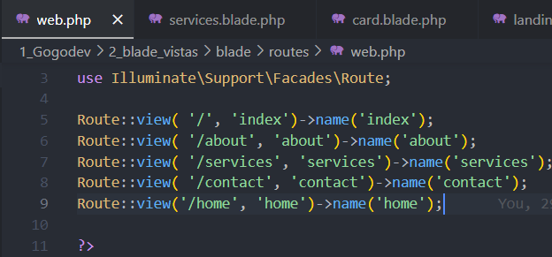
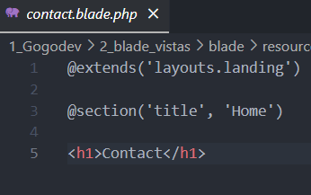

# **2_Blade_Vistas**

# **Estructura de Vistas en Laravel con Blade**

## **Introducción**

En este proyecto, implementamos el sistema de plantillas **Blade** en Laravel para mejorar la organización y reutilización del código en nuestras vistas.

## **Creación del Proyecto**

Ejecutamos:

```
laravel new blade
```

y configuramos las rutas en `routes/web.php`:

```
Route::view('/', 'index')->name('index');
Route::view('/about', 'about')->name('about');
Route::view('/services', 'services')->name('services');
Route::view('/contact', 'contact')->name('contact');
```

En mi caso tuve algunos problemas por que estaba colocando mal las rutas y **tengo el index, about, services, contact y home.** 



Y modifique las vistas con un h1 por cada apartado. **Es decir:** **About tenia el `<h1>About<h1/>`**



## **Uso de Layouts**

Creamos un layout principal en `views/layouts/landing.blade.php` para definir la estructura base:

```
<!DOCTYPE html>
<html lang="en">
<head>
    <meta charset="UTF-8">
    <meta name="viewport" content="width=device-width, initial-scale=1.0">
    <link rel="stylesheet" href="{{ asset('css/style.css') }}">
    <title>@yield('title')</title>
</head>
<body>
    @include('layouts._partials.menu')
    @yield('body')
</body>
</html>
```

Cada vista extiende este layout usando `@extends` y define su contenido con `@section`.

## **Uso de Partiales**

Para evitar repetir código, creamos un menú reutilizable en `views/layouts/_partials/menu.blade.php`:

```
<header>
    <nav>
        <ul>
            <li><a href="{{ route('index') }}">Index</a></li>
            <li><a href="{{ route('about') }}">About</a></li>
            <li><a href="{{ route('services') }}">Services</a></li>
            <li><a href="{{ route('contact') }}">Contact</a></li>
        </ul>
    </nav>
</header>
```

Lo incluimos en `landing.blade.php` con `@include('layouts._partials.menu')`.

## **Uso de Componentes Blade**

Para estructurar mejor el contenido repetitivo, creamos la carpeta `views/_components` con `card.blade.php`:

```
<div class="card">
    <h3>{{ $title }}</h3>
    
    <p>{{ $content }}</p>
</div>

```

Lo usamos en `services.blade.php` con `@component`:

```
@component('_components.card')
    @slot('title', 'Service 1')
    @slot('content', 'Descripción del servicio')
@endcomponent
```

## **Carga de Recursos Estáticos**

Ubicamos archivos en `public/` para imágenes y CSS.
Creamos `public/css/style.css`:

```
body { font-family: Arial, sans-serif; background-color: #f4f4f4; }
```

Y lo enlazamos en `landing.blade.php`:

```
<link rel="stylesheet" href="{{ asset('css/style.css') }}">
```

## **Conclusión**

Con Blade, organizamos las vistas de forma eficiente, reutilizando código con  **layouts, parciales y componentes** , facilitando el mantenimiento del proyecto.
