# Fundamentos

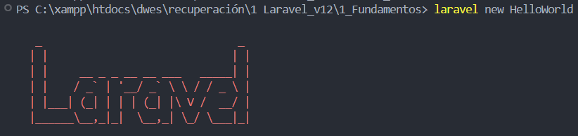

> En este documento, veremos al igual que en el 2 trimestre **los fundamentos de laravel**, pero esta vez utilizaremos **laravel 12**, haremos una breve introducción a Laravel 12, sus cambios respecto a la anterior versión y documentaremos **paso a paso** cada cambio que hagamos en el codigo.

---

### Indice.

Introduccion a Laravel 12

Elementos mas importantes

HelloWorld

---

## Introducción a Laravel 12.

> La información usada la he encontrado tanto en la misma **documentación** ya disponible de **[Laravel 12](https://laravel.com/docs/12.x/releases)**, como en una lista de videos de **youtube** que hablan de la misma, añadiendo un **[curso de iniciacion a Laravel 12.](https://www.youtube.com/playlist?list=PLZ2ovOgdI-kVtF2yQ2kiZetWWTmOQoUSG)**

#### Que es Laravel

> Para comenzar me gustaria recordar que es Laravel, **Laravel es un framework de PHP,** este Framework nos ayuda a **desarrollar aplicaciones** gracias a su **sistema de paquetes** y a ser un **framework del tipo MVC (Modelo-Vista-Controlador)**

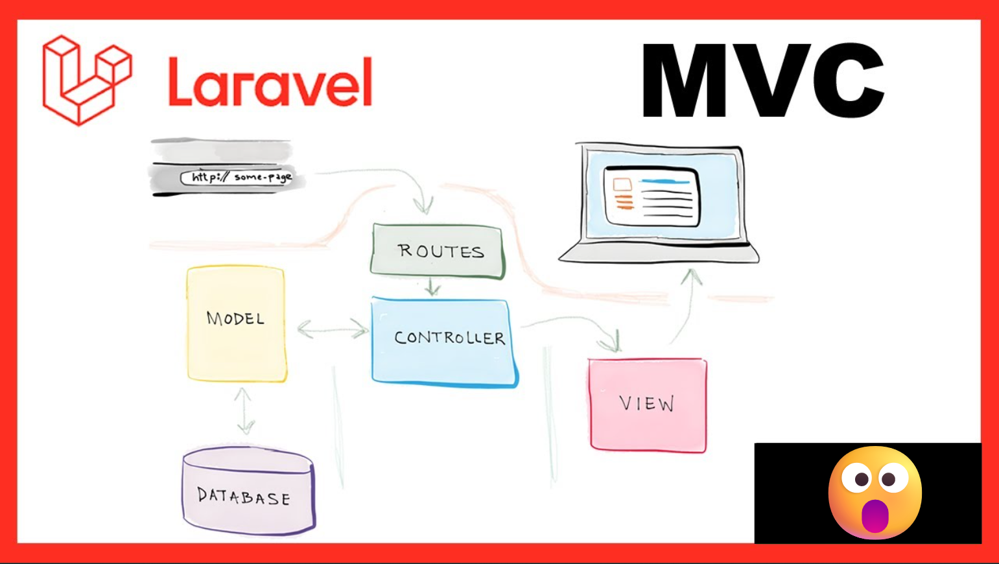

Funciona como muchos otros ya, desde la línea de comandos con el famoso **Artisan** que es el nombre que le dan a esta **interfaz por comandos** para ejecutar muchas funcionalidades como ver todas las rutas de la aplicación disponible, o poner a correr la aplicación o pararla. Es tan potente y sencillo de usar que una vez que lo has probado en alguna aplicación te puedes “malacostumbrar” y echarlo de menos cuando haces otra aplicación con otro framework que no cuenta con él, de Laravel tambien podemos señalar que incluye **Eloquent**, Eloquent es el famoso **ORM** que incluye Laravel, un **ORM** **es un mapeador relacional de objetos** el cual se encarga de hacer que sea agradable interactuar con su base de datos. Al usar Eloquent, cada tabla de la base de datos tiene un **"modelo"** correspondiente que se utiliza para interactuar con esa tabla.

#### Laravel 12

Esta version de Laravel es una **continuacion de la anterior**, es decir, que continua las mejoras de Laravel 11. Como por ejemplo:

Actualizar dependencias originales e introducir nuevos kits de inicio para **React**, **Vue** y **Livewire**, incluyendo la opción de usar **WorkOS AuthKit** para la **autenticación** de usuarios.

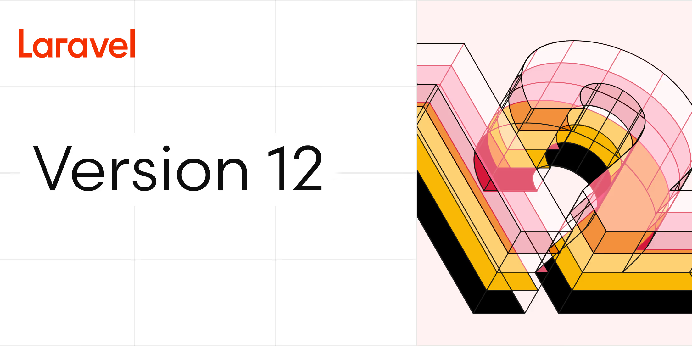

> Basicamente la version de Laravel 12 **actualiza las dependencias ya existentes** y por ello las aplicaciones puede actualizarse a Laravel 12 **sin cambiar el codigo**.

---

## Elementos mas importantes.

Como ya hemos dicho Laravel 12, no ha hecho cambios en cuanto a estructura de proyecto se refiere, pero igual vamos a hacer un breve recordatorio de sus elementos mas importantes.

#### .env:

> El .env es el archivo que se encarga de la configuración del entorno, de la base de datos, tambien de claves y tokens, mensajería, etc...


---

#### Routes:

> Contiene los archivos que agrupan las rutas de la aplicación incluyendo las rutas web y  API, Con los que vamos a trabajar son:
>
> * web.php: que se encarga de definir las rutas que manejan las solicitudes web tradicionales.
> * api.php: Contiene las rutas de la API.
>
> Aunque tenemos otros como pueden ser:
>
> * console.php: registra los comandos de consola personalizados.
> * channels.php: Define los canales de comunicación para notificaciones en tiempo real.

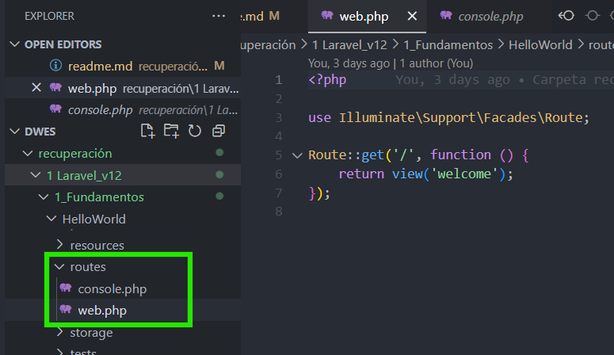

> Esos son los archivos que vienen de base como podemos observar no nos aparece api.php, eso es debido a que aun no lo han implementado por lo cual tendremos que añadirlo despues de crear el proyecto para ello es muy sencillo:

* creamos una nueva terminal:

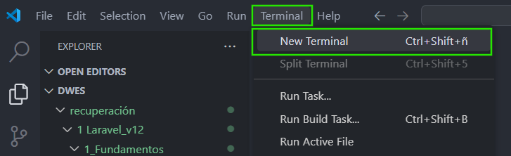

* Nos cercioramos de que estamos en la carpeta del proyecto y a continuación ponemos el siguiente comando:

`php artisan install:api`

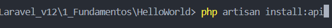

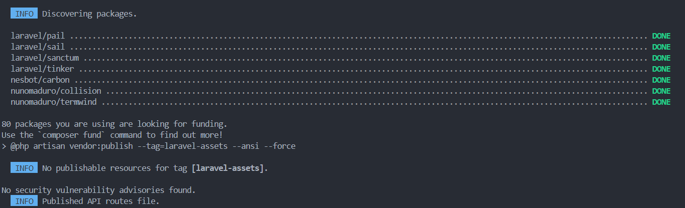

* Una vez termine la accion podemos comprobar que el archivo api.php esta en routes:

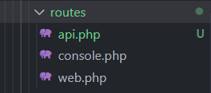

---

#### resources/views:

Como su propio nombre indica son las vistas de nuestro proyecto.

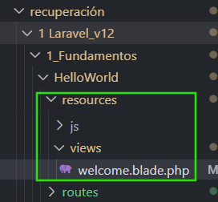

---

#### app/models:

> Donde estaran los modelos.

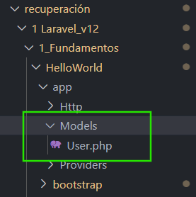

---

#### app/HTTP/ Controllers:

> Donde estaran los controladores del proyecto.

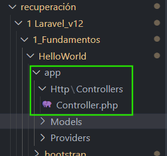

---

#### database:

> basicamente nuestra base de datos del proyecto, archivos a destacar seria el database.sqlite y las carpetas factories, migrations y seeders pero ya las veremos en un futuro mas detenidamente

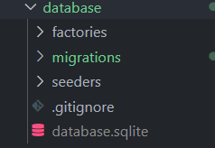

De momento estos serian los elementos mas importantes algunos de ellos los veremos mas a fondo en futuras documentaciones segun vallamos avanzando.

## HelloWorld.

Comencemos con una practica sencilla para ver como funciona, como ya cree un proyecto anteriormente lo hare de nuevo.

> Primero crearemos el proyecto HelloWorld en mi caso lo hice por terminal asi se veria en la terminal:

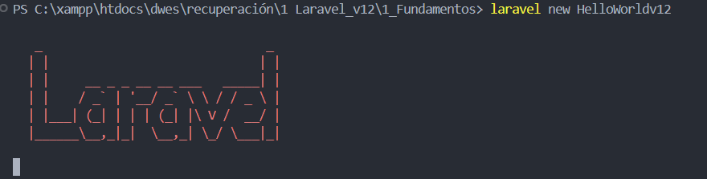

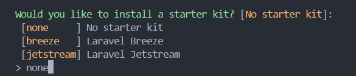

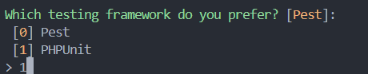


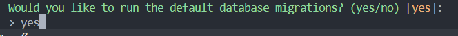

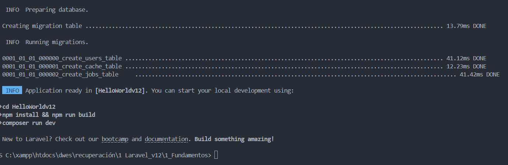

Y ya tendriamos listo nuestro proyecto.

Ahora vamos a modificarlo un poco.

Para iniciar el proyecto debemos poner en la **terminal**:

`php artisan serve`

Pero antes de ello tenemos que asegurarnos que estamos en la carpeta del proyecto, nos moveremos con el comando cd, o tambien podemos hacer click derecho en el proyecto y seleccionar la opcion **Open in Integrated Terminal:**

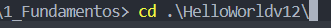

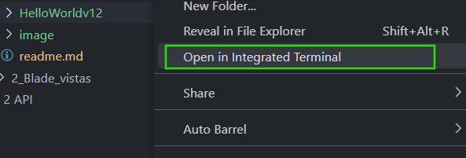

ahora si, podemos ejecutar el comando:

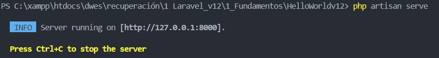

Nuestro proyecto esta encendido.

Si nosotros entramos en esa direccion, nos llevara a la vista de nuestro proyecto:

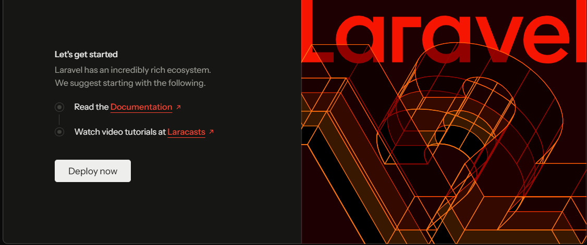

Pero, ¿porque?

Esto se debe a que el proyecto arranca desde la carpeta public, en index.php

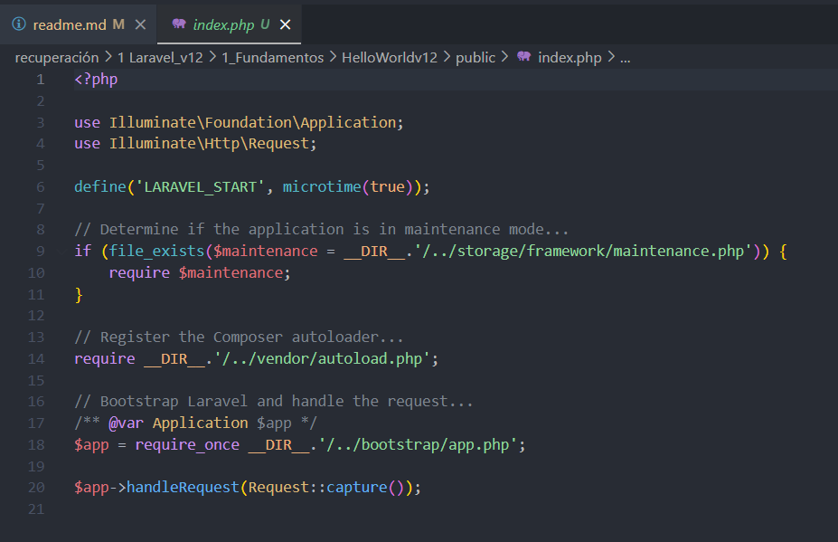

Vemos que define una constante llamada LARAVEL_START, que usa el autoload, bien, para el que no lo sepa, autoload es basicamente un sistema que carga (como su propio nombre indica) automaticamente las clases de php cuando las necesitamos.

> El autoload es generado por Composer y esta en la carpeta vendor.

Vemos que llama tambien al app.php de la carpeta bootstrap, y de ahi pasa al archivo de rutas web.php que es el encargado de finalmente lanzar la vista welcome.blade.php que es la que vimos anteriormente.

#### Modificando

Ahora probemos a modificar el proyecto:

Modificaremos la vista de inicio, para ello vamos a comentar la ruta inicial en web.php


La clase route dispone de métodos estáticos para poder crear las diferentes rutas:

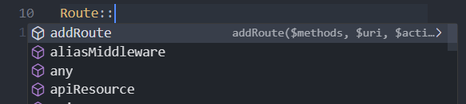

Pero de este vamos a destacar las peticiones HTTP.

* view()
* get()
* post()
* put()
* delete()
* patch()

> A estas rutas siempre deben tener **dos valores** por defecto: **ruta** y **controlador** salvo cuando es una **view** ya que al ser una vista estática no necesita datos y podemos omitir el controlador.

Siempre desde **resources views**:

`Route::view( '/', 'welcome');`

Podemos darle un nombre a nuestra primera vista:

`Route::view( '/', 'welcome')->name('welcome');`

A continuación vamos a crear el directorio **landing** en views:

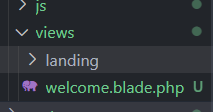

Dentro de esa carpeta crearemos las vistas a las que despues pintara nuestro **enrutador**, para ello debemos de modificarlo pero vayamos paso a paso.

Creemos la vista (**home**):

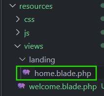

> Es importante recordar que todas las vistas deben tener la terminacion **.blade.php** esto permite el uso del motor de plantillas.

A continuacion pondremos el html que contendra nuestra vista, en mi caso:

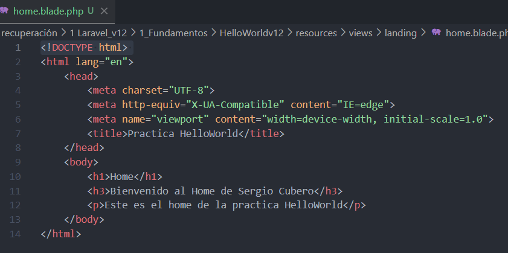

```
<!DOCTYPE html> 
<html lang="en"> 
    <head> 
        <meta charset="UTF-8"> 
        <meta http-equiv="X-UA-Compatible" content="IE=edge"> 
        <meta name="viewport" content="width=device-width, initial-scale=1.0"> 
        <title>Practica HelloWorld</title> 
    </head> 
    <body> 
        <h1>Home</h1>
        <h3>Bienvenido al Home de Sergio Cubero</h3>
        <p>Este es el home de la practica HelloWorld</p> 
    </body> 
</html>
```

> Para que esto funcione debemos de modificar las rutas:

Desde web.php añadimos la ruta que pintara nuestra vista:

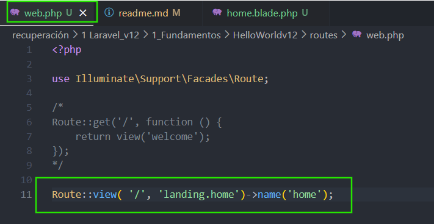

Una vez agregada la ruta iniciemos el proyecto y veamos que sucede.

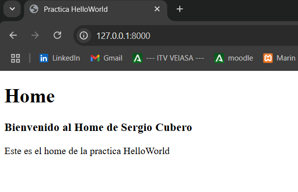

> Ahora probemos a añadir mas rutas, haremos lo siguiente:

Crearemos otra vista (info) en landing y pondremos otro html en la misma similar al anterior:

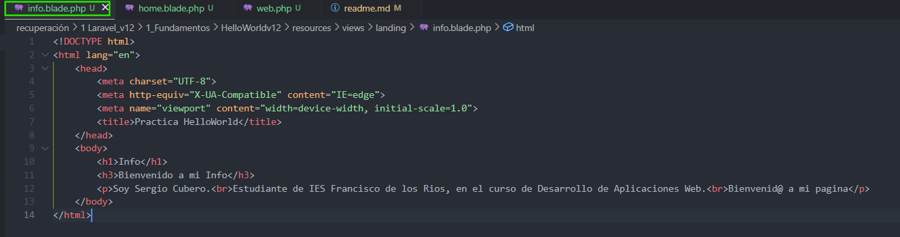

Mi html:

```
<!DOCTYPE html> 
<html lang="en"> 
    <head> 
        <meta charset="UTF-8"> 
        <meta http-equiv="X-UA-Compatible" content="IE=edge"> 
        <meta name="viewport" content="width=device-width, initial-scale=1.0"> 
        <title>Practica HelloWorld</title> 
    </head> 
    <body> 
        <h1>Info</h1>
        <h3>Bienvenido a mi Info</h3>
        <p>Soy Sergio Cubero.<br>Estudiante de IES Francisco de los Rios, en el curso de Desarrollo de Aplicaciones Web.<br>Bienvenid@ a mi pagina</p> 
    </body> 
</html>
```

Ahora nos movemos a web.php y como antes agregamos otra ruta:

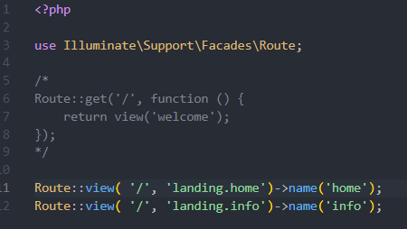

> Al comprobarlo vereis que se ve la vista de info, y os preguntareis ¿por que se ve la vista de info y no la de home si no la hemos comentado?
>
> Vereis, al tener dos rutas definidas por la misma URL, es decir: ' / ' . Laravel hace que la ultima sobreescriva a las anteriores por ello al estar la ruta de info la ultima es la que se muestra.

> ¿Como podemos arreglarlo?

Muy sencillo, cambiando la URL para ello haremos lo siguiente, descomentaremos la ruta de welcome que sera usada como URL principal y cambiaremos la de home y info:

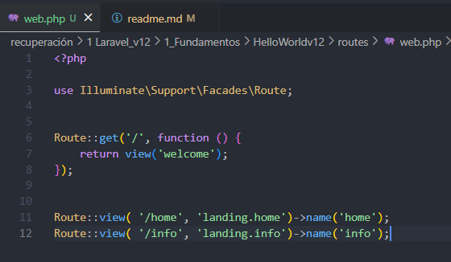

Ahora recargamos la pagina y se veria asi:

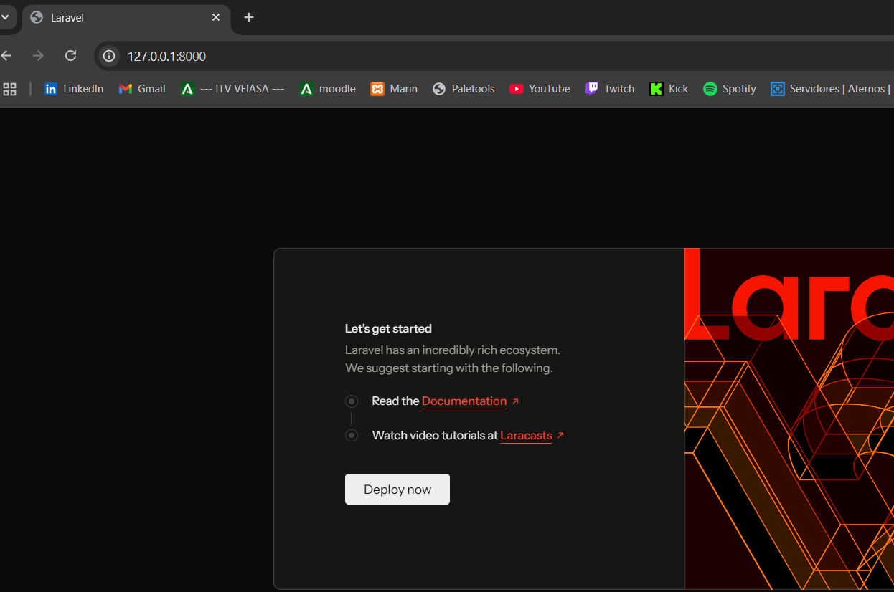

> En el caso de la ruta principal, para movernos simplemente cambiamos la URL a mano (En un futuro mejoraremos eso).

---

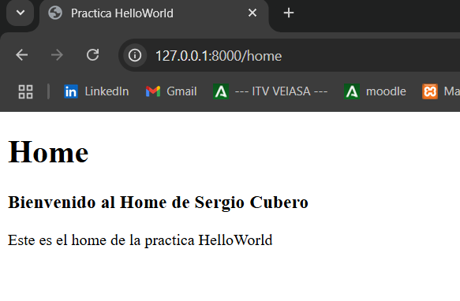

> Home.

---

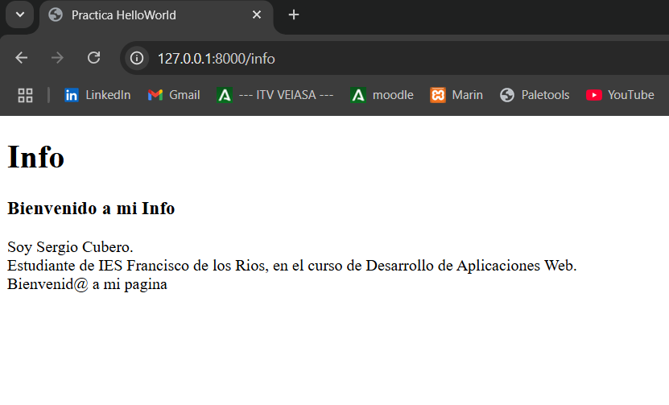

> Info

---
