# Blades.

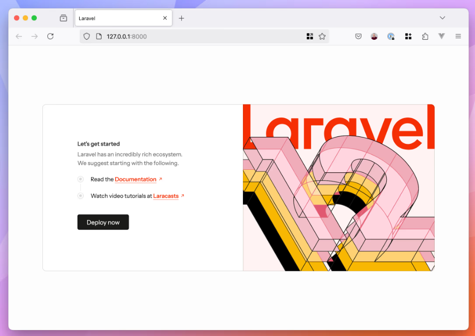

> En este documento, veremos al igual que en el 2 trimestre **las blades en laravel**, practicaremos mientras que aprendemos sobre las blades y documentaremos **paso a paso** para mayor entendimiento.

---

### Indice.

Layouts

Parciales

Rutas Nombradas

Componentes  Blade

Recursos Estáticos

---

## Layouts

Empecemos por crear dos vistas y modificar el web.php, en mi caso copiare la vista home y info pero esta vez borraremos welcome.blade.php y lo cambiaremos por home asi cuando la URL sea ' / ' se mostrara el home:


> asi se veria resources, a continuacion modificamos web.php:

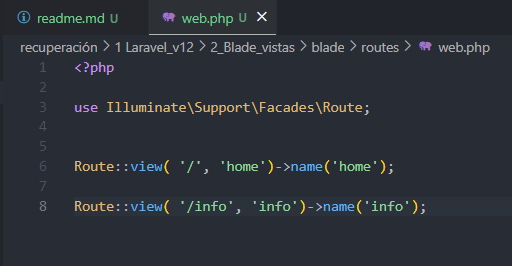

vamos a añadirle mas vistas y mas rutas:

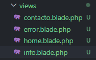

---

> vista **contacto**:

```
<!DOCTYPE html>
<html lang="en">
<head>
    <meta charset="UTF-8">
    <meta name="viewport" content="width=device-width, initial-scale=1.0">
    <title>Practica Blade</title>
</head>
<body>
    <h1>Contacto</h1>
    <form>
        <label for="name">Nombre:</label>
        <input type="text" id="name" placeholder="Escribe tu nombre">

        <label for="email">Correo Electrónico:</label>
        <input type="email" id="email" placeholder="Escribe tu correo">

        <label for="message">Mensaje:</label>
        <textarea id="message" rows="4" placeholder="Escribe tu mensaje"></textarea>

        <button type="button">Enviar</button>
    </form>
</body>
</html>
```

> vista **error**:

```
<!DOCTYPE html>
<html lang="en">
<head>
    <meta charset="UTF-8">
    <meta name="viewport" content="width=device-width, initial-scale=1.0">
    <title>Practica Blade</title>
</head>
<body>
    <h1>Error</h1>
    <p>Lo sentimos, ha ocurrido un error. Por favor, inténtalo de nuevo más tarde.</p>
</body>
</html>
```

---

> Rutas **web.php :**


> Ahora que tenemos todas las vistas y las rutas se puede observar que de alguna manera es poco eficiente, ahora es cuando comenzamos la practica, recordemos que Laravel nos facilitara el trabaja y hara que este sea mas eficiente usando las plantillas de blade.

#### Compartiendo Código

Podemos observar que en varias vistas repetimos codigo, en Laravel hay una manera de usar un codigo base en diferentes vistas eso facilita a la hora de organizar el codigo y lo hace mas limpio visualmente.

Para verlo mejor pongamoslo a prueba:

crearemos la carpeta layouts en views en esta carpeta ubicaremos las partes comunes:

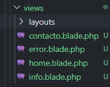

Una vez creada la carpeta layouts, en su interior crearemos el archivo que contendra el codigo repetitivo en mi caso lo llamare landing.blade.php y añadiremos el siguientes html:

```
<!DOCTYPE html>
<html lang="en">
<head>
    <meta charset="UTF-8">
    <meta http-equiv="X-UA-Compatible" content="IE=edge">
    <meta name="viewport" content="width=device-width, initial-scale=1.0">
    <title> @yield('title')</title>
</head>
<body>
    @yield('content')
</body>
</html>
```

> Bien expliquemos para que usamos @yield, es una directiva que se utiliza para definir secciones que pueden ser sobrescritas o rellenadas por otras vistas, basicamente, gracias a esta directiva podremos olvidarnos de repetir codigo innecesario.

Pero entonces como se verian las demas vistas, pues asi:

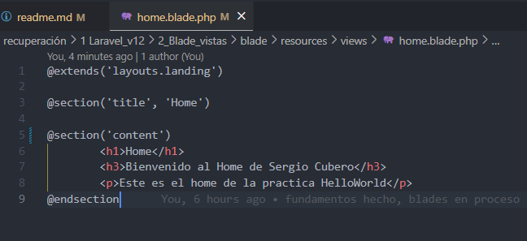

* Con el `@extends` llamamos al archivo landing
* Con el `@section('title', '` le decimos que titulo queremos para esa vista
* Con el `@section('content') ` le decimos lo que queremos para el contenido de nuestra vista

El @section (content) tambien puede ser como he hecho con el title es decir:

`@section('content','`**`este es el contenido ')`** pero en mi caso lo veia mas correcto con el @endsection.

---

## Parciales

> Para nuestra pagina, al tener varias vistas lo mas eficiente seria tener un menu con el que podamos manejar sin necesidad de cambiar la URL a mano, para ello haremos lo siguiente:

Incluiremos en el archivo landing, un header con un nav que a su vez sea una lista con los enlaces a las distintas vistas. Esto hara que te muestre un menu de navegacion en el resto de vistas que incluyan landing.blade.php:

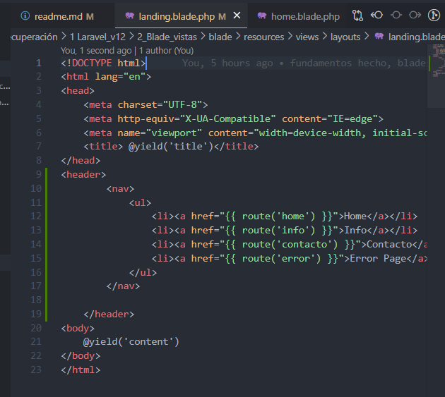

> Mi codigo en landing.blade.php quedaria asi:

```html
<!DOCTYPE html>
<html lang="en">
<head>
    <meta charset="UTF-8">
    <meta http-equiv="X-UA-Compatible" content="IE=edge">
    <meta name="viewport" content="width=device-width, initial-scale=1.0">
    <title> @yield('title')</title>
</head>
<header>
        <nav>
            <ul>
                <li><a href="{{ route('home') }}">Home</a></li>
                <li><a href="{{ route('info') }}">Info</a></li>
                <li><a href="{{ route('contacto') }}">Contacto</a></li>
                <li><a href="{{ route('error') }}">Error Page</a></li>
            </ul>
        </nav>

    </header>
<body>
    @yield('content')
</body>
</html>
```

---

> Asi solucionaremos de momento el problema de repetir codigo, pero se puede dar el caso de que al tener muchas vistas, tengamos que repetirlo igual entonces para mantener un orden y hacerlo de manera mas eficiente.

Para ello creamos la carpeta _partials dentro de layouts, y vamos a crear un archivo donde vamos a poner dicho menu, en mi caso lo llamare menu.blade.php y posteriormente lo incluiremos en landing:

> Asi se veria la estructura del proyecto y el archivo menu.blade.php

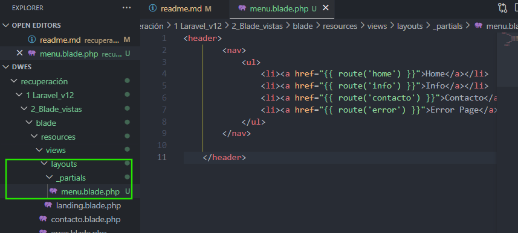

```html
<header>
        <nav>
            <ul>
                <li><a href="{{ route('home') }}">Home</a></li>
                <li><a href="{{ route('info') }}">Info</a></li>
                <li><a href="{{ route('contacto') }}">Contacto</a></li>
                <li><a href="{{ route('error') }}">Error Page</a></li>
            </ul>
        </nav>

    </header>
```

---

> Ahora modificaremos las rutas del mismo menu, haciendo referencia solo a los nombres del enrutador para mayor limpieza, ya que no hay que escribir rutas absolutas.

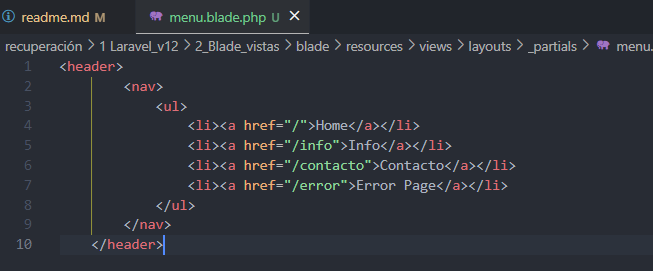

```
<header>
        <nav>
            <ul>
                <li><a href="/">Home</a></li>
                <li><a href="/info">Info</a></li>
                <li><a href="/contacto">Contacto</a></li>
                <li><a href="/error">Error Page</a></li>
            </ul>
        </nav>
    </header>
```

> Comentar que hasta este punto no habia iniciado proyecto, lo cual no es nada recomendable ya que no puedes observar si lo estas haciendo bien, bueno tenia un error pero lo conseguí arreglar, asi que quiero comentarlo por si acaso siguiendo este tutorial a ti tambien te ha dado. (Este error ya habra sido corregido en anteriores capturas o ejemplos).

Basicamente a la hora de hacer el @section('content') , en vez de content yo estaba poniendo body, eso hacia que diera un error al buscar la vista y solo me mostraba el menu.

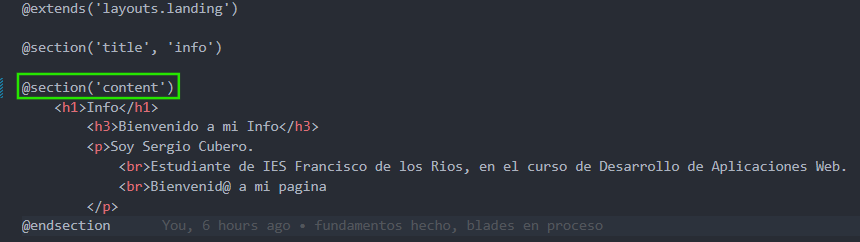

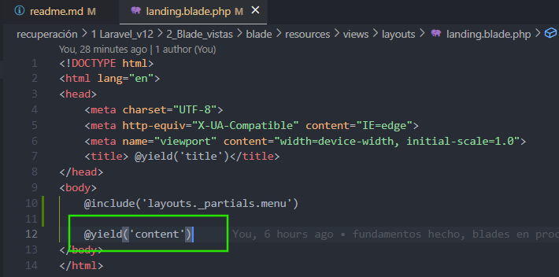

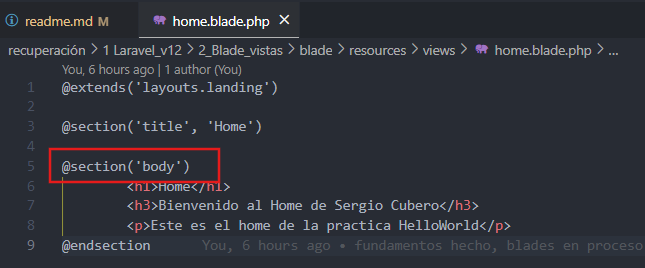

---

> Comprobación.

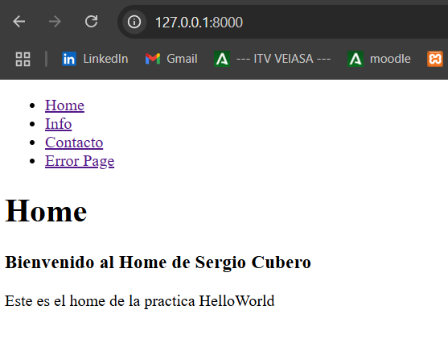

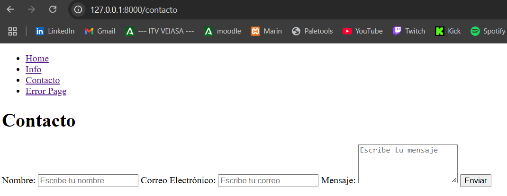

Podemos observar que funciona correctamente.

## Rutas Nombradas

> Ya hemos comentado que es mejor no escribir rutas absolutas y que preferiblemente era mejor simplemente usar los nombres del enrutador.

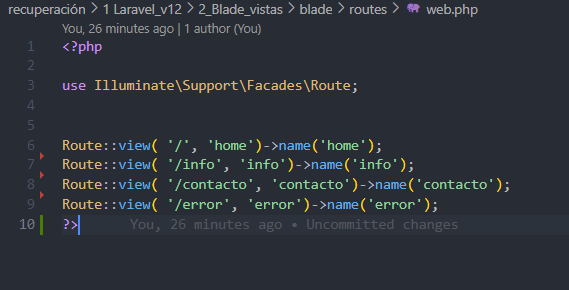

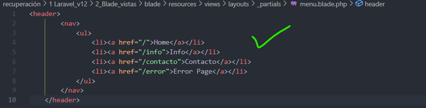

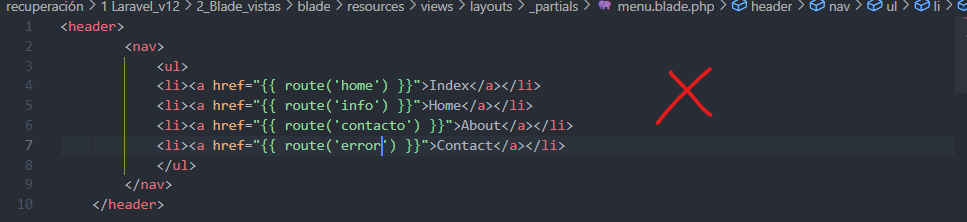

Usar nombres en lugar de rutas absolutas tiene sus beneficios que facilitan la gestión y el mantenimiento del código, especialmente en aplicaciones grandes y complejas.

[info](https://laravelole.es/optimizar-rutas-laravel-seo-rendimiento/)

## Componentes  Blade

> La inclusión del menu.blade no contiene ninguna parte que pueda ser modificada o partes distintas al archivo que lo está llamado, como hicimos con @yield y @section...

Ahora queremos hacer lo mismo pero en vez de como elementos padre, como componentes hijo. Para ello se usan los componentes.

> Vemos un ejemplo con la vista proyectos y un sistema de tarjetas:

creamos la vista proyetos en views:

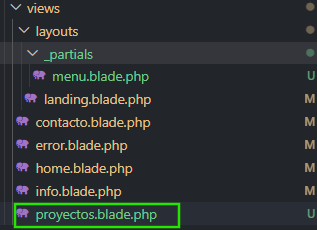

Ahora dentro escribimos el siguiente html.

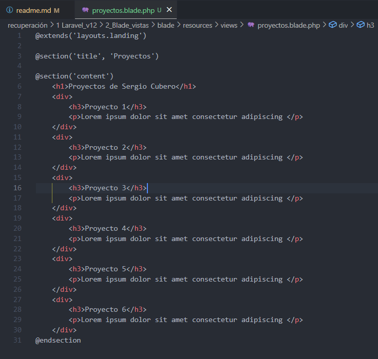

```
@extends('layouts.landing')

@section('title', 'Proyectos')

@section('content')
    <h1>Proyectos de Sergio Cubero</h1>
    <div>
        <h3>Proyecto 1</h3>
        <p>Lorem ipsum dolor sit amet consectetur adipiscing </p>
    </div>
    <div>
        <h3>Proyecto 2</h3>
        <p>Lorem ipsum dolor sit amet consectetur adipiscing </p>
    </div>
    <div>
        <h3>Proyecto 3</h3>
        <p>Lorem ipsum dolor sit amet consectetur adipiscing </p>
    </div>
    <div>
        <h3>Proyecto 4</h3>
        <p>Lorem ipsum dolor sit amet consectetur adipiscing </p>
    </div>
    <div>
        <h3>Proyecto 5</h3>
        <p>Lorem ipsum dolor sit amet consectetur adipiscing </p>
    </div>
    <div>
        <h3>Proyecto 6</h3>
        <p>Lorem ipsum dolor sit amet consectetur adipiscing </p>
    </div>
@endsection
```

---

> Podemos observar que comenzamos a repetir codigo

Creamos la carpeta _components en views y dentro el archivo card.blade.php

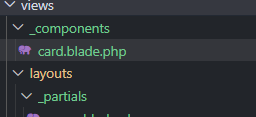

Y añadimos lo siguiente

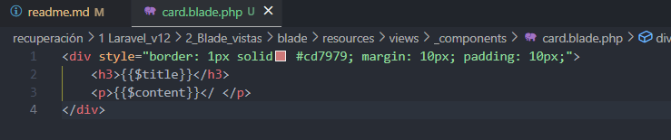

```
<div style="border: 1px solid #cd7979; margin: 10px; padding: 10px;">
    <h3>{{$title}}</h3>
    <p>{{$content}}</ </p>
</div>
```

---

Proseguimos con la modificación de la vista proyectos para ello vamos a usar 2 elementos uno va a ser el `@component('_components.card')` que es el que se va a encargar de incluir el componente card en la vista y el otro el `@slots(...)` que al igual que el yield es el que se va a encargar de darle forma al interior del componente, veamoslo:

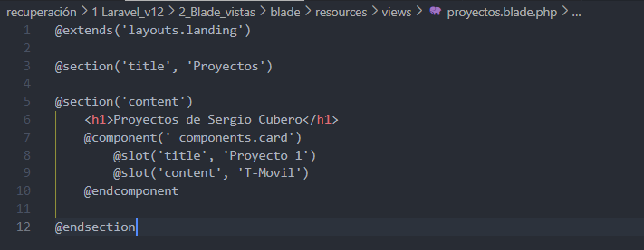

ahora para comprobar que funciona he añadido una ruta en web.php de esta vista y en el menu.blade.php he añadido un enlace.


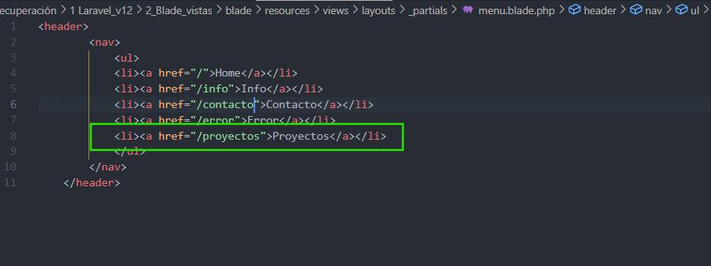

> Asi se veria una vez iniciado:

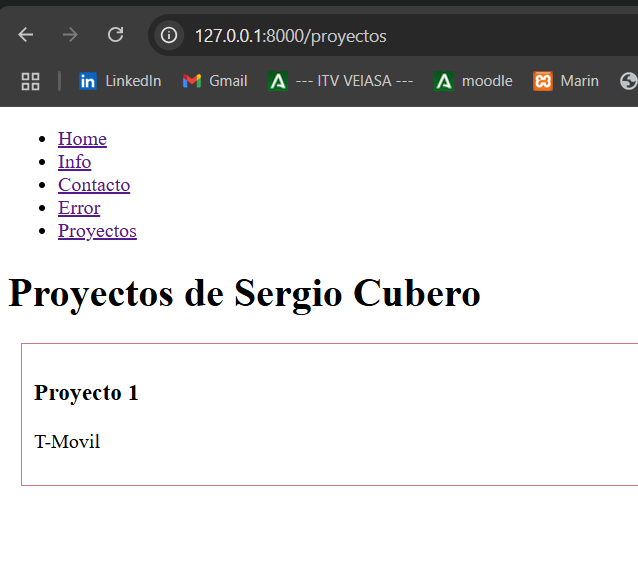

## Recursos Estáticos

> Ya hemos comentado anteriormente que todo comienza por el index.php de la carpeta public.
>
> También podemos cargar recursos que estarán ubicados en la carpeta public.

#### Ejemplo con IMG

Vamos a crear un directorio  **assets** en **public**, y dentro un directorio llamado **img**

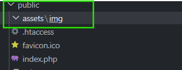

Vamos a guardar una imagen en la carpeta img, ya que le vamos a dar un uso.

En mi caso usare esta imagen en formato .png a la que he llamado laravel:


Y lo incluimos en nuestro card haciendo uso de nuestro método estático asset

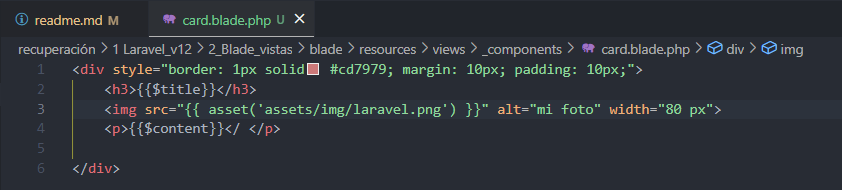

> El codigo se quedaria tal que asi:

```
<div style="border: 1px solid #cd7979; margin: 10px; padding: 10px;">
    <h3>{{$title}}</h3>
    
    <p>{{$content}}</ </p>

</div>
```

Este seria el resultado:

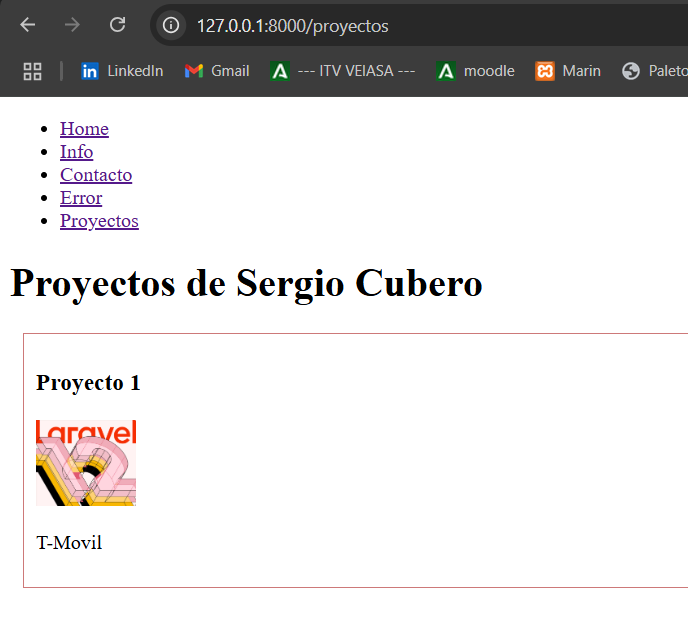

> Esto no solo va a valer para imágenes, sino que también se puede añadir CSS, Javascript...

#### Ejemplo con CSS

Creamos en public la carpeta **css** y creamos el archivo **style.css** con un código de estilos como puede ser:

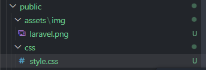

> style.css

```css
body {
    font-family: Arial, sans-serif;
    margin: 0;
    padding: 0;
    background-color: #f4f4f9;
    color: #333;
    line-height: 1.6;
}

h1, h2, h3 {
    color: #444;
    text-align: center;
}

/* Header and Navigation */
header {
    background-color: #007BFF;
    color: white;
    padding: 10px 0;
    box-shadow: 0 2px 5px rgba(0, 0, 0, 0.1);
}

header nav ul {
    list-style: none;
    margin: 0;
    padding: 0;
    display: flex;
    justify-content: center;
}

header nav ul li {
    margin: 0 15px;
}

header nav ul li a {
    color: white;
    text-decoration: none;
    font-weight: bold;
    transition: color 0.3s ease;
}

header nav ul li a:hover {
    color: #FFD700;
}

/* Main Content */
main {
    padding: 20px;
    max-width: 800px;
    margin: 20px auto;
    background: white;
    border-radius: 8px;
    box-shadow: 0 2px 5px rgba(0, 0, 0, 0.1);
}

/* Footer */
footer {
    text-align: center;
    padding: 10px 0;
    background-color: #007BFF;
    color: white;
    margin-top: 20px;
}
```

---

Ahora para usarlo nos dirigiremos a landing.blade.php y pondremos en el head: `<link rel="stylesheet" href="{{ asset('css/style.css') }}">`

Se quedaria asi:

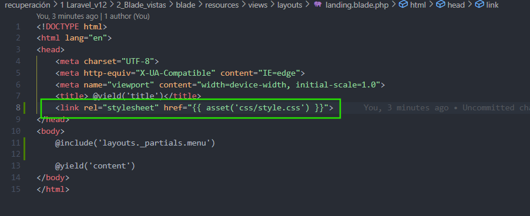

---

> Resultado esperado.

* El menú tendrá un fondo azul con texto blanco y un efecto de hover dorado.
* El contenido principal estará centrado, con un diseño limpio y un fondo blanco.
* El diseño será responsivo y se verá bien en diferentes tamaños de pantalla.

> Resultado final.

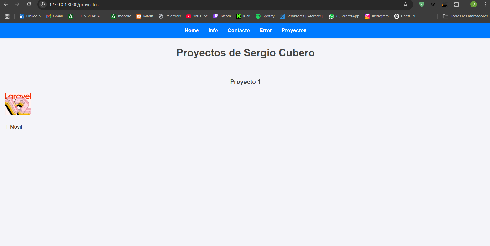

---

> Más adelante, a través de Vite podremos ubicarlo en otro sitio que no sea público


---

# Correcciones:

En la documentacion hablo de las rutas absolutas, pero hay un error y el error es que cuando muestro las imagenes de como deberian de verse los enlaces a las rutas en el menu, confundo las llamadas a los enrutadores por las rutas absolutas. Correccion:

#### Rutas Absolutas


#### LLamada a los Enrutadores


