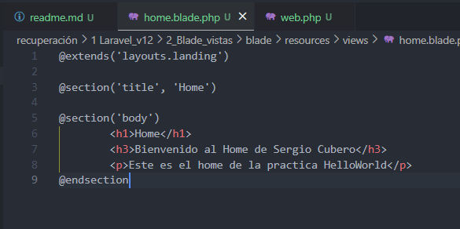

# Blades.


> En este documento, veremos al igual que en el 2 trimestre **las blades en laravel**, practicaremos mientras que aprendemos sobre las blades y documentaremos **paso a paso** para mayor entendimiento.

---

### Indice.

Layouts

Parciales

Rutas Nombradas

Componentes  Blade

Recursos Estáticos

---

## Layouts

Empecemos por crear dos vistas y modificar el web.php, en mi caso copiare la vista home y info pero esta vez borraremos welcome.blade.php y lo cambiaremos por home asi cuando la URL sea ' / ' se mostrara el home:


> asi se veria resources, a continuacion modificamos web.php:


vamos a añadirle mas vistas y mas rutas:


---

> vista **contacto**:

```
<!DOCTYPE html>
<html lang="en">
<head>
    <meta charset="UTF-8">
    <meta name="viewport" content="width=device-width, initial-scale=1.0">
    <title>Practica Blade</title>
</head>
<body>
    <h1>Contacto</h1>
    <form>
        <label for="name">Nombre:</label>
        <input type="text" id="name" placeholder="Escribe tu nombre">

        <label for="email">Correo Electrónico:</label>
        <input type="email" id="email" placeholder="Escribe tu correo">

        <label for="message">Mensaje:</label>
        <textarea id="message" rows="4" placeholder="Escribe tu mensaje"></textarea>

        <button type="button">Enviar</button>
    </form>
</body>
</html>
```


> vista **error**:

```
<!DOCTYPE html>
<html lang="en">
<head>
    <meta charset="UTF-8">
    <meta name="viewport" content="width=device-width, initial-scale=1.0">
    <title>Practica Blade</title>
</head>
<body>
    <h1>Error</h1>
    <p>Lo sentimos, ha ocurrido un error. Por favor, inténtalo de nuevo más tarde.</p>
</body>
</html>
```

---

> Rutas **web.php :**


> Ahora que tenemos todas las vistas y las rutas se puede observar que de alguna manera es poco eficiente, ahora es cuando comenzamos la practica, recordemos que Laravel nos facilitara el trabaja y hara que este sea mas eficiente usando las plantillas de blade.


#### Compartiendo Código

Podemos observar que en varias vistas repetimos codigo, en Laravel hay una manera de usar un codigo base en diferentes vistas eso facilita a la hora de organizar el codigo y lo hace mas limpio visualmente.

Para verlo mejor pongamoslo a prueba:

crearemos la carpeta layouts en views en esta carpeta ubicaremos las partes comunes:


Una vez creada la carpeta layouts, en su interior crearemos el archivo que contendra el codigo repetitivo en mi caso lo llamare landing.blade.php y añadiremos el siguientes html:

```
<!DOCTYPE html>
<html lang="en">
<head>
    <meta charset="UTF-8">
    <meta http-equiv="X-UA-Compatible" content="IE=edge">
    <meta name="viewport" content="width=device-width, initial-scale=1.0">
    <title> @yield('title')</title>
</head>
<body>
    @yield('content')
</body>
</html>
```

> Bien expliquemos para que usamos @yield, es una directiva que se utiliza para definir secciones que pueden ser sobrescritas o rellenadas por otras vistas, basicamente, gracias a esta directiva podremos olvidarnos de repetir codigo innecesario.

Pero entonces como se verian las demas vistas, pues asi:



* Con el `@extends` llamamos al archivo landing
* Con el `@section('title', '` le decimos que titulo queremos para esa vista

* Con el `@section('Body') ` le decimos lo que queremos para el body de nuestra vista

El @section (Body) tambien puede ser como he hecho con el title es decir:

`@section('body','`**`este es el body ')`** pero en mi caso lo veia mas correcto con el @endsection.

---


## Parciales

bgfgnghn

## Rutas Nombradas

vdttbftbgf

## Componentes  Blade

xvfdgbfgbgfg

## Recursos Estáticos

scsdcsdsf
