# Migraciones & Modelos


> En este documento, veremos al igual que en el 2 trimestre **las migraciones y modelos en laravel**, practicaremos mientras que aprendemos sobre estos y documentaremos **paso a paso** para mayor entendimiento.

---

### Indice.

* Introducción
* Configuración en la Capa de Persistencia
* Migraciones
* Rollbacking
* Modelos
* Atajos en la creación

---

## Introducción

#### Migraciones.

Las **migraciones** son como un **control de versiones** para su base de datos, permitiendo a su equipo definir y compartir la definición del esquema de la base de datos de la aplicación.

> Esto quiere decir que son como un "**historial**" o "**guía**" que le dice a tu base de datos cómo debe estructurarse. Son archivos de código que contienen **instrucciones** para **crear, modificar o eliminar tablas y columnas** en tu base de datos.

#### Modelos.

Ya hablamos anteriormente de **Eloquent,** para el que no lo recuerde, Eloquent es un **mapeador objeto-relacional** **(ORM)** que facilita la interacción con la base de datos.

> ¿Que tiene que ver con los Modelos?

Al usar Eloquent, cada tabla de la base de datos tiene un "**modelo**" correspondiente que se utiliza para **interactuar** con ella. Además de recuperar registros de la tabla de la base de datos, los modelos de Eloquent permiten insertar, actualizar y eliminar registros de la tabla.

Hay muchos mas datos interesantes en la documentacion de Laravel: como inspeccionar modelos, como se relacionan los nombres de los modelos a los de las tablas sin necesidad de referenciar, claves primarias...

> [clickea aqui para ver la documentacion](https://laravel.com/docs/12.x/eloquent)   `<- [Control & Click Izquierdo]`

## Configuración en la Capa de Persistencia

La capa de persistencia de una aplicación es la  pieza que permite **almacenar**, **recuperar**, **actualizar** y **eliminar** el **estado de los objetos** que necesitan persistir en un **sistema gestor de datos**.

Vamos a crear un proyecto para configurarla y verla mas detenidamente.

> Nos aseguramos que estamos en nuestra carpeta donde queremos que se encuentre el proyecto. Y ponemos lo siguiente en la terminal:
>
> `laravel new nombreProyecto` **modeldata** en mi caso

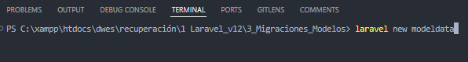

> Ahora os mostrare lo que nos preguntara despues de la linea anterior y que debemos de poner llegados a ese punto.

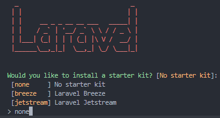

> none

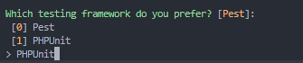

> Es indiferente, pero yo he elegido PHPUnit

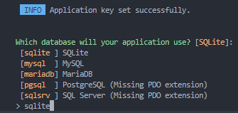

> sqlite

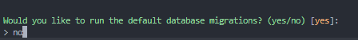

> no

Necesitamos especificar en el archivo .env a que sistema vamos a conectarlo, en nuestro caso vamos a conectarlo con SQLite, todo esto lo podemos ver mas detenidamente en /Config/database.php.

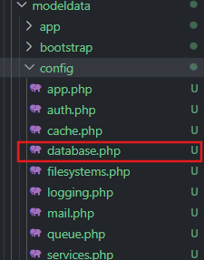

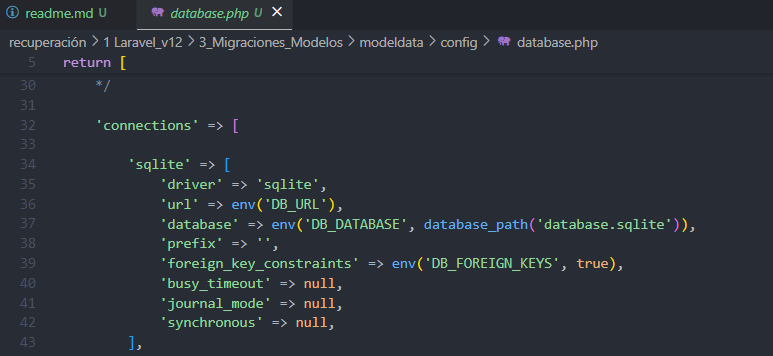

> Si queremos otro sistema, necesitariamos añadir el **driver** a este fichero de configuración.

#### Migrate.

El comando usado para migrar todas nuestras migraciones es el siguiente:

`php artisan migrate`

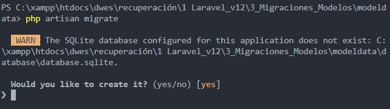

> Nos preguntara si queremos crearlo, a lo que responderemos con yes.

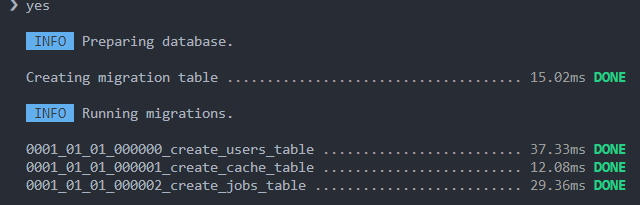

Esto nos creara 3 migraciones predeterminadas que estaran en la carpeta `/database/migrations`.

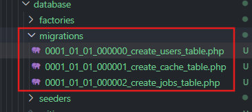

esto nos generara 10 tablas, para verlas solo debemos entrar en el archivo de `/database/database.sqlite`.

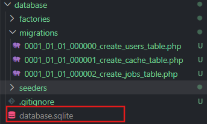

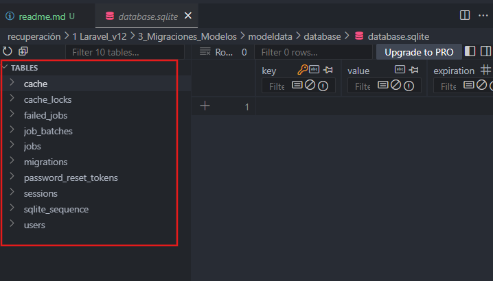

> Si vuelvo a ejecutar de nuevo el comando, detectara que no hay nada que migrar

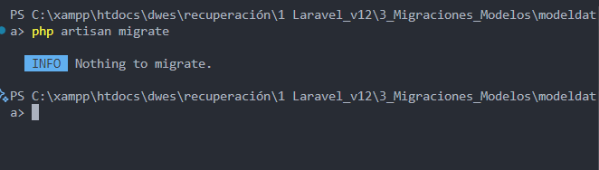

---

## Migraciones

> Ahora vamos a crear un **fichero** para **crear la estructura de nuestro objeto**, asi que **vamos a crear la migracion que se encargara de crear la tabla** y seria lo siguiente.

Dentro de la terminal escribimos el siguiente comando:

`php artisan make:migration (create_books_table)` (Ya que en mi caso lo hare de libros lo llamare asi).

Este es el comando que se encargara de **crear la migracion**, si todo ha ido bien, nos mostrara lo siguiente:

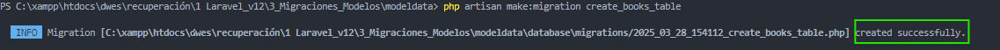

Y ya tendriamos la migracion en su lugar correspondiente

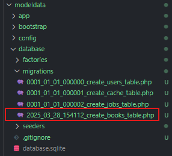

> Antes de seguir centremonos un poco en la migracion que hemos creado

El archivo genera una clase que extiende de la **clase Migration** con dos métodos

* **up**: Info para crear la tabla
* **down**: info para borrar esa migración y hacer rollback

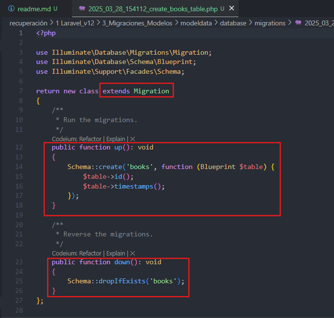

> Hablemos tambien de la clase **Schema**:

La clase **Schema** en Laravel es como un "**constructor**" que te permite **crear**, **modificar** o **eliminar tablas** en tu base de datos

> ¿Qué hace?

Con  **Schema** puedes:

* **Crear tablas**
* **Modificar tablas**
* **Eliminar tablas**

> Las funciones mas comunes son:

* **`Schema::create`**: Crear una tabla nueva.
* **`Schema::table`**: Modificar una tabla existente.
* **`Schema::drop`**: Eliminar una tabla.

> Para mas informacion aqui te dejo la [documentación ](https://laravel.com/docs/12.x/migrations#creating-tables)de Laravel que habla de ello, aqui tambien dejo un short de youtube que explica la clase schema de forma breve y un video que comenta unos tips con dicha clase aparte de los ya mencionados: [short](https://www.youtube.com/shorts/kgkYGb2xHkk) || [video](https://www.youtube.com/watch?v=ev-3ISnFU9o)

---

> nomenclatura de las tablas

Es **IMPORTANTE** que para que funcione bien automatizado las tablas se escriban en plural y todo en minúscula:

Así, la función create recibe dos argumentos: books y function

**Blueprint** es una clase que contiene todos los métodos para generar la estructura de la tabla

* Por defecto nos añade dos campos: id y timestamps.

Vamos a agregar algunos campos para nuestros libros:

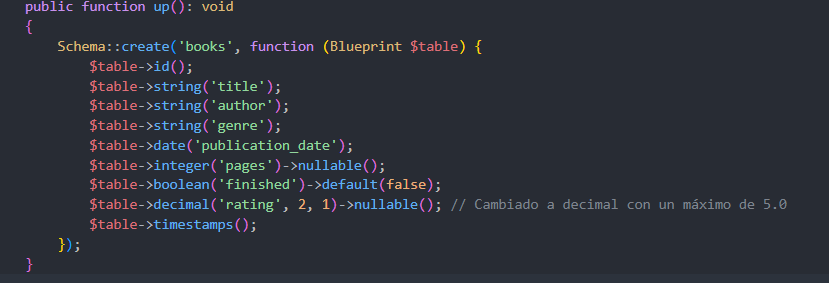

```php
    public function up(): void
    {
        Schema::create('books', function (Blueprint $table) {
            $table->id();
            $table->string('title');
            $table->string('author');
            $table->string('genre');
            $table->date('publication_date');
            $table->integer('pages')->nullable();
            $table->boolean('finished')->default(false);
            $table->decimal('rating', 2, 1)->nullable(); // Cambiado a decimal con un máximo de 5.0
            $table->timestamps();
        });
    }
```

estos son los campos que usaremos.

> Además, a cada una de los campos que hemos creado, podemos añadirle más condiciones, y esto se hace de la siguiente forma encadenando métodos.
>
> Por ejemplo que pueda ser nulo (ya que por defecto son requeridos)

```php
	    $table->integer('pages')->nullable(); // que puede ser nulo
            $table->boolean('finished')->default(false); // que por defecto se inicia falso
            $table->decimal('rating', 2, 1)->nullable(); // Cambiado a decimal con un máximo de 5.0
```

---

Pero **¿como es que no aparece la tabla?** Eso es porque deberemos de ejecutar la migracion primero, para ello haremos lo siguiente

`php artisan migrate`

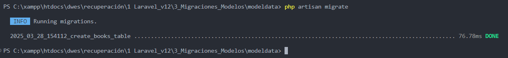

Y ya podemos encontrar la nueva tabla **books**:

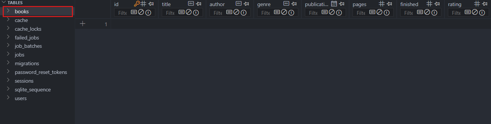

---

## Rollbacking


#### **¿A que nos referimos con Rollbacking?**

Bien, pues imaginemos que nos damos cuenta que algún campo se nos ha **olvidado o debemos cambiar.**

Algo que no debemos hacer bajo ningun concepto es tocar las tablas directamente sobre la base de datos, poque podria deribar en un gran problema, para ello, la mayoria de veces usaremos Rollback.

esto hara que como si de un viaje en el tiempo se tratara de un paso atras, hagamos un ejemplo:

#### Ejemplo Rollback

Recordemos que anteriormente creamos nuestra migracion books, bien, pero resulta que queremos cambiar un campo o añadirlo, primero de todo nos moveremos a la terminal y ejecutaremos lo siguiente:

`php artisan migrate:rollback`

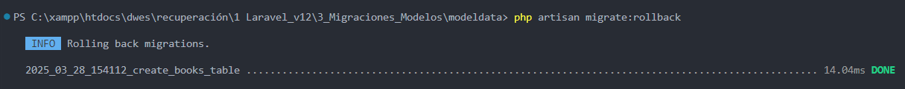

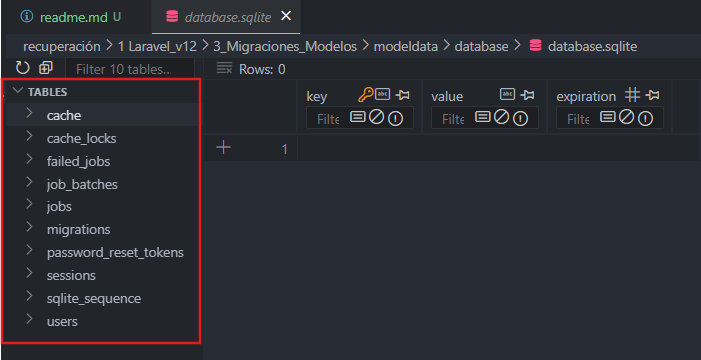

podemos observar que la tabla books desaparece, ahora podemos añadir o modificar los campos de la tabla, en mi caso añadire el campo **views**

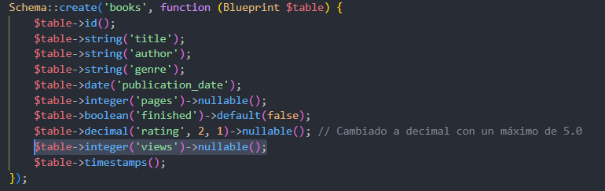

Para volver a migrar los  datos vuelvo a hacer `php artisan migrate` y sucede esto:


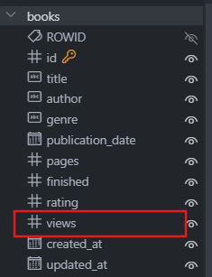

Ya tendriamos views en nuestra tabla books.

En resumen lo que acaba de suceder es lo siguiente:

* **`rollback`** utiliza el método `down()` para deshacer los cambios realizados por `up()`.
* El método `down()` debe definir cómo revertir los cambios realizados en `up()` (por ejemplo, eliminando tablas o columnas).

Y asi conseguimos hacer una manipulación correcta del proceso de migración.

---

> Otros tipos de  **rollback** , hay muchos pero los más comunes son:

1. `php artisan migrate:reset` para borrar todas las migraciones
2. `php artisan migrate:rollback --batch=1` significa que Laravel deshará todas las migraciones que se ejecutaron juntas en ese lote (batch) específico.
3. `php artisan migrate:refresh` para borrar las migraciones y volver a migrar

#### Update table

Algunas veces, cuando hacemos **rollback** perdemos elementos importantes como claves, relaciones, etc.

Asi que lo siguiente que haremos sera imprescindible para que en lugar de **crear** una tabla, nos la **actualice**.

Primero **crearemos la migracion que se encargara de ello**, que sera la siguiente:

> Desde terminal:

`php artisan make:migration update_books_table`

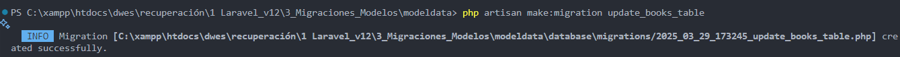

> y aqui la tenemos

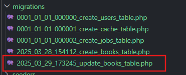

Ahora, en nuestro  **schema** , en vez de create vamos a usar la función table (para modificar la tabla ya creada)

> Tenemos que tener en cuenta que en el down ya no vamos a tirar la tabla entera si no que debemos realizar lo contrario que en el up


---


> Se veria asi:

```php


<?php

use Illuminate\Database\Migrations\Migration;
use Illuminate\Database\Schema\Blueprint;
use Illuminate\Support\Facades\Schema;

return new class extends Migration
{
    /**
     * Run the migrations.
     */
    public function up(): void
    {
        Schema::table('books', function (Blueprint $table) {
            $table->text('summary')->nullable(); // Añade una columna 'summary'
            $table->dropColumn(['views']); // Elimina la columna 'views'
        });
    }

    /**
     * Reverse the migrations.
     */
    public function down(): void
    {
        Schema::table('books', function (Blueprint $table) {
            $table->dropColumn(['summary']); // Elimina la columna 'summary'
            $table->integer('views')->nullable(); // Vuelve a agregar la columna 'views'
        });
    }
};
```

Este ejemplo **agrega una columna** `summary` (resumen del libro) y **elimina la columna** `views`.

Procedemos a ejecutar el comando `php artisan migrate` y se veria asi:

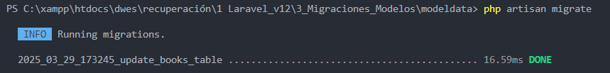

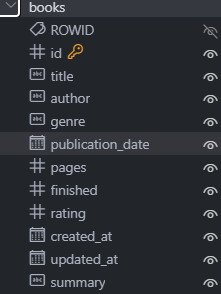

vemos que se **elimino la columna views** y se **añadio la columna summary**, ahora, como yo quiero que la tabla sea como antes, una vez comprobado, **borro el archivo migrate de update** y realizo un **refresh**:

`php artisan migrate:refresh`

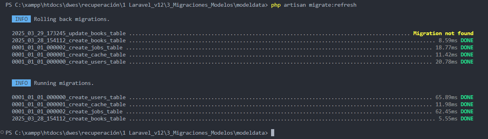

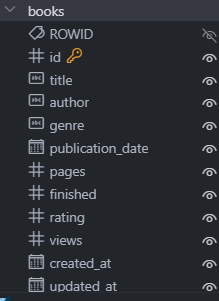

> Vemos que ya tenemos todo como antes.

## Modelos

Anteriormente ya mencionamos sobre los modelos, que el **ORM** (Mapeador Relacional de Objetos) incluido en Laravel se llama **Eloquent** y  **nos permite trabajar con los objetos y relaciones de la base de datos utilizando una sintaxis expresiva**. (*Mas info [aqui](https://codersfree.com/posts/que-es-laravel-eloquent-orm-y-query-builder))*

#### Ejemplo Modelos

Vamos a crear el modelo Book, (importante la nomenclatura de los modelos: sera en **singular**, en **INGLÉS** y con **UpperCamelCase/PascalCase**)

> **UpperCamelCase/PascalCase: cuando la primera letra de cada una de las palabras es mayúscula.**


---


###### ¿¿Como genero el modelo??

El comando para generar un modelo es:

`php artisan make:model NombreModelo` ->(El nombre que quieras, en mi caso Book)


Como vemos se ha creado correctamente, veamos lo que nos ha generado, para ello vayamos a la carpera `app/Models` y habrimos el archivo `Book.php` que seria el que se genero, al menos en mi caso.

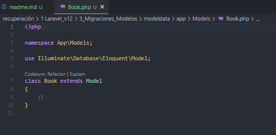

Como vemos aqui esta clase extiende de la clase **Model** en **POO**, la que nos incluirá todas las acciones que necesitemos.

> **Programación Orientada a Objetos (POO):**  **es un paradigma de programación, esto es, un modelo o un estilo de programación que proporciona unas guías acerca de cómo trabajar con él y que está basado en el concepto de clases y objetos**. (*Mas info [aqui](https://intelequia.com/es/blog/post/qu%C3%A9-es-la-programaci%C3%B3n-orientada-a-objetos#:~:text=La%20Programaci%C3%B3n%20Orientada%20a%20Objetos%20(POO)%20es%20un%20paradigma%20de,concepto%20de%20clases%20y%20objetos.)*)

vemos que en laravel 12 **NO** incluye la **factory** por defecto, lpero eso lo veremos mas adelante.

---


###### Flujo del modelo y convención nombre tabla

* ¿¿Como juntaríamos el **modelo** con su respectiva **tabla**??

En el caso de que hayamos escrito bien el nombre del modelo en **ingles** y en **singular**, ya debe saber que trabajara con la tabla **`create_books_table`**.

* ¿¿Pero que pasa en el caso de que **no se respete la convención de nombres**?? Imagina que las tablas estan en español.

Simplemente debemos indicar la **tabla model** dentro de nuestro **modelo**, en mi caso esta bien pero aqui mostrare un **ejemplo de como se haria**:


> Asi quedaria el codigo:

```php
<?php

namespace App\Models;

use Illuminate\Database\Eloquent\Model;

class Book extends Model
{
    // Definimos la tabla asociada al modelo
    // En este caso, la tabla se llama 'books'
    protected $table = 'books'; 
}

```

> Para que todo sea perfectamente funcional faltaría la parte de **Controllers,** pero eso ya lo veremos a su debido momento, sigamos.


###### Fillable, Guard, Cast y Hidden

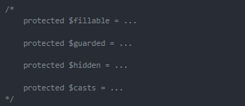

* `fillable`: propiedad que **especifica qué atributos deben ser asignables en masa**. Esto puede configurarse a nivel de clase o de instancia.
* `guarded`: al **contrario** de fillable, se **utiliza para especificar los campos que no se pueden asignar en masa** .
* **`cast`** :  para **forzar** que en el publication_date tenga un formato de fecha, por ejemplo.
* `hidden`: para evitar enviar datos para serializar, por ejemplo hacemos api y en el modelo user no queremos enviar el password, aunque esté encriptado, ya que no es seguro.

> Como dato, cuando tu defines un elemento como **fillable**, **el resto de los elementos no definidos son guard** y **esto tambien vale al contrario**.

Un ejemplo de como quedaría mi modelo:

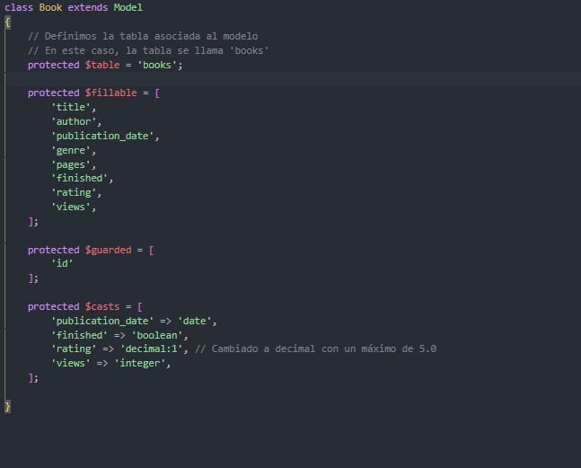

```php
<?php

namespace App\Models;

use Illuminate\Database\Eloquent\Model;

class Book extends Model
{
    // Definimos la tabla asociada al modelo
    // En este caso, la tabla se llama 'books'
    protected $table = 'books'; 

    protected $fillable = [
        'title',
        'author',
        'publication_date',
        'genre',
        'pages',
        'finished',
        'rating',
        'views',
    ];

    protected $guarded = [
        'id'
    ];

    protected $casts = [
        'publication_date' => 'date',
        'finished' => 'boolean',
        'rating' => 'decimal:1', // Cambiado a decimal con un máximo de 5.0
        'views' => 'integer',
    ];

}
```

---

## Atajos en la creación

> Anteriormente hemos realizado primero la migración **create_books_table** y luego el modelo **Book**, bien. **¿y si te dijera que podemos generar ambos con un solo comando?**

Creando el modelo y su migración, creamos un ejemplo **Author** y veremos como crea el **modelo** y su **migración**, **con lo que evitamos errores en la nomenclatura de la tabla y archivos**.

Escribimos el siguiente comando en la terminal:` php artisan make:model Author --migration`

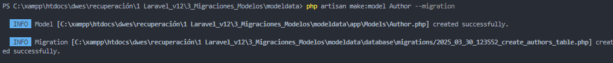

Ahora observemos que nos ha generado:

> Nuestro Modelo:


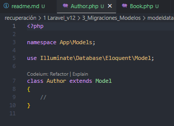

---


Nuestra Migracion:

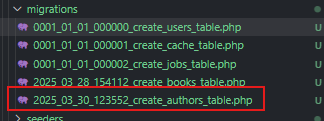

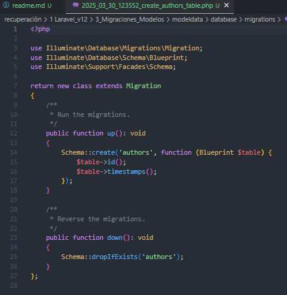

En la **documentacion** de **Laravel** vienen muchas mas opciones: pincha [aqui ](https://laravel.com/docs/12.x/eloquent#generating-model-classes)para verlas.
