# Controladores


> En este documento, veremos al igual que en el 2 trimestre **los controladores en laravel**, practicaremos mientras que aprendemos sobre estos y documentaremos **paso a paso** para mayor entendimiento.

Ya hemos trabajado con vistas (blades), modelos y migraciones, A continuacion finalizaremos el ciclo del MVC (Modelo Vista Controlador) dando así comienzo al breve curso de controladores. Donde veremos diferentes herramientas para acceso a datos tanto a través del ORM Eloquent, SQL y sistemas mixtos...

Tambien veremos rutas y parametros dinámicos.

> Nuestro objetivo es comprender todo el sistema completo.

---

### Indice.

* Introducción.
* Vinculacion Ruta-Controlador-Vista.
* Consultas a modelos, paso de información y pintado.
* Inserción de datos.
* Eloquent.
* SQL RAW.

---

## Introducción.

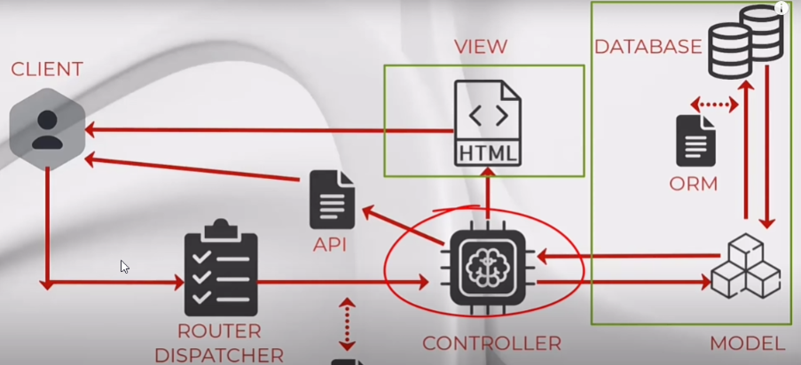

Los **controladores** son clases que manejan la **lógica** de la aplicación y se encargan de procesar las **solicitudes** del **usuario**.

#### Ejemplo

> Por ejemplo, una `UserController` clase podría gestionar todas las **solicitudes entrantes** relacionadas con los **usuarios**, incluyendo **mostrar**, **crear**, **actualizar** y **eliminar usuarios**. Por defecto, los controladores se almacenan en el  `app/Http/Controllers` directorio.

Aqui dejo un video de Coders Free, que explica y trabaja con Controladores en laravel 12, este canal tambien tiene un curso de laravel 12 desde cero. [VIDEO](https://youtu.be/ggIemaYN1Z0).

#### Creacion del Proyecto:

Para esta parte yo usare mi proyecto anterior para terminar de implementarle los controladores, asi que pueden hacer 2 cosas:

1. Clonar el proyecto del apartado anterior y continuar perfeccionandolo.
2. Crear uno de nuevo y ir añadiendo segun vayamos avanzando.

> No importa que opcion elijas porque en ninguna de ellas te vas a perder, ya que explicare detenidamente cada cosa que vaya implementando, modificando y creando asi podras seguir este apartado sin perderte nada.

###### Para crear un proyecto:

1. Con opciones en la instalación: `new laravel NombreProyecto.`
2. Sin opciones: `composer create-project laravel/laravel NombreProyecto.`
3. Tambien puedes crearlo con ***Herd.***

###### Para clonar el proyecto:

> En mi caso voy a donde estaria mi proyecto, el que voy a usar:

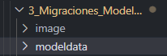

> hago ***click derecho*** y selecciono ***copy:***

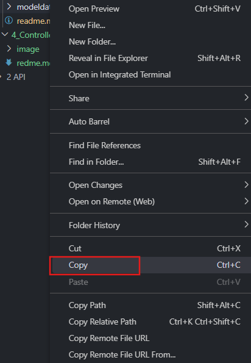

> A continuacion lo **pego** en la que seria la nueva carpeta en la que vamos a trabajar:

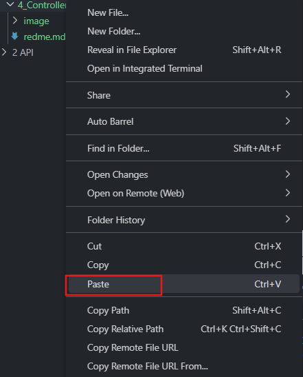

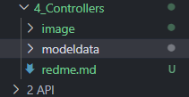

> En mi caso le voy a cambiar el nombre para organizarme mejor, solo hay que hacer ***click derecho*** y seleccionar ***Rename***:

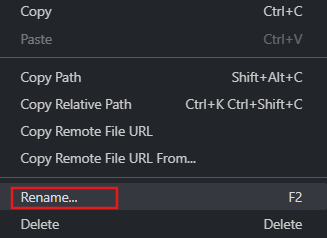

> Asi se veria ahora la carpeta:

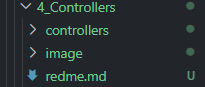

## Vinculación Ruta-Controlador-Vista.

### Configuración inicial

#### Configurar acceso a nueva base de datos.

Como ya hemos mencionado anteriormente es necesario tener una correcta configuracion con nuestra bueva base de datos, para ello habra que modificar nuestro .env, pero eso solo en el caso de que nuestra base de datos no sea SQLite ya que nosotros trabajamos con ella, no necesitamos hacerlo.Es solo en el caso de que tengamos otra base de datos.

Ahora en el .env que se encuentra en la carpeta raiz establecemos los valores de conexion:

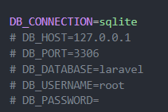

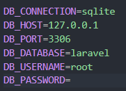

#### Modelado de datos

En mi caso quiero trabajar en todo lo que engloba ***b******ooks:***

Para ello vamos a movernos a la migracion de create_books_table.php.

> Para crear una migracion se usa el siguiente comando en la terminal, una vez dentro del proyecto donde queramos crearla escribimos:

 `php artisan make:migration NombreMigracion`

> (en mi caso create_books_table)

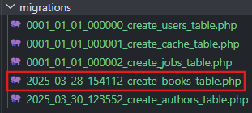

(se encuentra en `controllers/database/migrations`)

Mi tabla esta compuesta de estos datos:

```php
 public function up(): void
    {
        Schema::create('books', function (Blueprint $table) {
            $table->id();
            $table->string('title');
            $table->string('author');
            $table->string('genre');
            $table->date('publication_date');
            $table->integer('pages')->nullable();
            $table->boolean('finished')->default(false);
            $table->decimal('rating', 2, 1)->nullable(); // Cambiado a decimal con un máximo de 5.0
            $table->integer('views')->nullable();
            $table->rememberToken();
            $table->timestamps();
        });
    }
```

Vayamos al modelo ya que debemos añadirle estos elementos:

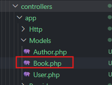

(`controllers/app/models/Book`)

Y lo modificamos de tal manera que quede así:

```php
<?php

namespace App\Models;

use Illuminate\Database\Eloquent\Model;

class Book extends Model
{
    // Definimos la tabla asociada al modelo
    // En este caso, la tabla se llama 'books'
    protected $table = 'books'; 

    protected $fillable = [
        'title',
        'author',
        'genre',
        'publication_date',
        'genre',
        'pages',
        'finished',
        'rating',
        'views',
    ];

    protected $casts = [
        'publication_date' => 'date',
        'finished' => 'boolean',
        'rating' => 'decimal:1', // Cambiado a decimal con un máximo de 5.0
        'views' => 'integer',
    ];
    protected $hidden = [
        'remember_token',
    ];

}

```

> Si nos fijamos hay otros datos del modelo que **NO** aparecen en el **fillable** porque son automáticos y no son cumplimentables, como el **ID** y, además, hay algunos **hidden** y otros que definen el **cast**

#### Migración del contenido

Para realizar la ***migración*** de contenidos desde la consola de comandos ponemos:

`php artisan migrate`

Pero como en la creación del proyecto nosotros ya teniamos una primera migracion y nosotros la hemos modificado tendriamos que hacer un ***refresh***:

`php artisan migrate:refresh`

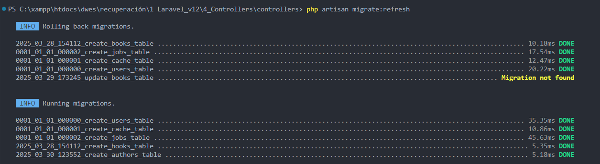

### Creación y configuración del controlador

Vamos a recordar el flujo **modelo vista controlador** (**MVC**)

Primero el usuario escribirá una ruta, esta tendra un controlador asociado, el controlador se encargara de recuperar los datos del modelo ys e los ofrecerá tanto:

1. A una vista
2. A una API

Para que esa información se muestre finalmente.

#### Ejemplo

##### Ruta web.php

En la ruta **web.php**, como ya trabajamos anteriormente fue con el uso de la clase `Route::view`, ahora cambiaremos esa forma de usarla ya que usaremos el **controlador** de cada modelo, esto nos permitirá recuperar los datos.

##### Creamos el controlador

Ya hemos visto en la **introducción** que es un **controlador** y que funcion tiene dentro de Laravel, ahora vamos a proceder a crear uno para nuestro modelo ***Book.***

> Como recomendación es mejor crear un controlador para cada modelo y **NO** solo un controlador que trabaje con todo.

Por ello crearemos el controlador ***BookController** *con el siguiente comando:

`php artisan make:controller NombreController` (BookController)

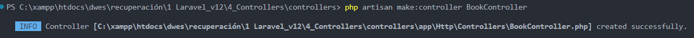

Como hemos podido observar, la **nomenclatura** que hemos usado para el controlador es usando el nombre del **modelo** y la palabra **Controller**, en singular y en ingles Ejem: ***ModelController***

Una vez abrimos el controlador situado en `app/Http/Controllers`

Vemos que la clase extiende de **Controller**. En esta clase definimos **funciones públicas para controlar una vista**, que en  este caso **Index** seria la que va a controlar nuestra primera vista.

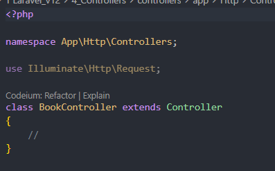

#### Vinculación Ruta-Controlador

Como ya hemos comentado dentro de nuestro controlador se definiran las funciones públicas, hagamos un ejemplo:

Pondre lo siguiente en el controlador:

```php
<?php

namespace App\Http\Controllers;

use Illuminate\Http\Request;

class BookController extends Controller
{
    //
    public function index(){
        dd("Hello World");
      }
}

```

Ahora vamos a configurar la ruta que se encargara de llamar al controlador, nos movemos a `routes/web.php`:

> Dentro de **web.php** vamos a asociar al controlador a la raiz y tambien algo que no nos podemos olvidar es de su importación al mismo.

```php
<?php

use Illuminate\Support\Facades\Route;
use App\Http\Controllers\BookController;

Route::get('/', [BookController::class, 'index']) ->name('book.index');

```

> Asi se veria mi clase ` web.php`:

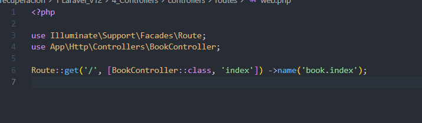

**Resumen:**

* Hemos usado **Use** para importar el controlador
* Hemos usado el **get** sencillo sin autenticación que se vincula a un controlador
* Especificamos ***BookController:class*** que es el método mágico, y como segundo parámetro, la función ***index***
* nombramos la ruta como ***book.index***, ya que es ventajoso.

**Esto lo que hace es:**

Nos aparecerá el texto de ***Hello World*** que se encuentra en nuestro ***BookController*** y se llama desde la ruta de nuestro archivo ***web***

**Probemoslo:**

> Usamos **`php artisan serve`**

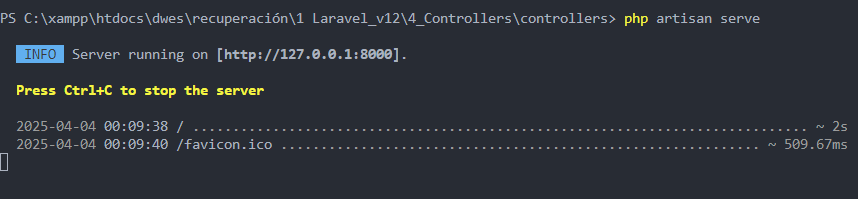

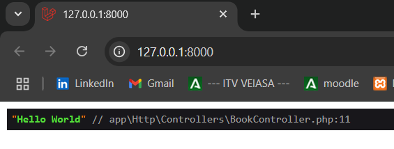

> Lo siguiente que haremos es, **vincular** el controlador a la vista y despues que este **use** los datos.

#### Vinculación Controlador-Vista

Para poder hacer este paso necesitaremos una vista nosotros crearemos el* **index.blade.php***  que se encontrará en `app/resources/views/books/index.blade.php`, aqui adjunto de que va a estar compuesta esta nueva vista:

> Para crearla es tan facil como hacer* **click derecho*** en la carpeta donde queramos dejarla, seleccionar ***new file*** y al ponerle el nombre no olvidarnos de añadir la terminacion ***.blade.php***.

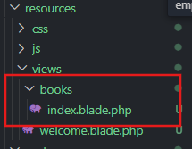

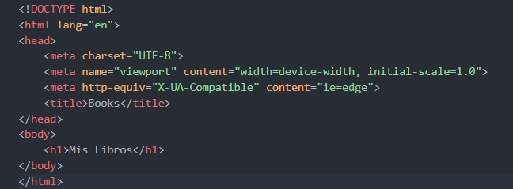

```html
<!DOCTYPE html>
<html lang="en">
<head>
    <meta charset="UTF-8">
    <meta name="viewport" content="width=device-width, initial-scale=1.0">
    <meta http-equiv="X-UA-Compatible" content="ie=edge">
    <title>Books</title>
</head>
<body>
    <h1>Mis Libros</h1>
</body>
</html>
```

Ahora modifiquemos nuestro BookController, ya que la funcion que tenemos la vamos a reemplazar por una que nos mostrara nuestra vista

```php
 public function index(){
        return view ('books.index'); //books es la carpeta y index es el archivo
      }
```

> Asi se veria:

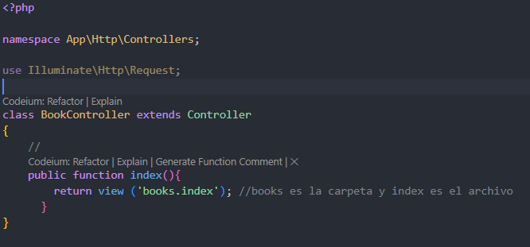

Ahora comprobemos que nos muestra:

> Como yo ya habia iniciado el servidor me ha bastado con recargar la página.

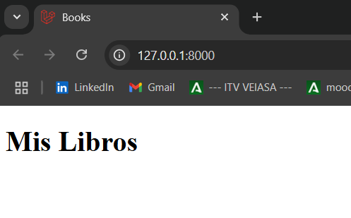

Despues de esta etapa vamos a ver algo aun mas interesante como es el añadir acciones para los modelos con las cuales podemos trabajar para hacer un listado de libros y muchas mas cosas que veremos en un futuro.

## Consultas a modelos, paso de información y pintado.

> Aqui vamos a aprender a traer datos de nuestro modelo el cual sería Book.php.

Primero debemos **importarlo** en nuestro **controlador**, para ello nos vamos a ***BookController.php*** y ponemos lo siguiente con las demas importaciones:

`use App\Models\Book;`

> quedaría tal que así:

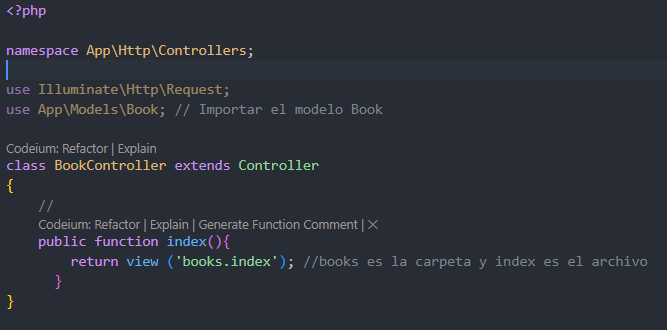

```php
<?php

namespace App\Http\Controllers;

use Illuminate\Http\Request;
use App\Models\Book; // Importar el modelo Book

class BookController extends Controller
{
    //
    public function index(){
        return view ('books.index'); //books es la carpeta y index es el archivo
      }
}

```

Una vez incluido debemos de obtener los elementos de ***Book*** desde la función  ***index*** , todo esto antes de devolver las vistas, para ello lo haremos de la siguiente manera:

> Nos apoyaremos en algunos métodos estáticos como es ***`all`*** para esta labor.

**Eloquent**, es un patrón de diseño que se basa en ***active record*** para describir lo que queremos leer/escribir en la base de datos.

```php
<?php

namespace App\Http\Controllers;

use Illuminate\Http\Request;
use App\Models\Book; // Importar el modelo Book

class BookController extends Controller
{
    //
    public function index(){

        $books = Book::all();

        //Se puede hacer de la siguiente manera
        // return view('books.index', ['books' => $books]); // books es la variable y books es el archivo


        /*pero cuando la clave y el valor son iguales se puede 
        SIMPLIFICAR con compact de la siguiente manera*/
        return view('books.index', compact('books')); //books es la variable y books es el archivo

        return view ('books.index'); //books es la carpeta y index es el archivo
      }
}
```

> Asi se vería mi clase `BookController.php.`

---

Ahora en la vista podemos utilizar esos datos para pintarlos utilizando la ***directiva @foreach*** donde indicamos que para cada libro pintamos un `li` con algún dato del libro:

> Las directivas iterativas como foreach nos permiten recorrer una estructura, mientras que las selectivas nos permiten pintar o no cierta información en función de si se cumple alguna condición( ***@if, @switch, @else, @case...*** )

> index.blade.php:

```html
<!DOCTYPE html>
<html lang="en">
<head>
    <meta charset="UTF-8">
    <meta name="viewport" content="width=device-width, initial-scale=1.0">
    <meta http-equiv="X-UA-Compatible" content="ie=edge">
    <title>Books</title>
</head>
<body>
    <h1>Mis Libros</h1>
    <ul>
        @foreach ($books as $book)
            <li>{{$book->title}}</li>
        @endforeach

    </ul>
</body>
</html>
```

Esto no nos mostrara ninguna lista ya que no tenemos ningun libro guardado.

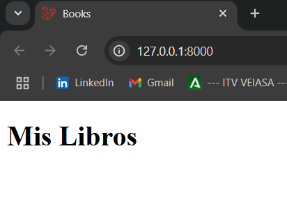

Vamos a a añadirle al codigo anterior un condicionante ***@if*** que nos indique cuando la lista esta vacía:

```html
<body>
    <h1>Mis Libros</h1>
     <!--Si la condición isEmpty() se cumple nos muestra el mensaje-->
     @if($books->isEmpty())
        <p>La lista de libros esta vacía</p>
    @else
    <ul>
        @foreach ($books as $book)
            <li>{{$book->title}}</li>
        @endforeach

    </ul>
    @endif
</body>
```

O de forma mas legible:

```html
<body>
    <h1>Mis Libros</h1>
    <ul>
        @forelse ($books as $book)
            <li>{{$book->title}}</li>
        @empty
            <li>La lista de libros esta vacía</li>   
        @endforelse

    </ul>
</body>
```

Si lo comprobamos nos mostrara esto:

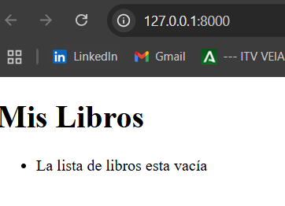

## Inserción de datos.

Ahora para comprobar que todo funciona correctamente vamos a insertar algunos datos, para ello vamos a generar un sistema para cumplimentar con datos de prueba nuestro contenido. seria mas recomendable usar seeder, factory o faker pero eso lo veremos mas a delante.

dentro de web.php vamos a  crear una nueva ruta:

Asi se veria web.php:

```php
<?php

use Illuminate\Support\Facades\Route;
use App\Http\Controllers\BookController;

Route::get('/', [BookController::class, 'index']) ->name('book.index');
Route::get('/create', [BookController::class, 'create']) ->name('book.create');
```

Esta nueva ruta llamara a la funcion ***create** *pero para ello demosle forma desde ` BookController`:

```php
public function create(){
        $book = new Book;
        $book->title = 'El libro de la selva';
        $book->author = 'Rudyard Kipling';
        $book->description = 'Un libro sobre la selva';
        $book->genre = 'Aventura';
        $book->publication_date = '1894-04-01';
        $book->pages = 200;
        $book->finished = true;
        $book->rating = 4.5;
        $book->views = 1000;
        $book->save(); // Guardar el libro en la base de datos

    }
```

> podemos ahorrarnos pasos como el guardado y la necesitdad de poner ***$book*** utilizando **Book::create([ DATOS DEL LIBRO ]);.** La forma anterior no es la única forma, podríamos hacer uso de User:create de la siguiente manera:

```php
 public function create(){
    
        Book::create([
        "title" => "El libro de la selva",
        "author" => "Rudyard Kipling",
        "genre" => "Aventura",
        "publication_date" => "1894-04-01",
        "pages" => 200,
        "finished" => true,
        "rating" => 4.5,
        "views" => 1000
      ]);

      Book::create([
        "title" => "Harry Potter y la piedra filosofal",
        "author" => "J.K. Rowling",
        "genre" => "Fantasía",
        "publication_date" => "1997-06-26",
        "pages" => 223,
        "finished" => true,
        "rating" => 4.8,
        "views" => 5000
      ]);

      Book::create([
        "title" => "El señor de los anillos",
        "author" => "J.R.R. Tolkien",
        "genre" => "Fantasía",
        "publication_date" => "1954-07-29",
        "pages" => 1178,
        "finished" => true,
        "rating" => 5.0,
        "views" => 10000
      ]);

      Book::create([
        "title" => "Frankenstein",
        "author" => "Mary Shelley",
        "genre" => "Ciencia ficción",
        "publication_date" => "1818-01-01",
        "pages" => 280,
        "finished" => true,
        "rating" => 4.2,
        "views" => 2000
      ]);
    }
```

> He aprobechado para meter mas libros.

Una vez creados los libros queremos que se nos ***redirija al contenido de index*** en el que vamos a tener nuestra vista:

> Recordemos no escribir rutas absolutas, para eso tenemos los nombres de los enrutadores.

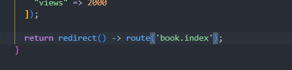

> ***BookController*** se quedaría asi:

```php
<?php

namespace App\Http\Controllers;

use Illuminate\Http\Request;
use App\Models\Book; // Importar el modelo Book


class BookController extends Controller
{
    //
    public function index(){

        $books = Book::all();

        //Se puede hacer de la siguiente manera
        // return view('books.index', ['books' => $books]); // books es la variable y books es el archivo


        /*pero cuando la clave y el valor son iguales se puede 
        SIMPLIFICAR con compact de la siguiente manera*/
        return view('books.index', compact('books')); //books es la variable y books es el archivo

        return view ('books.index'); //books es la carpeta y index es el archivo
      }

      public function create(){

        Book::create([
        "title" => "El libro de la selva",
        "author" => "Rudyard Kipling",
        "genre" => "Aventura",
        "publication_date" => "1894-04-01",
        "pages" => 200,
        "finished" => true,
        "rating" => 4.5,
        "views" => 1000
      ]);

      Book::create([
        "title" => "Harry Potter y la piedra filosofal",
        "author" => "J.K. Rowling",
        "genre" => "Fantasía",
        "publication_date" => "1997-06-26",
        "pages" => 223,
        "finished" => true,
        "rating" => 4.8,
        "views" => 5000
      ]);

      Book::create([
        "title" => "El señor de los anillos",
        "author" => "J.R.R. Tolkien",
        "genre" => "Fantasía",
        "publication_date" => "1954-07-29",
        "pages" => 1178,
        "finished" => true,
        "rating" => 5.0,
        "views" => 10000
      ]);

      Book::create([
        "title" => "Frankenstein",
        "author" => "Mary Shelley",
        "genre" => "Ciencia ficción",
        "publication_date" => "1818-01-01",
        "pages" => 280,
        "finished" => true,
        "rating" => 4.2,
        "views" => 2000
      ]);
  
      return redirect() -> route('book.index');
    }
}

```

Ahora para comprobarlo debemos añadir* **/create*** a la **url**

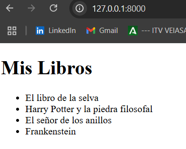

¿que es lo que ha pasado?

Al nosotros poner /create sucedió lo siguiente:

1. sigue por la ruta al UserController función create
2. Crea tres usuarios
3. redirige al index que muestra esos usuarios.

## Eloquent.

En este punto vamos a realizar consultas con Eloquent para consultas más complejas, hasta ahora nos hemos traído todos los datos, pero podemos realizar consultas más complejas en la que vayamos poniendo condicionantes para que la búsqueda por ejemplo de un libro sea más exacta, por ejemplo así:

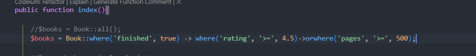

una vez puestas las condiciones debemos ponerle un get() para obtener todos los resultado de la consulta

```php
public function index(){

        //$books = Book::all();
        $books = Book::where('finished', true) -> where('rating', '>=', 4.5)->orwhere('pages', '>=', 500)->get();

        //Se puede hacer de la siguiente manera
        // return view('books.index', ['books' => $books]); // books es la variable y books es el archivo


        /*pero cuando la clave y el valor son iguales se puede 
        SIMPLIFICAR con compact de la siguiente manera*/
        return view('books.index', compact('books')); //books es la variable y books es el archivo

        return view ('books.index'); //books es la carpeta y index es el archivo
      }
```

> También podemos ordenar los resultados que nos vaya a dar la consulta, para eso usaremos el *orderBy(asc* (ascendente) *|| desc* (descendente) *})*

por ejemplo:

```php
$books = Book::where('finished', true) -> 
        where('rating', '>=', 4.5)->
        orwhere('pages', '>=', 500)
        ->orderBy('views', 'desc')
        ->get();
```

---

Si ahora queremos ver la información de el autor para comprobarla, pues nos iremos a nuestra vista `index.blade.php` y desde ahí le diremos que la pinte:

```html
<body>
    <h1>Mis Libros</h1>
    <ul>
        @forelse ($books as $book)
            <li>{{$book->title}} || Escrito por: {{$book->author}}</li>
        @empty
            <li>La lista de libros esta vacía</li>   
        @endforelse

    </ul>
</body>
```

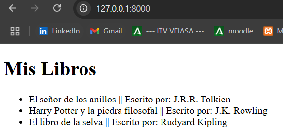

También podemos especificar límites dentro de nuestros resultados usando  ***limit()*** :

```php
 $books = Book::where('finished', true) -> 
        where('rating', '>=', 4.5)->
        orwhere('pages', '>=', 500)
        ->orderBy('views', 'desc')
        ->limit(2) // Limitar a 2 resultados
        ->get();
```

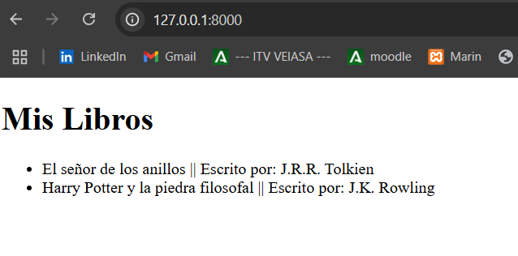

> Hay muchos más métodos que veremos poco a poco.

---

En ningún sitio hemos tenido que realizar una estructura ***SQL*** todas las consultas las hemos hecho a través de los  ***métodos estáticos*** . Es el ***motor ORM de Eloquent*** el que se encarga de realizar la traducción a consultas para nuestra base de datos independientemente de nuestro sistema de base de datos, esto hace que nos mantengamos al margen de nuestro sistema de persistencia.

* Ventaja de eloquent, trabajamos con POO

Eloquent también tiene desventajas como por ejemplo:

* Nuestra lógica de negocio es totalmente dependiente de Laravel, no podríamos extraerla
* No controlamos la eficiencia de las consultas

## SQL RAW.

Vamos a realizar las consultas sin apoyarnos en el ORM para poder utilizar consultas  ***SQL*** , para ello vamos a apoyarnos en la clase DB que nos permite realizar consultas, funciona de la siguiente manera:

> Pero antes debemos importar el elemento DB: `useIlluminate\Support\Facades\DB;// Importar la clase DB para consultas directas a la base de datos`

```php
 $books = DB::select ('select * from books');

        /*pero cuando la clave y el valor son iguales se puede 
        SIMPLIFICAR con compact de la siguiente manera*/
        return view('books.index', compact('books')); //books es la variable y books es el archivo
```

> Eso es para obtener todos los libros.

> Ahora veamos para crearlos:

```php
 public function create(){

        DB::insert(DB::raw('INSERT INTO books VALUE ...'));
      }
```
