# CRUD


> En este documento, veremos al igual que en el 2 trimestre **el crud en laravel**, practicaremos mientras que aprendemos sobre estos y documentaremos **paso a paso** para mayor entendimiento.

---

### Índice.

* Introducción
* Rutas Con Parametros
* Crud Parte I
* Crud Parte II
* Crud Parte III
* Validación y Custom Request
* Gestion de errores y Mensajes de Sesión
* Rutas y Controladores Resource

---

## Introducción

En este tema veremos cómo realizar un **CRUD** Completo.

**Pero... ¿que es un CRUD?**

Como ya sabemos laravel es un popular framework de PHP, se utiliza mayormente para desarrollar webs, para gestionar los datos de la misma en muchas ocasiones se usa un CRUD.

> ¿Que es un CRUD? Es un acrónimo que representa las cuatro operaciones fundamentales para gestionar datos en una base de datos o sistema de almacenamiento:
>
> **Crear, Leer, Actualizar y Borrar =*****(Create, Read, Update, Delete)***. Estas operaciones son esenciales para cualquier aplicación que manipule datos persistentes.

---

## Rutas con parametros

### ¿¿Que son??

> Las rutas con parámetros son  segmentos variables en una URL que permiten a una aplicación web acceder a diferentes recursos o realizar acciones basadas en los valores de esos parámetros. Por ejemplo, una URL con una ruta con parámetro podría ser `/usuarios/{id}`, donde `{id}` es el parámetro que se reemplaza con un valor específico, como `/usuarios/123` para acceder al usuario con ID 123.

Para empezar a trabajar con ello vamos a crear el proyecto, en mi caso voy a copiar y pegar el del paso anterior y le cambiare de nombre a crud, pero tambien podreis crearlo desde cero como ya hemos visto anteriormente, con las distintas formas de hacerlo.

* Composer: `composer create proyect laravel/laravel NombreProyecto.`
* La creación con preguntas de configuración:  `new laravel NombreProyecto`.
* laravel Herd.

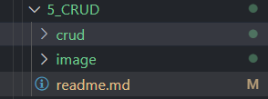

> Asi se veria mi carpeta 5_CRUD.

Ahora nos movemos a `crud/routes/web.php` y podemos observar que el formato de rutas que hemos visto hasta ahora es estatico.

> web.php

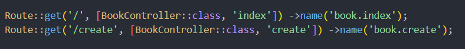

Pero eso lo cambiaremos ya que lo que nos interesa es añadir parametros en las rutas para asi hacerlas dinamicas

y ¿como lo haremos? como en el ejemplo que hemos puesto anteriormente:

Por ejemplo, si tenemos productos, estaría bien poder tener en la ruta el valor del producto que estamos buscando en la URL para que el controlador trabaje con él.

Lo tomará, irá al modelo y buscará la información adecuada o la modificará.


¿Cómo lo hacemos?, incluimos las **llaves** y le damos un nombre para  **{valor}** :

`get('product/{id}')`

---

#### Valores en rutas Opcional

Si es opcional: lo finalizamos con una interrogación

`get('product/{id?}')`

---

A partir de aquí lo vemos en ejemplo, para ello usaremos nuestro controlador de BookController, tambien necesitaremos la migración y el modelo, pero si los quieres generar de cero serian con los siguientes comandos:

* `php artisan make:controller NombreController` para generar el controlador.
* `php artisan make:model Namemodel --migration` para generar el modelo y la migración a la vez.

Ahora modificaremos la migración, asi es como se ve en mi caso:

> `crud\database\migrations\2025_03_28_154112_create_books_table`

```php
<?php

use Illuminate\Database\Migrations\Migration;
use Illuminate\Database\Schema\Blueprint;
use Illuminate\Support\Facades\Schema;

return new class extends Migration
{
    /**
     * Run the migrations.
     */
    public function up(): void
    {
        Schema::create('books', function (Blueprint $table) {
            $table->id();
            $table->string('title');
            $table->string('author');
            $table->string('genre');
            $table->date('publication_date');
            $table->integer('pages')->nullable();
            $table->boolean('finished')->default(false);
            $table->decimal('rating', 2, 1)->nullable(); // Cambiado a decimal con un máximo de 5.0
            $table->integer('views')->nullable();
            $table->rememberToken();
            $table->timestamps();
        });
    }

    /**
     * Reverse the migrations.
     */
    public function down(): void
    {
        Schema::dropIfExists('books');
    }
};

```

Ahora vayamos al modelo y añadimos los campos para que puedan cumplimentarse.

> `app/Models/Book.php`

```php
<?php

namespace App\Models;

use Illuminate\Database\Eloquent\Model;

class Book extends Model
{
    // Definimos la tabla asociada al modelo
    // En este caso, la tabla se llama 'books'
    protected $table = 'books'; 

    protected $fillable = [
        'title',
        'author',
        'genre',
        'publication_date',
        'genre',
        'pages',
        'finished',
        'rating',
        'views',
    ];

    protected $casts = [
        'publication_date' => 'date',
        'finished' => 'boolean',
        'rating' => 'decimal:1', // Cambiado a decimal con un máximo de 5.0
        'views' => 'integer',
    ];
    protected $hidden = [
        'remember_token',
    ];

}

```

y ya podemos hacer la migración, en mi caso no seria necesario pero aqui muestro el comando para hacerlo.

> `php artisan migrate`

A continuación nos moveremos a web.php e importaremos el controller y crearemos una ruta con parametro, se veria tal que así:

> `crud/routes/web.php`

```php
<?php

use Illuminate\Support\Facades\Route;
use App\Http\Controllers\BookController;

//Route::get('/', [BookController::class, 'index']) ->name('book.index');
//Route::get('/create', [BookController::class, 'create']) ->name('book.create');
Route::get('/book/{id}', [BookController::class, 'index'])->name('book.index');
```

y en la función correspondiente del controlador (index) lo incluimos como parámetro: `public function index($id)`

> `crud/app/Http/Controllers/BookController`

```php
<?php

namespace App\Http\Controllers;

use Illuminate\Http\Request;
use App\Models\Book; // Importar el modelo Book
use Illuminate\Support\Facades\DB; // Importar la clase DB para consultas directas a la base de datos

class BookController extends Controller
{
    //
    public function index($id)
    {
       // $books = Book::all();
        return view('books.index', compact('id'));
    }
}

```

Lo siguiente que vamos a hacer es preparar nuestra vista, como ya hemos comentado anteriormente vamos a hacer una vista por modelo creando dentro de resources/views una carpeta con el nombre del modelo en minuscula y dentro de ella nuestro archivo ***.blade.php***

Se quedaria asi en mi caso:

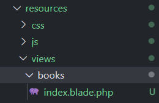

> `crud/resources/views/books/index.blade.php`

```html
<!DOCTYPE html>
<html lang="en">
<head>
    <meta charset="UTF-8">
    <meta name="viewport" content="width=device-width, initial-scale=1.0">
    <meta http-equiv="X-UA-Compatible" content="ie=edge">
    <title>Books</title>
</head>
<body>
    <h1>Mis Libros son {{$id}}</h1>
</body>
</html>
```

Este es el html que he añadido de momento, para probar.

Si ahora levantamos el servicio para verlo:

`php artisan serve`

Y le pasamos algo a la ruta, esta la recepcionará, se la pasará a la vista, y la mostrará:

* `http://127.0.0.1:8000/book/4`
* `http://127.0.0.1:8000/book/muchos`

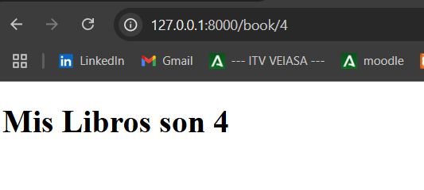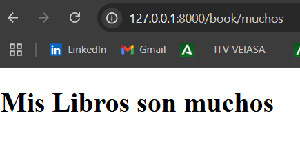

> Esto sólo nos ha servido para ver la variable o parámetro que le pasamos a la ruta y los recogemos, el controlador lo recepciona y se lo pasa a la vista.

Es más normal, pasarlo a un modelo para su búsqueda.

* Si el valor es opcional {id?} , le debemos pasar un **valor por defecto** (o nulo) para el caso que no lo envién por ruta.

Probemoslo, modifiquemos el controller y el web.php

* Controller= `public function index($id = 'UNICOS')`

```php
public function index($id = 'UNICOS')
    {
       // $books = Book::all();
        return view('books.index', compact('id'));
    }
```

* web.php= `Route::get('/book/{id?}', [BookController::class, 'index'])->name('book.index');`

```php
<?php

use Illuminate\Support\Facades\Route;
use App\Http\Controllers\BookController;

//Route::get('/', [BookController::class, 'index']) ->name('book.index');
//Route::get('/create', [BookController::class, 'create']) ->name('book.create');
Route::get('/book/{id?}', [BookController::class, 'index'])->name('book.index');
```

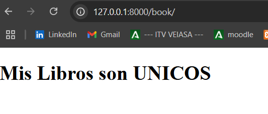

---

Un último apunte es que hay que tener cuidado con el orden de cómo describimos nuestra ruta:

Si por ejemplo creáramos la siguiente ruta:

`Route::get('/book/hello', [BookController::class, 'example'])->name('book.example');`

No se ejecutaría nunca, **¿****por qué?**

En Laravel, las rutas llevan un orden secuencial de arriba a abajo, por tanto si hacemos eso y cuando está esperando el **id** anterior, la tomará como el parámetro y ejecutará la ruta index,

```php
Route::get('/book/{id?}', [BookController::class, 'index'])->name('book.index');
Route::get('/book/hello', [BookController::class, 'example'])->name('book.example');
```

Por tanto, habría que ponerla antes de la ruta index y en general, poner:

* **Primero las rutas más específicas**
* **El caso más general, dejarlo abajo**

> Para evitar problemas, hacer rutas que no provoquen colisiones

```php

//ruta con parámetro opcional, más específica
Route::get('/book/hello', [BookController::class, 'example'])->name('book.example');

//ruta con parámetro opcional, más general
Route::get('/book/{id?}', [BookController::class, 'index'])->name('book.index');

//ruta que evitaría colisiones:
Route::get('/book/detail/{id?}', [BookController::class, 'index'])->name('book.index');

```

Hasta aquí hemos conocido las rutas dinámicas, vamos a dejarlo  **todo vacío de nuevo** . Si queréis conservar cierta trazabilidad y no perder este ejemplo, yo he creado una copia de la carpeta llamada `crud_v1_rutas_dinámicas`

Pero esto es opcional, seguimos en la carpeta original llamada  **crud** .


Para ello:

1. Elimino carpeta de **vistas book**
2. Elimino el interior de la función index del controlador
3. Borro las rutas creadas en **routes**

Una vez hecho lo anterion daremos comienzo al CRUD, empezaremos por incorporar la ruta general, index, nos mostrara todos los libros:

> `Route::get('/book', [BookController::class, 'index'])->name('book.index');`

> `routes/web.php`

```php
<?php

use Illuminate\Support\Facades\Route;
use App\Http\Controllers\BookController;

//Route::get('/', [BookController::class, 'index']) ->name('book.index');
//Route::get('/create', [BookController::class, 'create']) ->name('book.create');
//Route::get('/book/{id?}', [BookController::class, 'index'])->name('book.index');
Route::get('/book', [BookController::class, 'index'])->name('book.index');
```

En el controlador, importamos el modelo y creamos el index:

> `BookController.php`

```php
<?php

namespace App\Http\Controllers;

use Illuminate\Http\Request;
use App\Models\Book; // Importar el modelo Book

class BookController extends Controller
{
    //
    public function index()
    {
        //obtenemos todos los libros de la base de datos
        $books = Book::all();

        //retornamos la vista con los libros, la función compact nos permite pasar variables a la vista en un array asociativo  
        return view('book.index', compact('books'));
    }
}

```

## CRUD Parte 1

Para mostrar lo realizado hasta ahora, vamos a crear unas vistas primero crearemos una carpeta llamada layouts y dentro el archivo app.blade.php que sera el que se encargara de darle forma a las demas vistas como ya vimos en el apartado de blade, y tambien crearemos el archivo index dentro de la carpeta book:

> Asi se vería:

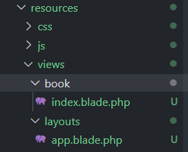

> `app.blade.php`

```html
<!DOCTYPE html>
<html lang="en">
<head>
    <meta charset="UTF-8">
    <meta name="viewport" content="width=device-width, initial-scale=1.0">
    <meta http-equiv="X-UA-Compatible" content="ie=edge">
    <title>Layout</title>
</head>
<body>
        @yield('content')
</body>
</html>

```

---

> `index.blade.php`

```php
@extends('layouts.app')

@section('content')
<ul>
    @forelse ($books as $book)
        <li>
            <a href="#">{{ $book->title }}</a>
        </li>
    @empty
        <li>No data</li>
    @endforelse
</ul>
@endsection
```

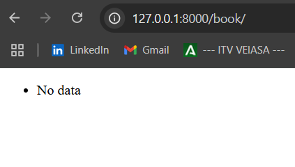

Ese resultado se debe a que no tenemos datos guardados ahora crearemos un formulario para interactuar con nuestro modelo y asi insertar, actualizar y borrar datos.

> Veamos como crear un libro, comencemos por la ruta:

web.php

```php
<?php

use Illuminate\Support\Facades\Route;
use App\Http\Controllers\BookController;

//Route::get('/', [BookController::class, 'index']) ->name('book.index');
//Route::get('/create', [BookController::class, 'create']) ->name('book.create');
//Route::get('/book/{id?}', [BookController::class, 'index'])->name('book.index');
Route::get('/book', [BookController::class, 'index'])->name('book.index');
Route::get('/book/create', [BookController::class, 'create'])->name('book.create');
```

En el controlador, desarrollamos la función create

BookController.php

```php
    //crea create, donde se pasa una vista para que cree un libro
    public function create()
    {
        return view('book.create');
    }
```

Vamos a crear nuestra vista create, cuya sección de contenido será el formulario para crear un libro:

```html
@extends('layouts.app')

@section('content')

    <h1>Crear Libro</h1>
    <form>

        <label for="title">Título</label>
        <input type="text">

        <label for="author">Autor</label>
        <input type="text">

        <label for="genre">Género</label>
        <input type="text">

        <label for="publication_date">Fecha de Publicación</label>
        <input type="date">

        <label for="pages">Páginas</label>
        <input type="number">

        <label for="finished">¿Terminado?</label>
        <input type="checkbox" value="1">

        <label for="rating">Calificación (0.0 - 5.0)</label>
        <input type="number" step="0.1" min="0" max="5">

        <label for="views">Vistas</label>
        <input type="number">

        <input type="submit" value="Create"/>
    </form>

@endsection

```

Asi se vería, mas tarde se vera mejor pero de momento lo dejaremos así.

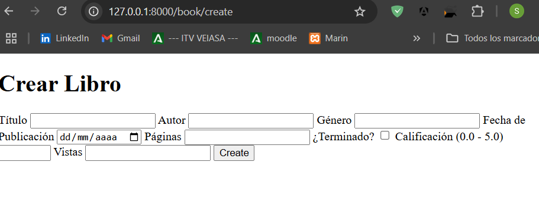

Para evitar poner las rutas, vamos a crear un enlace en la vista index:

```html
@extends('layouts.app')

@section('content')
<h1>Libros</h1>
<a href="{{ route('book.create') }}">Crear libro</a>
<ul>
    @forelse ($books as $book)
        <li>
            <a href="#">{{ $book->title }}</a>
        </li>
    @empty
        <li>No data</li>
    @endforelse
</ul>
@endsection
```

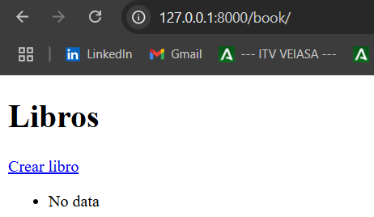

De la misma manera podemos enlazar la vista create con index para establecer una conexion y asi hacer mas comodo el desplazamiento por las distintas vistas.

```php
@section('content')
    <a href="{{ route('book.index') }}">Atras</a>
    <h1>Crear Libro</h1>
    <form>

        <label for="title">Título</label>
        <input type="text">

        <label for="author">Autor</label>
        <input type="text">
.......
```

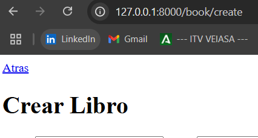

> Ahora, estudiaremos nuevos conceptos para  **poder introducir ese libro**, recogida por formulario, en nuestro sistema.

---

## CRUD Parte 2

Ahora vamos ha escribir una ruta para recibir los datos del formulario, será la ruta store:

```php
Route::post('/book/store', [BookController::class, 'store'])->name('book.store');
```

Lo siguiente que haremos es ir a la vista create y dentro de form escribiremos lo siguiente:

```php
@section('content')
    <a href="{{ route('book.index') }}">Atras</a>
    <h1>Crear Libro</h1>
    <form method="POST" action="{{ route('book.store') }}>
        @csrf

```

> ***@csrf*** es un token de seguridad que implementa Laravel, si no lo incluimos, nos dará **error**

Tenemos que darle un nombre a cada uno de los campos para que luego podamos leer los datos

con lo que nuestro formulario quedaría:

```php
@extends('layouts.app')

@section('content')
    <a href="{{ route('book.index') }}">Atras</a>
    <h1>Crear Libro</h1>
    <form method="POST" action="{{ route('book.store') }}>
        @csrf

       <label for="title">Título</label>
        <input type="text" name="title">

        <label for="author">Autor</label>
        <input type="text" name="author">

        <label for="genre">Género</label>
        <input type="text" name="genre">

        <label for="publication_date">Fecha de Publicación</label>
        <input type="date" name="publication_date">

        <label for="pages">Páginas</label>
        <input type="number" name="pages">

        <label for="finished">¿Terminado?</label>
        <input type="checkbox" name="finished" value="1">

        <label for="rating">Calificación (0.0 - 5.0)</label>
        <input type="number" name="rating" step="0.1" min="0" max="5">

        <label for="views">Vistas</label>
        <input type="number" name="views">


        <input type="submit" value="Create"/>
    </form>

@endsection

```

Ahora tendremos que crear la función store en nuestro controlador, para ello:

Esta función recibe petición ( **Request** ) de tipo POST, que es para crear un elemento.

`public function store(BookRequest $request): RedirectResponse`

**Tenemos muchas opciones, vamos a ir viendo las principales**

* Podemos crear un nuevo objeto, y luego guardarlo
* Podemos usar la función estática create

> Vemos aquí las opciones:

```php
OPCION 1. 
        $book = new Book();
        $book->title = $request->title;
        $book->author= $request->author;
	...
        $book->save();

  OPCION 2.
        $book = Book::create(
            [
                'title' => $request->title,
                'author' => $request->author,
		...
            ]
        );
```

Para la segunda opción Y SOLO SI, nuestras columnas de formulario coinciden en nombre con lass del MODELO (title, author, genre...), podemos hacer uso de la siguiente línea de código mucho más eficiente y corta (es la que vamos a usar).

```php
public function store(Request $request)
    {
       /*OPCION 1. 
            $book = new Book();
            $book->title = $request->title;
            $book->author= $request->author;
	        ...
            $book->save();

        OPCION 2.
            $book = Book::create(
                [
                    'title' => $request->title,
                    'author' => $request->author,
		            ...
                ]
        );*/ 

        Book::create($request->all());

        return redirect()->route('book.index');
  
  
    }
```

> Ya vemos como se están creando las notas y redirigiendo al index.

---

Para la siguiente función necesitaremos un parametro como puede ser id ya que vamos a actualizar el contenido de un libro, gracias a ese parametro encontraremos ese libro especifico que queremos modificar.

> **OJO** la gente suele equivocarse y añadir el simbolo de dolar de **PHP** cuando se elabora la ruta.

> web.php

```php
<?php

use Illuminate\Support\Facades\Route;
use App\Http\Controllers\BookController;

//Route::get('/', [BookController::class, 'index']) ->name('book.index');
//Route::get('/create', [BookController::class, 'create']) ->name('book.create');
//Route::get('/book/{id?}', [BookController::class, 'index'])->name('book.index');
Route::get('/book', [BookController::class, 'index'])->name('book.index');
Route::get('/book/create', [BookController::class, 'create'])->name('book.create');
Route::post('/book/store', [BookController::class, 'store'])->name('book.store');
Route::get('/book/edit/{book}', [BookController::class, 'edit'])->name('book.edit');
```

> BookController.php

```php
    public function edit(Book $book)
    {
       //$book = Book::find($id);  NO NECESARIO. Lo hace de forma implícita
        return view('book.edit', compact('book'));
    }
```

Asi se vería tanto la ruta, como la funcion editar en el controlador.

---

**Creamos vista edit.blade.php**

Como antes, extendemos layout, su protección csrf y añadimos los campos que tiene el libro editables:

* En el value, le añadimos el contenido actual del libro con `value="{{ $note->title }}`
* Vinculamos el enlace para editarlo y para visualizarlo en la vista INDEX
* Quiero que si pulso editar, me lleve a su formulario de edición (edit.blade.php)

> `index.blade.php`

```php
@extends('layouts.app')

@section('content')
<h1>Libros</h1>
<a href="{{ route('book.create') }}">Crear libro</a>
<ul>
    @forelse ($books as $book)
        <li>
            <a href="#">{{ $book->title }}</a> |
            <a href="{{ route('book.edit', $book->id) }}">EDITAR</a> |
            <a href="#">ELIMINAR</a> |
        </li>
    @empty
        <li>No data</li>
    @endforelse
</ul>
@endsection
```

Crearemos la vista edit a continuación.

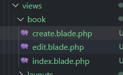

edit.blade.php

```html
@extends('layouts.app')

@section('content')
    <a href="{{ route('book.index') }}">Atras</a>

    <h1>Crear Libro</h1>
    <form method="POST" action="{{ route('book.store') }}>
        @csrf

       <label for="">Título</label>
        <input type="text" name="title">

        <label for="">Autor</label>
        <input type="text" name="author">

        <label for="">Género</label>
        <input type="text" name="genre">

        <label for="">Fecha de Publicación</label>
        <input type="date" name="publication_date">

        <label for="">Páginas</label>
        <input type="number" name="pages">

        <label for="">¿Terminado?</label>
        <input type="checkbox" name="finished" value="1">

        <label for="">Calificación (0.0 - 5.0)</label>
        <input type="number" name="rating" step="0.1" min="0" max="5">

        <label for="">Vistas</label>
        <input type="number" name="views">


        <input type="submit" value="Update"/>
    </form>

@endsection

```

## CRUD Parte 3

En este punto completaremos la actualización del valor, eso lo llevaremos a cabo con el metodo PUT.

`Route::put('/book/update/{book}', [BookController::class, 'update' ])->name('book.update');`

Ahora, en el formulario edit, ya podemos marcarle la acción/ruta a la que lleva el usuario al que le pasaremos el ID del libro

> `web.php`

```php
<?php

use Illuminate\Support\Facades\Route;
use App\Http\Controllers\BookController;

//Route::get('/', [BookController::class, 'index']) ->name('book.index');
//Route::get('/create', [BookController::class, 'create']) ->name('book.create');
//Route::get('/book/{id?}', [BookController::class, 'index'])->name('book.index');
Route::get('/book', [BookController::class, 'index'])->name('book.index');
Route::get('/book/create', [BookController::class, 'create'])->name('book.create');
Route::post('/book/store', [BookController::class, 'store'])->name('book.store');
Route::get('/book/edit/{book}', [BookController::class, 'edit'])->name('book.edit');
Route::put('/book/update/{book}', [BookController::class, 'update'])->name('book.update');
```

> `edit.blade.php`

```html
@extends('layouts.app')

@section('content')
    <a href="{{ route('book.index') }}">Atras</a>

    <h1>Editar Libro</h1>
    <form action="{{ route('book.update', $book->id) }}" method="POST">
        @csrf

       <label for="">Título</label>
        <input type="text" name="title">

        <label for="">Autor</label>
        <input type="text" name="author">

        <label for="">Género</label>
        <input type="text" name="genre">

        <label for="">Fecha de Publicación</label>
        <input type="date" name="publication_date">

        <label for="">Páginas</label>
        <input type="number" name="pages">

        <label for="">¿Terminado?</label>
        <input type="checkbox" name="finished" value="1">

        <label for="">Calificación (0.0 - 5.0)</label>
        <input type="number" name="rating" step="0.1" min="0" max="5">

        <label for="">Vistas</label>
        <input type="number" name="views">


        <input type="submit" value="Update"/>
    </form>

@endsection

```

**Verbos PUT, ... con HTML**

Vamos a pensar un aspecto importante:

* En nuestro **CRUD** estamos enviando los verbos **HTTP: POST, GET,  PUT, DELETE ...**
* **Pero sabemos que los formularios HTML no contemplan esos métodos, sólo GET y POST**
* **Por tanto hay que específicarlo con la directiva BLADE @method.**
* **`@method('PUT') <!-- Esto es porque html no permite el metodo put, así que lo ponemos con esta etiqueta -->`**
* **Laravel ya va a entender mejor que vamos a usar PUT**

Con esto, vamos al controlador para ejecutar esta acción **UPDATE**, que recibe dos valores: La request (petición) y el libro.

* Recordamos añadir el Book para que Laravel busque por el ID pasado
* Recordamos, como los valores coinciden con los del modelo, podemos usar `>update($request->all());`
* Otra forma vista anteriormente es a través de la POO
* Pero, vamos a usar la función update estática de Book::class
* Por último redirigimos
* Comprobamos que se ejecuta bien

# ERRORComprobación del update

---

#### Ruta, vista y método SHOW

Vamos a hacer un metodo que nos permite ver los datos de un libro.

> `web.php:`

```php
<?php

use Illuminate\Support\Facades\Route;
use App\Http\Controllers\BookController;

//Route::get('/', [BookController::class, 'index']) ->name('book.index');
//Route::get('/create', [BookController::class, 'create']) ->name('book.create');
//Route::get('/book/{id?}', [BookController::class, 'index'])->name('book.index');
Route::get('/book', [BookController::class, 'index'])->name('book.index');
Route::get('/book/create', [BookController::class, 'create'])->name('book.create');
Route::post('/book/store', [BookController::class, 'store'])->name('book.store');
Route::get('/book/edit/{book}', [BookController::class, 'edit'])->name('book.edit');
Route::put('/book/update/{book}', [BookController::class, 'update'])->name('book.update');
Route::get('/book/show/{book}', [BookController::class, 'show'])->name('book.show');
```

> `BookController.php`

```php
public function show(Book $book)
    {
        return view('book.show', compact('book'));
    }
```

Ahora crearemos la vista de show:

```html
@extends('layouts.app')

@section('content')
<a href="{{ route('book.index') }}">Back</a>
<h1>Titulo:  {{ $book->title }}</h1>
<h2>Autor: {{ $book->author }}</h2>
<p>Genre: {{ $book->genre }}</p>
<p>Publication Date: {{ $book->publication_date }}</p>
<p>Pages: {{ $book->pages }}</p>
<p>Finished: {{ $book->finished ? 'Yes' : 'No' }}</p>
<p>Rating: {{ $book->rating }}</p>
<p>Views: {{ $book->views }}</p>
@endsection
```

Ahora el index le añadimos la ruta para mostrarlo, pasándole el ID así:

> `index.blade.php`

```html
@extends('layouts.app')

@section('content')
<h1>Libros</h1>
<a href="{{ route('book.create') }}">Crear libro</a>
<ul>
    @forelse ($books as $book)
        <li>
            <a href="#">{{ $book->title }}</a> |
            <a href="{{ route('book.edit', $book->id) }}">EDITAR</a> |
            <a href="#">ELIMINAR</a> |
            <a href="{{ route('book.show', $book->id) }}">Ver {{ $book->title }}</a> |
        </li>
    @empty
        <li>No data</li>
    @endforelse
</ul>
@endsection
```

Ya podríamos verla desde el index

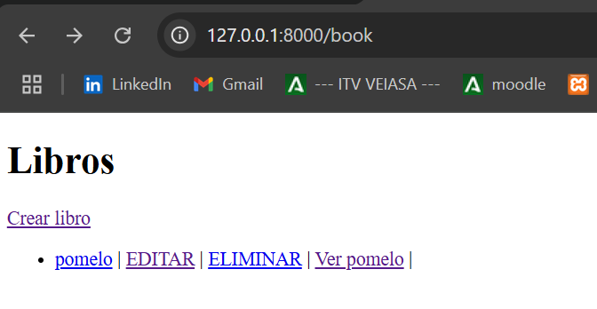

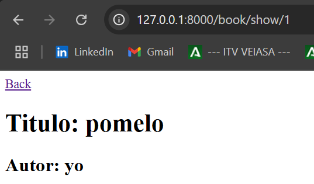

#### DELETE

Tiene una pequeña diferencia con los demas metodos , y es que directamente implementamos la funcionalidad aquí sin necesidad de enviar ningún formulario, ya que no requiere de información adicional aparte de su ID que se conoce desde el INDEX

> Añadimos en primer lugar la ruta para DELETE

> `web.php`

```php
<?php

use Illuminate\Support\Facades\Route;
use App\Http\Controllers\BookController;

//Route::get('/', [BookController::class, 'index']) ->name('book.index');
//Route::get('/create', [BookController::class, 'create']) ->name('book.create');
//Route::get('/book/{id?}', [BookController::class, 'index'])->name('book.index');
Route::get('/book', [BookController::class, 'index'])->name('book.index');
Route::get('/book/create', [BookController::class, 'create'])->name('book.create');
Route::post('/book/store', [BookController::class, 'store'])->name('book.store');
Route::get('/book/edit/{book}', [BookController::class, 'edit'])->name('book.edit');
Route::put('/book/update/{book}', [BookController::class, 'update'])->name('book.update');
Route::get('/book/show/{book}', [BookController::class, 'show'])->name('book.show');
Route::delete('/book/destroy/{book}', [BookController::class, 'destroy'])->name('book.destroy');
```

Vamos al index y observamos com ahora NO podemos pasarle un enlace a DELETE ya que no tiene ningún formulario asociado:

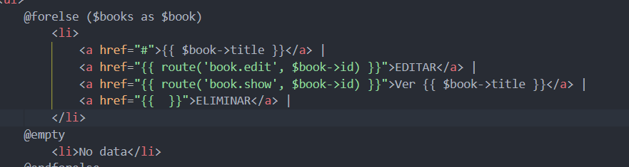

¿¿Y como lo llamaremos??

1. hacemos un formulario desde el index
2. Le indicamos que el método es DELETE (y no post)
3. Aplicamos el CSRF
4. añadimos el input submit que enviará la info del libro a borrar

**Quedaría así:**

> `index.blade.php`

```html
@extends('layouts.app')

@section('content')
<h1>Libros</h1>
<a href="{{ route('book.create') }}">Crear libro</a>
<ul>
    @forelse ($books as $book)
        <li>
            <a href="#">{{ $book->title }}</a> |
            <a href="{{ route('book.edit', $book->id) }}">EDITAR</a> |
            <a href="{{ route('book.show', $book->id) }}">Ver {{ $book->title }}</a> |
            <form action="{{ route('book.destroy', $book->id) }}" method="POST">
                @method('DELETE')
                @csrf
                <input type="submit" value="BORRAR"/>
            </form>
        </li>
    @empty
        <li>No data</li>
    @endforelse
</ul>
@endsection
```

**Y el controller se vería asi:**

```php
<?php

namespace App\Http\Controllers;

use Illuminate\Http\Request;
use App\Models\Book; // Importar el modelo Book


class BookController extends Controller
{
    //
    public function index()
    {
        //obtenemos todos los libros de la base de datos
        $books = Book::all();

        //retornamos la vista con los libros, la función compact nos permite pasar variables a la vista en un array asociativo  
        return view('book.index', compact('books'));
    }

    //crea create, donde se pasa una vista para que cree un libro
    public function create()
    {
        return view('book.create');
    }

    //crea store, donde se guarda el libro en la base de datos
    public function store(Request $request)
    {
       /*OPCION 1. 
            $book = new Book();
            $book->title = $request->title;
            $book->author= $request->author;
	        ...
            $book->save();

        OPCION 2.
            $book = Book::create(
                [
                    'title' => $request->title,
                    'author' => $request->author,
		            ...
                ]
        );*/ 

        Book::create($request->all());

        return redirect()->route('book.index');   
    }

    public function edit(Book $book)
    {
       //$book = Book::find($id);  NO NECESARIO. Lo hace de forma implícita
        return view('book.edit', compact('book'));
    }

    public function update(Request $request, Book $book)
    {
        $book->update($request->all());
        return redirect()->route('book.index');
    }

    public function show(Book $book)
    {
        return view('book.show', compact('book'));
    }

    public function destroy(Book $book)
{

      $book->delete();  
    return redirect()->route('book.index');
  }
}

```

**Comprobemoslo**

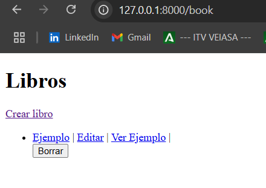

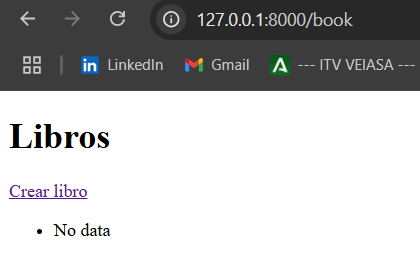

Al hacer *click* al boton borrar debera salir el texto de ***No data,***

#### Tipado de devoluciones

Desde Laravel 10, para ganar comprensión de código y eliminar comentarios muy extensos antes de cada función, podemos indicar la devolución de cada método desde su definición con dos puntos y el tipo `public funcion (Note note):view / note/ integer ...`

Actualizamos por tanto así

* `public function index(): view //<-- Esto es de Laravel 10. Indica el tipo de dato que retorna la función`
* `public function create(): View`
* `public function store(Request $request): RedirectResponse`
* `public function edit(Note $note): View`
* `public function update(NoteRequest $request, $note): RedirectResponse`
* `public function show($note):View`
* `public function delete($id): RedirectResponse`

> Esto sirve para entender que realiza cada funcion sin ir mas lejos en el apartado anterior se muestra que tanto index, create, edit y show trabajan con vistas y el resto son funciones que trabajan con los datos.

## Validación Y Custom Request

Comenzamos un punto fundamental en toda programación como es el de la validación de los datos que recepcionamos.

Aqui vamos a **validar** para hacer **precisos los datos** que queremos guardar, ya sea que queremos numeros, caracteres, tantos decimales....

**Vamos a ver dos formatos:**

* El más sencillo, en el **controlador**, aunque NO es el recomendable
* Las ***Custom Request***

### Desde Controlador

En el controlador, hacemos uso de Request y del método estático  **validate,** si dichas reglas **NO se cumplen**, se aboratá la función y lanza un **error**.

> validate y array (BookController.php):

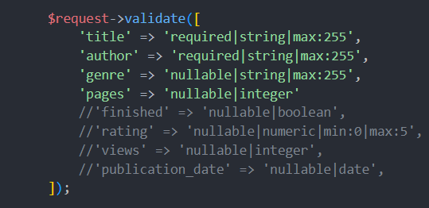

```php
<?php

namespace App\Http\Controllers;

use Illuminate\Http\Request;
use App\Models\Book; // Importar el modelo Book


class BookController extends Controller
{
    //
    public function index()
    {
        //obtenemos todos los libros de la base de datos
        $books = Book::all();

        //retornamos la vista con los libros, la función compact nos permite pasar variables a la vista en un array asociativo  
        return view('book.index', compact('books'));
    }

    //crea create, donde se pasa una vista para que cree un libro
    public function create()
    {
        return view('book.create');
    }

    //crea store, donde se guarda el libro en la base de datos
    public function store(Request $request)
    {
        Book::create($request->all());

        $request->validate([
            'title' => 'required|string|max:255|min:1',
            'author' => 'required|string|max:255|min:3',
            'genre' => 'nullable|string|max:255|min:2',
            'pages' => 'nullable|integer|min:10'
            //'finished' => 'nullable|boolean',
            //'rating' => 'nullable|numeric|min:0|max:5',
            //'views' => 'nullable|integer',
            //'publication_date' => 'nullable|date',
        ]);

        return redirect()->route('book.index');   
    }

    public function edit(Book $book)
    {
       //$book = Book::find($id);  NO NECESARIO. Lo hace de forma implícita
        return view('book.edit', compact('book'));
    }

    public function update(Request $request, Book $book)
    {
        $book->update($request->all());
        return redirect()->route('book.index');

        $request->validate([
            'title' => 'required|string|max:255|min:1',
            'author' => 'required|string|max:255|min:3',
            'genre' => 'nullable|string|max:255|min:2',
            'pages' => 'nullable|integer|min:10'
            //'finished' => 'nullable|boolean',
            //'rating' => 'nullable|numeric|min:0|max:5',
            //'views' => 'nullable|integer',
            //'publication_date' => 'nullable|date',
        ]);

    }

    public function show(Book $book)
    {
        return view('book.show', compact('book'));
    }

    public function destroy(Book $book)
{

      $book->delete();  
    return redirect()->route('book.index');
  }
  
  
}

```

Nos damos cuenta de que este método no es el más adecuado ya que:

1. Estamos agrandando el tamaño de nuestro controlador
2. No es mantenible ya que si cambias uno, debes cambiar todos. (Duplicidad de código)
3. El controlador ya tiene una doble **responsabilidad** (VALIDAR y ENRUTAR)

### Desde el ***Custom Request***

Para escenarios de **validación** más complejos, puede crear una "**solicitud de formulario** (***form request***)". Las solicitudes de formulario son ***clases de solicitud personalizadas*** (***custom request***) que encapsulan su propia lógica de validación y autorización. Nosotros vamos a crear una clase de solicitud de formulario, podemos usar el `make:request` comando de la *CLI de Artisan,*tal que así:

> `php artisan make:request BookRequest`

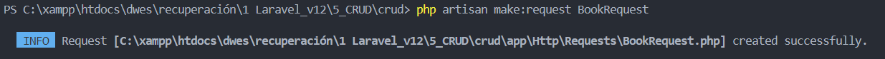

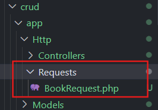

Y es en esta clase donde vamos a crear nuestras **validaciones**, vemos que es una clase que extiende de **Request** con las funciones:

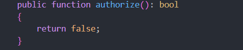

> Authorize

Indica cuando vamos a permitir que se utilice esta función, por tanto debe **ponerse a true (IMPORTANTE)**

* `return true;`

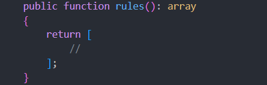

Aquí es donde vamos a indicar el array con las reglas que debe cumplir, lo cambiamos a:

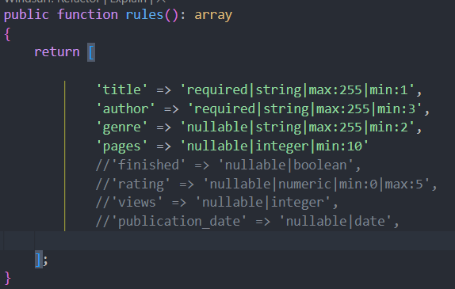

Ya podemos borrar las validaciones del controlador, asi se veria el BookRequest.php:

```php
<?php

namespace App\Http\Requests;

use Illuminate\Foundation\Http\FormRequest;

class BookRequest extends FormRequest
{
    /**
     * Determine if the user is authorized to make this request.
     */
    public function authorize(): bool
    {
        return false;
    }

    /**
     * Get the validation rules that apply to the request.
     *
     * @return array<string, \Illuminate\Contracts\Validation\ValidationRule|array<mixed>|string>
     */
    public function rules(): array
    {
        return [
    
                'title' => 'required|string|max:255|min:1',
                'author' => 'required|string|max:255|min:3',
                'genre' => 'nullable|string|max:255|min:2',
                'pages' => 'nullable|integer|min:10'
                //'finished' => 'nullable|boolean',
                //'rating' => 'nullable|numeric|min:0|max:5',
                //'views' => 'nullable|integer',
                //'publication_date' => 'nullable|date',
  
        ];
    }
}

```

y ahora solo falta añadirlo al controlador de BookController.php, para ello ponemos lo siguiente en el controlador:

```php
<?php

namespace App\Http\Controllers;

use Illuminate\Http\Request;
use App\Models\Book; // Importar el modelo Book
use App\Http\Requests\BookRequest; // Importar el request BookRequest
```

Ahora en las funciones que reciban la petición, quitamos la request generalista y la cambiamos por la BookRequest, así:

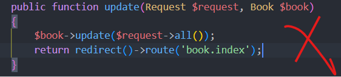

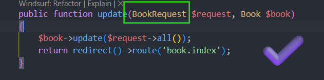

así se vería el controlador:

```php
<?php

namespace App\Http\Controllers;

use Illuminate\Http\Request;
use App\Models\Book; // Importar el modelo Book
use App\Http\Requests\BookRequest; // Importar el request BookRequest

    class BookController extends Controller
    {
        //
        public function index()
        {
            //obtenemos todos los libros de la base de datos
            $books = Book::all();
            //retornamos la vista con los libros, la función compact nos permite pasar variables a la vista en un array asociativo  
            return view('book.index', compact('books'));
        }


        //crea create, donde se pasa una vista para que cree un libro
        public function create()
        {
            return view('book.create');
        }

        //crea store, donde se guarda el libro en la base de datos
        public function store(BookRequest $request)
        {
            Book::create($request->all());
            return redirect()->route('book.index');   
        }

        //muestra el formulario para editar un libro
        public function edit(Book $book)
        {
            //$book = Book::find($id);  NO NECESARIO. Lo hace de forma implícita
            return view('book.edit', compact('book'));
        }

        //actualiza un libro
        public function update(BookRequest $request, Book $book)
        {
            $book->update($request->all());
            return redirect()->route('book.index');
        }

        //muestra un libro en específico
        public function show(Book $book)
        {
            return view('book.show', compact('book'));
        }

        //eliminar un libro
        public function destroy(Book $book)
        {
            $book->delete();  
            return redirect()->route('book.index');
        }
  
  
}


```

Así, el sistema primero cumple las reglas descritas. El problema es que no estamos indicando los errores ni las acciones realizadas con éxito,

> Lo que vamos a realizar ahora es la incorporacion de mensajes y avisos tanto de errores como de acciones realizadas correctamente.

## Gestión De Errores Y Mensajes De Sesión

Comencemos por los errores:

### Errores

Para ello, en los formularios de CREATE y EDIT podemos hacer lo siguiente:

> Directiva `@error`

Con esta directiva puedo indicar dónde se ha equivocado.

* SI falla el título, recojo un `@error`
* Demtro, podemos acudir a la variable , que incluye el mensaje de este error.

En mi caso quedaría así:

> create.blade.php

```html
@extends('layouts.app')

@section('content')
    <a href="{{ route('book.index') }}">Atras</a>
    <h1>Crear Libro</h1>
    <form method="POST" action="{{ route('book.store') }}">
        @csrf

       <label for="">Título</label>
        <input type="text" name="title">
        @error('title')
        <small style="color: red">{{ $message }}</small>
        @enderror
        <br>

        <label for="">Autor</label>
        <input type="text" name="author">
        @error('author')
        <small style="color: red">{{ $message }}</small>
        @enderror
        <br>

        <label for="">Género</label>
        <input type="text" name="genre">
        @error('genre')
        <small style="color: red">{{ $message }}</small>
        @enderror
        <br>

        <label for="">Páginas</label>
        <input type="number" name="pages">
        @error('pages')
        <small style="color: red">{{ $message }}</small>
        @enderror
        <br>

        <!--<label for="">Fecha de Publicación</label>
        <input type="date" name="publication_date">-->

        <!--<label for="">¿Terminado?</label>
        <input type="checkbox" name="finished" value="1">

        <label for="">Calificación (0.0 - 5.0)</label>
        <input type="number" name="rating" step="0.1" min="0" max="5">

        <label for="">Vistas</label>
        <input type="number" name="views">-->

        <input type="submit" value="Create"/>
    </form>

@endsection

```

> edit.blade.php

```html
@extends('layouts.app')

@section('content')
    <a href="{{ route('book.index') }}">Atras</a>

    <h1>Editar Libro</h1>
    <form action="{{ route('book.update', $book->id) }}" method="POST">
        @csrf
        @method('PUT')

       <label for="">Título</label>
        <input type="text" name="title" value="{{ $book->title }}">
        @error('title')
        <small style="color: red">{{ $message }}</small>
        @enderror
        <br>

        <label for="">Autor</label>
        <input type="text" name="author" value="{{ $book->author }}">
        @error('author')
        <small style="color: red">{{ $message }}</small>
        @enderror
        <br>

        <label for="">Género</label>
        <input type="text" name="genre" value="{{ $book->genre }}">
        @error('genre')
        <small style="color: red">{{ $message }}</small>
        @enderror
        <br>

        <label for="">Páginas</label>
        <input type="number" name="pages" value="{{ $book->pages }}">
        @error('pages')
        <small style="color: red">{{ $message }}</small>    
        @enderror
        <br>

       <!-- 
        <label for="">Fecha de Publicación</label>
        <input type="date" name="publication_date" value="{{ $book->publication_date }}">


        <label for="">¿Terminado?</label>
        <input type="checkbox" name="finished">

        <label for="">Calificación (0.0 - 5.0)</label>
        <input type="number" name="rating" step="0.1" min="0" max="5" value="{{ $book->rating }}">

        <label for="">Vistas</label>
        <input type="number" name="views" value="{{ $book->views }}">
        -->


        <input type="submit" value="Update"/>
    </form>

@endsection

```

Ya estamos comunicándole que tiene algún error.

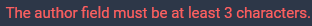

### Mensaje de acción realizada satisfactoriamente

El caso inverso es cuando se hace una acción correctamente y le queremos pasar un mensaje. Esto se conoce como flash message o mensajes de sesión:

* Se ejecutan o se muestran una única vez cuando hacemos una acción en concreto
* Lo vamos a aplicar directamente en el layouts pero a través de un parcial (_partials) para externalizarlo en un componente
* Se pintará antes que la vista en concreto
* `@include('layouts._partials.messages')`

Me dirijo a layouts app y lo modifico de la siguiente manera:

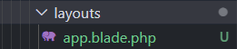

Creamos, como vimos en la clase de  ***Blades***  un parcial de la siguiente manera:

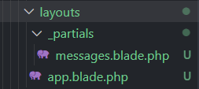

#### messages.blade.php

modifico la clase messages.blade.php de la siguiente manera:

```php
@if ($message = Session::get('success'))
    <div class="alert success-alert">
        <strong>{{ $message }}</strong>
    </div>
@endif

@if ($message = Session::get('danger'))
    <div class="alert danger-alert">
        <strong>{{ $message }}</strong>
    </div>
@endif

```

> Como veis aplico una clase de estilos mas tarde mostrare como la hice y de que esta compuesta para que la pagina se muestre mas atractiva.

Ahora, se aplicará a todas las vistas desde un parcial que se dedica a esto exclusivamente

Ahora nos iremos a BookController para especificar en que ocasión nos gustaria mostrar dicho mensaje, por ejemplo en el index, edit o create no me interesaría, ya que no trabajamos con datos como tal solo pintamos cosas, como formularios...

Sin  embargo en funciones como store, update o delete si, veamos como se veria la clase del controlador una vez se incorporen los mensajes:

> Es facil de concatenarlos pongamos el ejemplo del store, cuando lo redirigimos de nuevo al index, le añadimos con que tipo de mensaje aparecerá ejemplo:

```
public function store(BookRequest $request)
        {
            Book::create($request->all());
            return redirect()->route('book.index')->with('success', 'Libro creado correctamente');   
        }
```

---

> BookController.php

```php
<?php

namespace App\Http\Controllers;

use Illuminate\Http\Request;
use App\Models\Book; // Importar el modelo Book
use App\Http\Requests\BookRequest; // Importar el request BookRequest

    class BookController extends Controller
    {
        //
        public function index()
        {
            //obtenemos todos los libros de la base de datos
            $books = Book::all();
            //retornamos la vista con los libros, la función compact nos permite pasar variables a la vista en un array asociativo  
            return view('book.index', compact('books'));
        }


        //crea create, donde se pasa una vista para que cree un libro
        public function create()
        {
            return view('book.create');
        }

        //crea store, donde se guarda el libro en la base de datos
        public function store(BookRequest $request)
        {
            Book::create($request->all());
            return redirect()->route('book.index')->with('success', 'Libro creado correctamente');   
        }

        //muestra el formulario para editar un libro
        public function edit(Book $book)
        {
            //$book = Book::find($id);  NO NECESARIO. Lo hace de forma implícita
            return view('book.edit', compact('book'));
        }

        //actualiza un libro
        public function update(BookRequest $request, Book $book)
        {
            $book->update($request->all());
            return redirect()->route('book.index')->with('success', 'Libro actualizado correctamente');
        }

        //muestra un libro en específico
        public function show(Book $book)
        {
            return view('book.show', compact('book'));
        }

        //eliminar un libro
        public function destroy(Book $book)
        {
            $book->delete();  
            return redirect()->route('book.index')->with('danger', 'Libro eliminado correctamente');
        }
  
  
}


```

#### Comprobación Mensajes:


---


## Estilos

Nos movemos a la carpeta **`public `**dentro creamos otra carpeta llamada `css `y dentro creamos el archivo `styles.css`.

> Este archivo contendra los estilos que le otorgaremos a `layouts/app.blade.php ` y esta se los pasara a las demas vistas, ademas, las vistas tambien han sido modificadas.

Asi quedaria el codigo:

> styles.css

```css
/* Reset básico */
* {
    margin: 0;
    padding: 0;
    box-sizing: border-box;
}

/* Tipografía global */
body {
    font-family: 'Poppins', 'Roboto', sans-serif;
    background-color: #1a202c; /* gris oscuro azulado */
    color: #e2e8f0; /* gris clarito */
    line-height: 1.6;
    padding: 20px;
}

/* Encabezados */
h1, h2, h3 {
    margin-bottom: 20px;
    color: #f7fafc; /* casi blanco suave */
}

/* Enlaces */
a {
    color: #63b3ed; /* azul suave */
    text-decoration: none;
}

a:hover {
    text-decoration: underline;
}

/* Botones genéricos */
button, input[type="submit"] {
    background-color: #4299e1; /* azul medio */
    color: #f7fafc;
    padding: 10px 20px;
    border: none;
    border-radius: 8px;
    cursor: pointer;
    transition: background-color 0.3s;
}

button:hover, input[type="submit"]:hover {
    background-color: #3182ce; /* azul más oscuro */
}

/* Formularios */
form {
    background-color: #2d3748; /* gris oscuro */
    padding: 20px;
    border-radius: 12px;
    box-shadow: 0px 4px 10px rgba(0, 0, 0, 0.4);
    max-width: 500px;
    margin: 20px auto;
}

label {
    display: block;
    margin-bottom: 8px;
    font-weight: bold;
    color: #e2e8f0;
}

input[type="text"], input[type="number"], input[type="date"], input[type="email"], input[type="password"], textarea {
    width: 100%;
    padding: 10px;
    border: 1px solid #4a5568;
    border-radius: 8px;
    margin-bottom: 20px;
    background-color: #1a202c;
    color: #edf2f7;
}

input[type="text"]:focus, input[type="number"]:focus, input[type="date"]:focus, textarea:focus {
    outline: none;
    border-color: #63b3ed;
    background-color: #2d3748;
}

/* Mensajes de error */
small {
    display: block;
    margin-top: -15px;
    margin-bottom: 10px;
    color: #f56565; /* rojo suave */
}

/* Listas */
ul {
    list-style-type: none;
    padding: 0;
    margin-top: 20px;
}

li {
    background: #2d3748;
    margin-bottom: 10px;
    padding: 15px;
    border-radius: 12px;
    box-shadow: 0px 2px 6px rgba(0, 0, 0, 0.3);
}

/* Tarjetas (cards) */
.card {
    background: #2d3748;
    border-radius: 12px;
    padding: 20px;
    box-shadow: 0px 4px 12px rgba(0, 0, 0, 0.4);
    margin-bottom: 20px;
}

/* Contenedor principal */
.container {
    max-width: 1200px;
    margin: 0 auto;
}

/* Espaciados */
.mt-4 {
    margin-top: 1rem;
}

.mb-4 {
    margin-bottom: 1rem;
}

.flex {
    display: flex;
    gap: 10px;
}

.flex-space-between {
    display: flex;
    justify-content: space-between;
    align-items: center;
}

/* Footer */
footer {
    text-align: center;
    margin-top: 40px;
    font-size: 0.9rem;
    color: #a0aec0;
}
/* Alertas */
.alert {
    padding: 15px 20px;
    margin-bottom: 20px;
    border-radius: 8px;
    font-weight: bold;
    display: flex;
    align-items: center;
    justify-content: space-between;
    animation: fadeIn 0.5s ease-in-out;
}

/* Alerta de éxito */
.success-alert {
    background-color: #38a169; /* verde suave */
    color: #f0fff4; /* verde claro para texto */
    border-left: 5px solid #2f855a;
}

/* Alerta de peligro (error) */
.danger-alert {
    background-color: #e53e3e; /* rojo moderado */
    color: #fff5f5; /* rosa pálido para texto */
    border-left: 5px solid #c53030;
}

/* Animación simple para que aparezca más elegante */
@keyframes fadeIn {
    from {
        opacity: 0;
        transform: translateY(-10px);
    }
    to {
        opacity: 1;
        transform: translateY(0);
    }
}

```

> app.blade.php

```html
<!DOCTYPE html>
<html lang="en">
<head>
    <meta charset="UTF-8">
    <meta name="viewport" content="width=device-width, initial-scale=1.0">
    <meta http-equiv="X-UA-Compatible" content="ie=edge">
    <link rel="stylesheet" href="{{ asset('css/styles.css') }}">
    <title>Layout</title>
</head>
<body>
        @include('layouts._partials.messages')
        @yield('content')
</body>
</html>

```

> index.blade.php

```html
@extends('layouts.app')

@section('content')
<div class="container">
    <div class="flex-space-between mb-4">
        <h1>Libros</h1>
        <a href="{{ route('book.create') }}" class="button">Crear libro</a>
    </div>

    @if($books->isEmpty())
        <p class="text-gray-500">No hay libros disponibles.</p>
    @else
        <ul>
            @foreach($books as $book)
                <li class="card">
                    <h2>{{ $book->title }}</h2>
                    <p>Autor: {{ $book->author }}</p>
                    <div class="flex mt-4">
                        <a href="{{ route('book.show', $book->id) }}">Ver</a>
                        <a href="{{ route('book.edit', $book->id) }}">Editar</a>
                        <form action="{{ route('book.destroy', $book->id) }}" method="POST" onsubmit="return confirm('¿Seguro que quieres borrar este libro?');">
                            @csrf
                            @method('DELETE')
                            <input type="submit" value="Borrar">
                        </form>
                    </div>
                </li>
            @endforeach
        </ul>
    @endif
</div>
@endsection

```

> create.blade.php

```html
@extends('layouts.app')

@section('content')
<div class="container">
    <a href="{{ route('book.index') }}" class="text-blue-500 hover:underline">← Atrás</a>

    <div class="card mt-4">
        <h1>Crear Libro</h1>

        <form method="POST" action="{{ route('book.store') }}" class="mt-4">
            @csrf

            <label for="title">Título</label>
            <input type="text" name="title" id="title" >
            @error('title')
                <small>{{ $message }}</small>
            @enderror

            <label for="author">Autor</label>
            <input type="text" name="author" id="author">
            @error('author')
                <small>{{ $message }}</small>
            @enderror

            <label for="genre">Género</label>
            <input type="text" name="genre" id="genre">
            @error('genre')
                <small>{{ $message }}</small>
            @enderror

            <label for="pages">Páginas</label>
            <input type="number" name="pages" id="pages">
            @error('pages')
                <small>{{ $message }}</small>
            @enderror

            <input type="submit" value="Crear">
        </form>
    </div>
</div>
@endsection

```

> show.blade.php

```html
@extends('layouts.app')

@section('content')
<div class="container">
    <a href="{{ route('book.index') }}" class="text-blue-500 hover:underline">← Volver</a>

    <div class="card mt-4">
        <h1>{{ $book->title }}</h1>
        <h2 class="mt-4">Autor: {{ $book->author }}</h2>
        <p class="mt-4">Género: {{ $book->genre }}</p>
        <p>Páginas: {{ $book->pages }}</p>
    </div>
</div>
@endsection

```

> edit.blade.php

```html
@extends('layouts.app')

@section('content')
<div class="container">
    <a href="{{ route('book.index') }}" class="text-blue-500 hover:underline">← Atrás</a>

    <div class="card mt-4">
        <h1>Editar Libro</h1>

        <form action="{{ route('book.update', $book->id) }}" method="POST" class="mt-4">
            @csrf
            @method('PUT')

            <label for="title">Título</label>
            <input type="text" name="title" id="title" value="{{ $book->title }}">
            @error('title')
                <small>{{ $message }}</small>
            @enderror

            <label for="author">Autor</label>
            <input type="text" name="author" id="author" value="{{ $book->author }}">
            @error('author')
                <small>{{ $message }}</small>
            @enderror

            <label for="genre">Género</label>
            <input type="text" name="genre" id="genre" value="{{ $book->genre }}">
            @error('genre')
                <small>{{ $message }}</small>
            @enderror

            <label for="pages">Páginas</label>
            <input type="number" name="pages" id="pages" value="{{ $book->pages }}">
            @error('pages')
                <small>{{ $message }}</small>
            @enderror

            <input type="submit" value="Actualizar">
        </form>
    </div>
</div>
@endsection

```

**Se vería tal que así:**

> index.blade.php

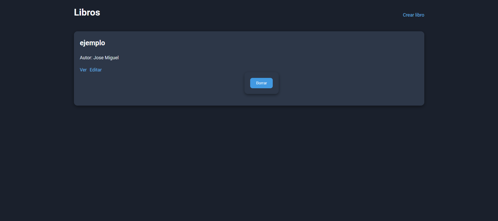

> show.blade.php

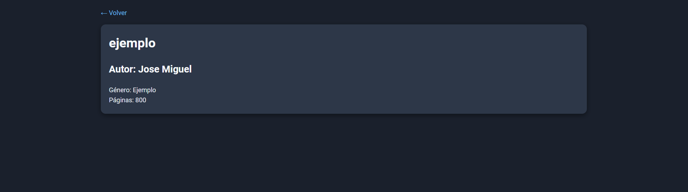

> create.blade.php

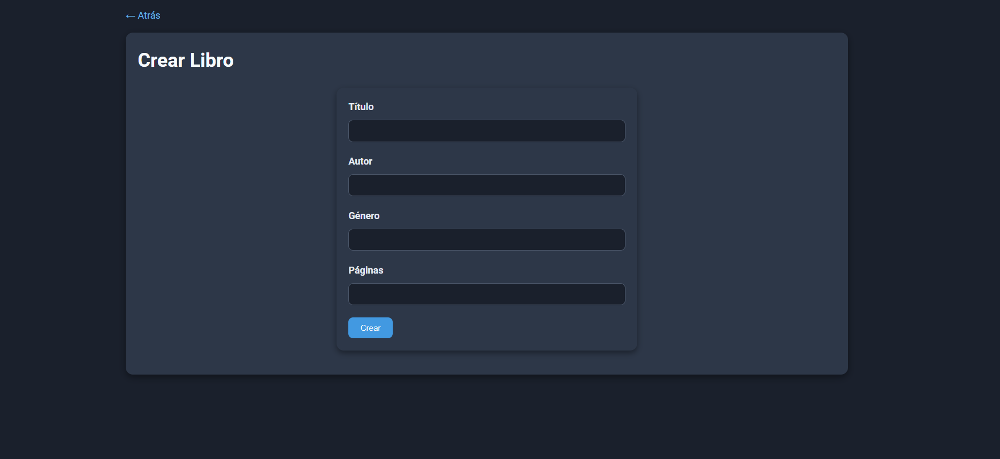

> edit.blade.php

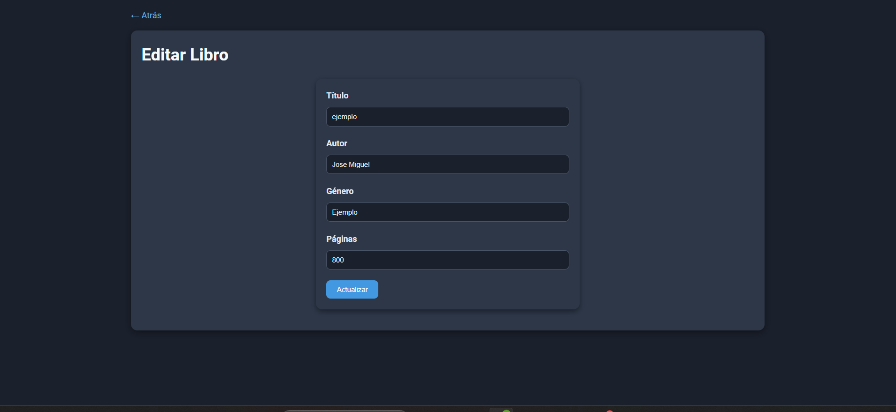
