# Seeder Factory & Faker


> En este documento, veremos al igual que en el 2 trimestre **los seeders, factory y faker en laravel**, practicaremos mientras que aprendemos sobre estos y documentaremos **paso a paso** para mayor entendimiento.

---

### Índice

* Introducción
* Proyecto Base
* Seeders
* Factory
* Faker

---

## Introducción

En este punto veremos maneras que nos facilitaran el trabajar con la base de datos, como por ejemplo, en los sistemas necesitaremos poblar con datos necesarios, usarios, roles...

> Al instalar debería llevar al menos un admin/admin, o los productos, categoría... de la tienda

1. Para todo lo anterior, usaremos los **SEEDERS**.
2. Además, necesitamos añadir cientos de usuarios, miles de productos.... mediante los **FACTORIES**,
3. Los Factories llevarán un **FAKER** que nos incluirán datos falsos que tengan sentido para pruebas

Mas adelante profundizaremos mas en dichos terminos.

## Proyecto Base

Para ello lo primero que vamos a hacer es crear una nuevo proyecto Laravel al que vamos a llamar databases, y lo hacemos de la siguiente manera:

`composer create-project laravel/laravel databases `

o

`laravel new databases `

`despues >> cd databases (para trabajar dentro del proyecto desde la terminal)`

puedes hacer eso o como en mi caso copiar de nuevo el proyecto del curson anterior (crud) y usarlo.

* Primero haces click derecho en el proyecto y pegas en la carpeta.
* y despues le cambias el nombre al proyecto.

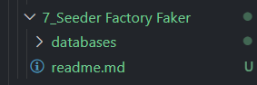

Una vez creado nuestro proyecto en Laravel vamos a crear nuestro sistema de persistencia, y le vamos a llamar  ***databases***.

> Ya he comentado en otras ocasiones que trabajo con SQLite y que si trabajan con otro sistema de gestion de datos solo deben modificar el .env el apartado de conexión.

Una vez hecho esto, nos iremos a nuestra carpeta `databases/database` y veremos que tenemos tres carpetas  ***factories, migrations y seeders***, sobre la carpeta migrations ya hemos trabajado anteriormente, pero en este apartado nos centraremos en las demas

## Seeders

#### Preparación

Los  **seeders** , los cuales nos van a servir para dar un poblado inicial a nuestra estructura de datos

Laravel permite sembrar datos en la base de datos mediante clases **seeders**. Todas las clases **seeders** se almacenan en el directorio `database/seeders`. Por defecto, se define una clase `DatabaseSeeder` . Desde esta clase, se puede usar el método `call` para ejecutar otros seeders, lo que permite controlar el orden de sembrado.

Ahora para ponernos manos a la obra, primero crearemos el modelo y la migración que vayamos a usar en mi caso usare un modelo y migración ya creados, solo los modificaré pero para el que tenga que crearlo, es así de sencillo:

`php artisan make:model NombreModelo --migration`

podremos ver que dentro de la carpeta `models` se nos ha generado el modelo ***Book*** al cual le vamos a indicar el comando `protected $guarded =[]`; para que podamos guardar todo tipo de información ya que ningún dato va a estar protegido en nuestro modelo, quedaría de la siguiente manera:

> Book.php

```php
<?php

namespace App\Models;

use Illuminate\Database\Eloquent\Model;
use Illuminate\Database\Eloquent\Factories\HasFactory;

class Book extends Model
{
    use HasFactory;

    protected $guarded =[];


}

```

Asegurate de incluir el HasFactory ya que Laravel aun no lo incluye de manera predeterminada.

Ya podemos acudir a las migraciones de nuestro modelo que se encuentran en `database/migrations` y desde ahí le añadiremos los datos que queremos crear en nuestro modelo **Book** desde su archivo correspondiente:

> 2025_03_28_154112_create_books_table.php

```php
<?php

use Illuminate\Database\Migrations\Migration;
use Illuminate\Database\Schema\Blueprint;
use Illuminate\Support\Facades\Schema;

return new class extends Migration
{
    /**
     * Run the migrations.
     */
    public function up(): void
    {
        Schema::create('books', function (Blueprint $table) {
            $table->id();
            $table->string('title');
            $table->string('author');
            $table->string('genre')->nullable();
            $table->integer('pages')->nullable();
            $table->timestamps();
        });
    }

    /**
     * Reverse the migrations.
     */
    public function down(): void
    {
        Schema::dropIfExists('books');
    }
};

```

Migramos el contenido:

* Si es la primera vez { `php artisan migrate`
* Si ya lo has hecho antes puedes hacer un { `php artisan migrate:refresh`

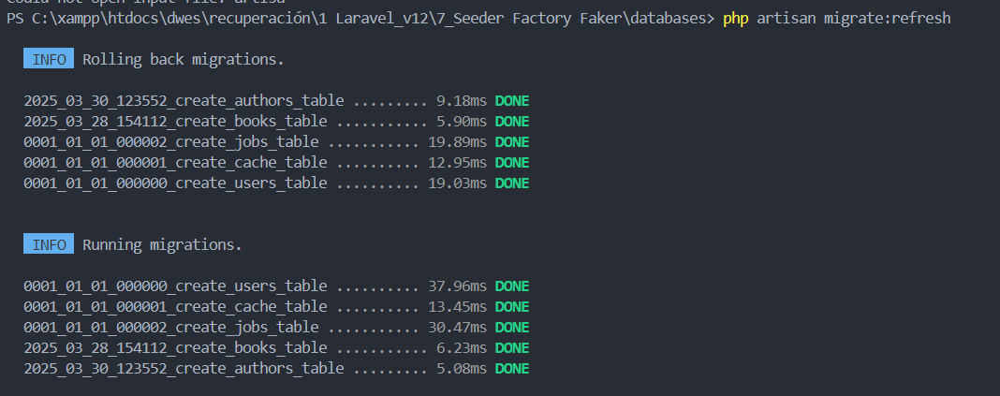

A continuación voy a preparar una vista en la que vaya a mostrar un **listado del contenido** del seeder para poder visualizarlos el contenido mientras trabajamos con ellos, para ello antes necesitamos un controlador que yo usare BookController.php pero tambien lo podeis crear con `php artisan make:controller NameController` .

y esta seria la funcion index que coontendria el controlador:

```php
public function index()
        {
            //obtenemos todos los libros de la base de datos
            $books = Book::all();
            //retornamos la vista con los libros, la función compact nos permite pasar variables a la vista en un array asociativo  
            return view('book.index', compact('books'));
        }
```

Ya nos queda crear el archivo de la vista, que haremos dentro de `app/resources/view`, para ello dentro de esta carpeta creamos otra carpeta llamada ***book*** en la cual vamos a incluir la vista de libros a la que llamaremos **index.blade.php** en el que incluiremos la información de la vista, pero como ya he dicho en mi caso ya la tendria y contiene lo siguiente:

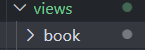

```php
@extends('layouts.app')

@section('content')
<div class="container">
    <div class="flex-space-between mb-4">
        <h1>Libros</h1>
        <a href="{{ route('book.create') }}" class="button">Crear libro</a>
    </div>

    @if($books->isEmpty())
        <p class="text-gray-500">No hay libros disponibles.</p>
    @else
        <ul>
            @foreach($books as $book)
                <li class="card">
                    <h2>{{ $book->title }}</h2>
                    <p>Autor: {{ $book->author }}</p>
                    <div class="flex mt-4">
                        <a href="{{ route('book.show', $book->id) }}">Ver</a>
                        <a href="{{ route('book.edit', $book->id) }}">Editar</a>
                        <form action="{{ route('book.destroy', $book->id) }}" method="POST" onsubmit="return confirm('¿Seguro que quieres borrar este libro?');">
                            @csrf
                            @method('DELETE')
                            <input type="submit" value="Borrar">
                        </form>
                    </div>
                </li>
            @endforeach
        </ul>
    @endif
</div>
@endsection
```

> El css lo dejare en el final del curso en  caso de que lo necesiten tambien esta en el punto de **crud**.

Lo siguiente que hacemos es ir a nuestro archivo de rutas `wep.php` e importamos nuestro controlador de libros y le indicamos a nuestra ruta principal raiz que queremos utilizar como dupla el  **BookController,** se veria así:

> web.php

```php
<?php

use Illuminate\Support\Facades\Route;
use App\Http\Controllers\BookController;


Route::get('/book', [BookController::class, 'index'])->name('book.index');
```

Una vez hecho todo esto si nos vamos a la página web de nuestro servicio veremos que nos muestra el texto **"No hay libros disponibles"** eso es porque no tenemos nada, para levantar el servicio hacemos `php artisan serve`:

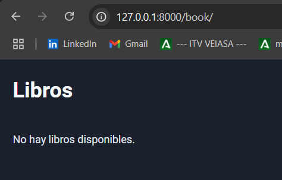

#### Creación y trabajo con seeders

Para crear nuestro primer **seeder** lo que haremos es desde la consola de comandos poner lo siguiente:

`php artisan make:seeder BookSeeder`

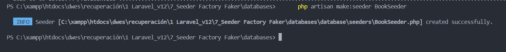

nos habrá creado un seeder dentro de `database/seeders`, dentro de la carpeta **seeders** nos encontraremos siempre por defecto el archivo  **DatabaseSeeder** , este es el encargado principal de generar todos los seeders que ya comentamos anteriormente, por lo que debemos de hacer siempre es generar un **seeder** por cada una de los *elementos/recursos* y posteriormente al **DatabaseSeeder** le vamos a indicar cual de todos los **seeders** vamos a estar utilizando.

> De manera que lo primero que vamos a hacer es un seeder sencillo, para poblar nuestra base de datos con datos que nuestro proyecto necesita.

Para ello dentro del seeder generado añadimos los datos del seeder:

> BookSeeder.php

```php
<?php

namespace Database\Seeders;

use Illuminate\Database\Console\Seeds\WithoutModelEvents;
use Illuminate\Database\Seeder;
use App\Models\Book;

class BookSeeder extends Seeder
{
    /**
     * Run the database seeds.
     */
    public function run(): void
    {
        Book::create([
            'title'=> 'Luna de Pluton',
            'author' => 'Javier Negrete',
            'genre' => 'Ciencia Ficción',
            'pages'=> 426
        ]);

        Book::create([
            'title'=> 'El juego de Ender',
            'author' => 'Orson Scott Card',
            'genre' => 'Ciencia Ficción',
            'pages'=> 257
        ]);

        Book::create([
            'title'=> 'El nombre del viento',
            'author' => 'Patrick Rothfuss',
            'genre' => 'Fantasía',
            'pages'=> 600
        ]);
        Book::create([
            'title'=> 'La sombra del viento',
            'author' => 'Carlos Ruiz Zafón',
            'genre' => 'Ficción',
            'pages'=> 426
        ]);

        Book::create([
            'title'=> 'El Alquimista',
            'author' => 'Paulo Coelho',
            'genre' => 'Ficción',
            'pages'=> 257
        ]);

        Book::create([
            'title'=> 'El Principito',
            'author' => 'Antoine de Saint-Exupéry',
            'genre' => 'Ficción',
            'pages'=> 600
        ]);
    }
}

```

Nuestro seeder está aislado, es decir que cuando usemos el comando para poblar la base de datos, este comando no va a ser ejecutado, por lo que dentro del ***DatabaseSeeder.php*** debemos de indicar cual de nuestros seeders queremos utilizar:

```php
<?php

namespace Database\Seeders;

use App\Models\User;
use App\Models\Book;
// use Illuminate\Database\Console\Seeds\WithoutModelEvents;
use Illuminate\Database\Seeder;

class DatabaseSeeder extends Seeder
{
    /**
     * Seed the application's database.
     */
    public function run(): void
    {
       $this->call([
            BookSeeder::class,
        ]);
    }
}

```

A continuación cuando ejecutemos las instrucciones de poblado se crearán los 6 libros del seeder, así que desde el proyecto `databases` vamos a ejecutar el sigueinte comando:

`php artisan db:seed`


Y ahora si volvemos a arrancar se deberian ver los resultados del seeder:

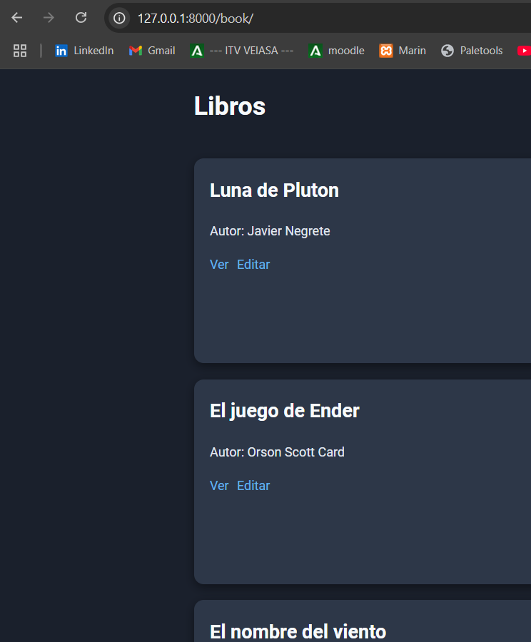

## Factory

Vamos a utilizar los ***Factories*** para generar diferentes datos de prueba, porque si queremos probar la aplicación cuando tiene muchos articulos no vamos a estar haciendo seeders 1 a 1.

Para ello debemos generar nuestro factory desde la consola de comandos, para ello vamos a poner:

> `php artisan make:factory BookFactory`

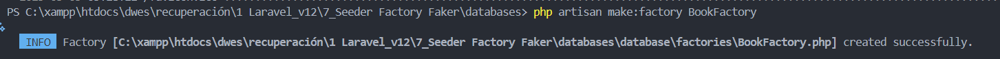

Una vez hecho esto, dentro de nuestra carpeta `databases/database/factories` nos vamos a poder encontrar nuestro ***BookFactory.php*** también por defecto tenemos el  ***UserFactory.php*** .

> El **factory** se va a encargar de establecer como se debe de crear el dato de prueba, de manera que no tengamos que crear el dato por completo a mano, haciendo que nos genere un dato aleatorio siguiendo algunas ***reglas*** las cuales nosotros mismos vamos a indicar.

A continuación vamos a generar nuestro primer Factory, para ello nos iremos a nuestro ***BookFactory.php*** y ponemos:

```php
<?php

namespace Database\Factories;

use Illuminate\Database\Eloquent\Factories\Factory;
use Illuminate\Support\Str;

/**
 * @extends \Illuminate\Database\Eloquent\Factories\Factory<\App\Models\Book>
 */
class BookFactory extends Factory
{
    /**
     * Define the model's default state.
     *
     * @return array<string, mixed>
     */
    public function definition(): array
    {
        return [
            'title'=>Str::random(25),//Cadena random de 25 caracteres
            'author'=>Str::random(45),//Cadena random de 45 caracteres
            'genre'=>Str::random(150),//Cadena random de 150 caracteres
            'pages'=>random_int(40,2000),//Genera un número aleatorio entre 1 y 125
        ];
    }
}

```

> Lo ideal es que los datos de prueba que introduzcamos sean lo más reales posibles, ya sea incluyendo comas, puntos o mayúsculas, para eso ya lo veremos más adelante voy a utilizar los  ***Faker*** .

Ahora lo que queremos es indicar en nuestro **seeder** que queremos generar estos datos de prueba, para ello vamos a indicarle que queremos generar ciertos datos de prueba apoyándonos en el factory que hemos generado anteriormente

Nos iremos a nuestro ***BookSeeder.php***

quitamos lo añadido anteriormente y usando el método `factory()` ponemos lo siguiente:

```php
<?php

namespace Database\Seeders;

use Illuminate\Database\Console\Seeds\WithoutModelEvents;
use Illuminate\Database\Seeder;
use App\Models\Book;

class BookSeeder extends Seeder
{
    /**
     * Run the database seeds.
     */
    public function run(): void
    {
        Book::factory()->count(80)->create(); //Crea 80 libros
    }
}
```

Nos apoyamos en el ORM Eloquent para poder **encadenar métodos** y no tener que poner todo el rato la función create o realizar bucles for innecesarios para crear tantos productos con sus datos como queramos.

Para ver el resultado de todo lo realizado vamos a hacer desde la consola de comandos:

> `php artisan db:seed`

> Y si todo ha ido bien se nos generará los productos utilizando el factory:

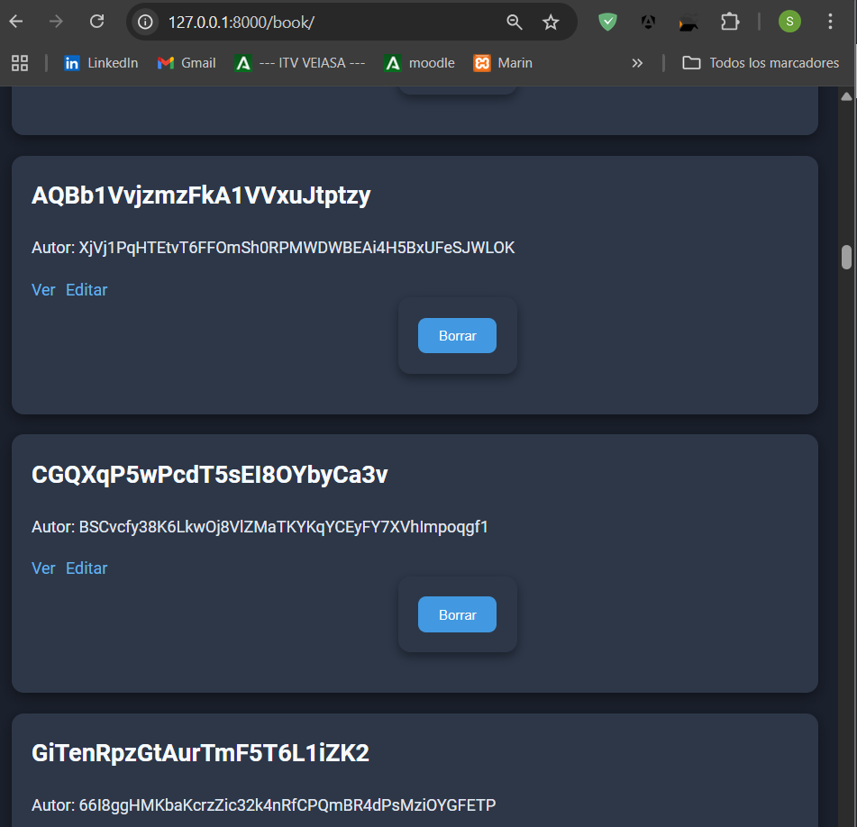

## Faker

> Como hemos visto antes con ***Faker*** lo que vamos a conseguir es generar datos pero para que **tengan más sentido** y estén más claros a la hora de que los visualicemos.

Entonces desde nuestro ***Factories*** Nos vamos a apoyar en la utilización de la clase ***Faker*** para generar estos elementos:

```php
<?php

namespace Database\Factories;

use Illuminate\Database\Eloquent\Factories\Factory;
use Illuminate\Support\Str;

/**
 * @extends \Illuminate\Database\Eloquent\Factories\Factory<\App\Models\Book>
 */
class BookFactory extends Factory
{
    /**
     * Define the model's default state.
     *
     * @return array<string, mixed>
     */
    public function definition(): array
    {
        return [
            'title'=>fake()->title(),
            'author'=>fake()->name(),
            'genre'=>fake()->name(50),//Cadena random de 50 caracteres
            'pages'=>fake()->numberBetween(40,2000),//Genera un número aleatorio entre 1 y 125
        ];
    }
}

```

No solo tenemos esas funciones, dependiendo del tipo de dato hay muchas otras que deberemos de utilizar, pero esas serían como las más básicas.

A continuación voy a borrar todos los datos de las migraciones realizadas anteriormente con:

> `php artisan migrate:rollback`

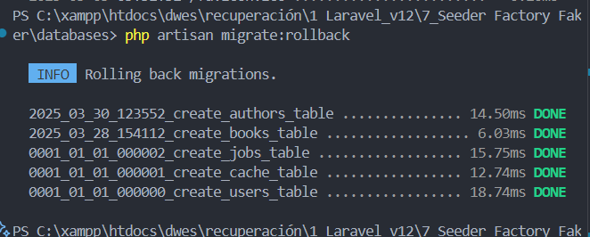

Migramos de nuevo el contenido:

> `php artisan migrate`

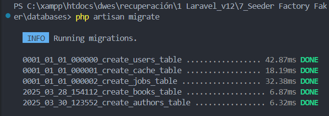

Y a continuación utilizamos los seeders para poblar nuestra base de datos:

> `php artisan db:seed`

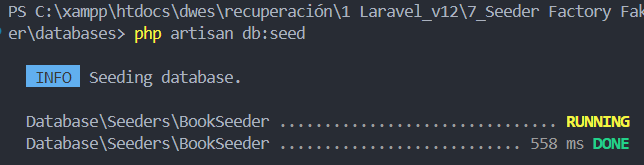

Nos quedaría levantar de nuevo el servicio:

> `php artisan serve`

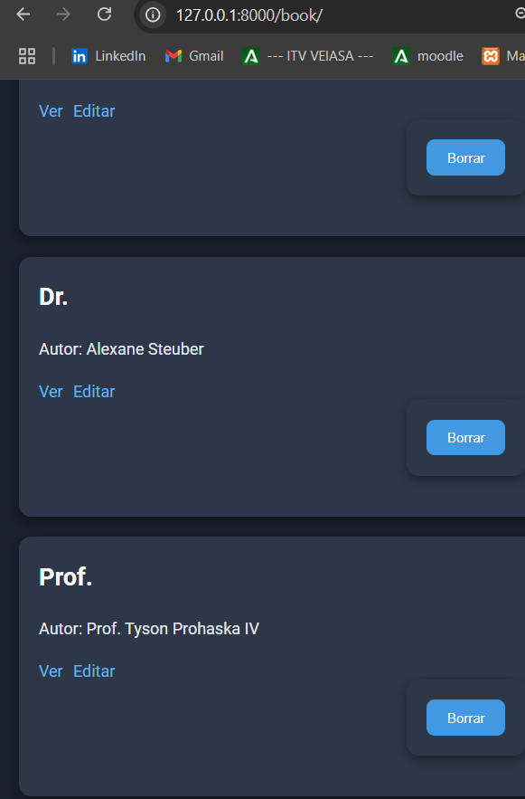

> Y hasta aqui seria el curso de seeders factories y faker, con esto podremos hacer comprobaciones y pruebas poblando la base de datos de una forma comoda y correcta.
