# Relaciones.


> En este documento, veremos al igual que en el 2 trimestre **las relaciones y sus variantes en laravel** **12** practicaremos mientras que aprendemos sobre estos y documentaremos **paso a paso** para mayor entendimiento.

---

### Índice.

* Introducción
* Relación 1-1
* Relación 1-N
* Relación N-M
* Proyecto

---

## Introducción.

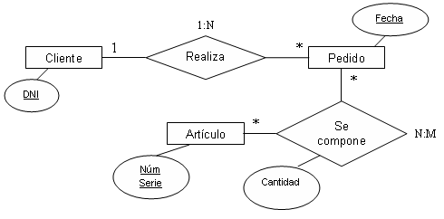

> En este apartado veremos que son las relaciones, para que las usaremos en laravel 12 y sus distintas variantes.

Las tablas de bases de datos suelen estar **relacionadas** entre sí. Por ejemplo, una entrada de blog puede tener muchos comentarios o un pedido podría estar relacionado con el usuario que lo realizó. **Eloquent** facilita la gestión y el trabajo con estas relaciones, y admite diversas relaciones comunes.

Las distintas relaciones que hay son:

* 1-1 o ***hasOne***
* 1-N o ***HasMany***
* N-M o ***belongsToMany***

Aunque hay algunos otros ejemplos que podemos ver en la documentación de laravel, como pueden ser:

* ***Has One Through* o  *Has Many Through***  ([enlace](https://laravel.com/docs/12.x/eloquent-relationships#main-content)).

Las relaciones de Eloquent se definen como métodos en las clases del modelo de Eloquent. Definirlas como métodos proporciona potentes funciones de encadenamiento de métodos y consulta.

> Daré una breve explicación y pondré un ejemplo rapido de la **1-1** y de la **1-N** y luego continuaré con mi proyecto anterior ya que usaremos una relación de N-M para la relación entre Libros y Autores (que serán los propios usuarios), pero más adelante explicare más detenidamente en que se diferencian y que funciones tendrán en el proyecto.

---

## Relación 1-1.

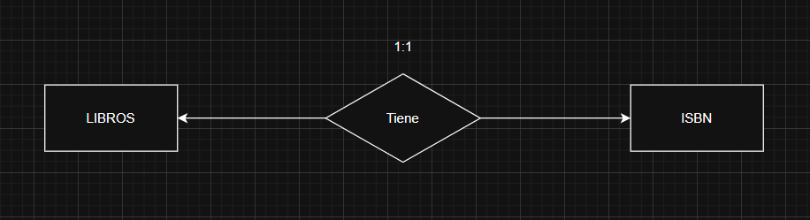

Una **relación** **uno a uno** es un tipo muy básico de relación de base de datos. Por ejemplo, el modelo  `libro`  podría estar **asociado** a  `isbn`. Para definir esta relación, asignaremos un método `isbn` al modelo  `libro` . Este método `isbn` debe llamar al método `hasOne` y devolver su resultado.

---

## Relación 1-N.

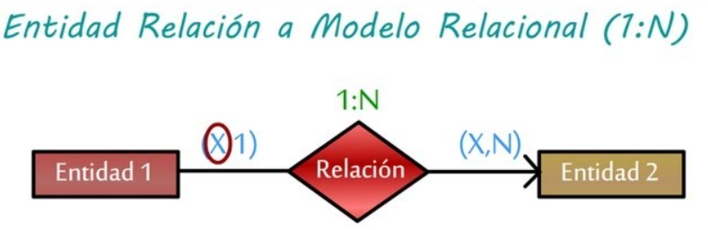

Una **relación uno a muchos** se utiliza para definir relaciones en las que un único modelo es el padre de uno o más modelos secundarios. Por ejemplo, **Un coche** puede **tener un titular** pero **un titular** puede **tener varios coches**. Al igual que todas las demás relaciones de ***Eloquent***, las relaciones **uno a muchos** se definen mediante la definición de un método en el modelo de ***Eloquent***.

---

## Relación N-M.

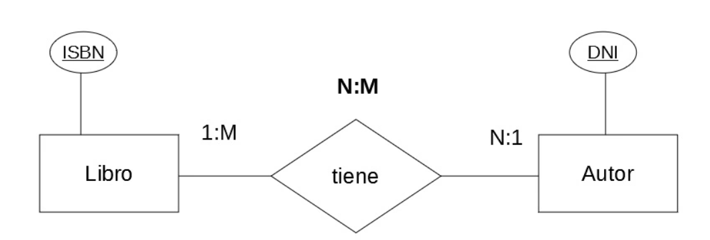

Las **relaciones de varios a varios** son ligeramente más complejas que las relaciones  `hasOne`  y `hasMany` . Un ejemplo de **una relación de** **varios a varios** es por ejemplo, a **un autor** puede **escribir varios libros** ; sin embargo, estos **libros también pueden haberse realizado gracias a otros autores.** Es decir, una especie de colaboración entre autores. Por lo tanto, **un autor tiene varios libros y un libro tiene varios autores**.

---

## Proyecto.

### Autores y Libros

> Será la primera relación que haremos

#### Resumen.

> En este apartado vamos a comenzar a poner en practica la teoría.

Con el **proyecto** que usamos en ***seeders factories y faker*** vamos a copiarlo y pegarlo ademas de renombrarlo (en mi caso). Aunque tambíen podemos crear otro proyecto Con el nombre de relaciones con el comando: `laravel new relaciones`.


> En este proyecto vamos a realizar lo siguiente:
>
> * Vamos a realizar dos relaciones
> * La primera relación será una N-M,  haremos una relación entre libros y autores
> * La segunda relación sera un extra que relacionará libros y autores con la valoración de un libro, para hacer como una especie de ranking para mostrar los mejor valorados.

---

#### Autor.

Como ya hemos dicho anteriormente trabajaremos con dos modelos, Libro y Autor. Vamos a empezar con el modelo autor, para ello primero debemos de crear tanto el propio modelo como la migración y lo haremos con el comando:

`php artisan make:model Author --migration`.

> Una vez realizado eso veremos como le daremos forma a ese modelo y migración.

* pd: Despues de realizar cambios en las migraciones se recomienda realizar un `php artisan migrate` en el caso de que no nos lo permita es porque quizas no sea la primera vez que lo hacemos, bastaria con hacer un `php artisan migrate:refresh`.


##### Migración.

Nos moveremos al archivo de nuestra migracion, situado en: `database/migrations/2025_03_30_123552_create_authors_table.php`.

la modificamos, asi se veria en mi caso:

```php
<?php

use Illuminate\Database\Migrations\Migration;
use Illuminate\Database\Schema\Blueprint;
use Illuminate\Support\Facades\Schema;

return new class extends Migration
{
    /**
     * Run the migrations.
     */
    public function up(): void
    {
        Schema::create('authors', function (Blueprint $table) {
            $table->id();
            $table->string('username');
            $table->string('email')->unique();
            $table->string('password');
            $table->timestamps();
        });
    }

    /**
     * Reverse the migrations.
     */
    public function down(): void
    {
        Schema::dropIfExists('authors');
    }
};

```

##### Modelo.

Nos moveremos al archivo de nuestra migracion, situado en: `app/Models/Author.php`.

y lo modificamos para que quede así:

```php
<?php

namespace App\Models;

use Illuminate\Database\Eloquent\Model;
use Illuminate\Database\Eloquent\Factories\HasFactory;


class Author extends Model
{
    use HasFactory;
  
    protected $guarder = [];
}


```

> protected  $guarder = []; || para utilizar todos los datos de la tabla.

---

#### Libro.

Al igual que el anterior necesitamos el modelo y la migración, yo ya los tengo de los otros apartados pero se haria como hemos señalado antes:

`php artisan make:model Book --migration`.

Una vez  tengamos el modelo y la migración veamos como quedarían:

##### Migración.

```php
<?php

use Illuminate\Database\Migrations\Migration;
use Illuminate\Database\Schema\Blueprint;
use Illuminate\Support\Facades\Schema;

return new class extends Migration
{
    /**
     * Run the migrations.
     */
    public function up(): void
    {
        Schema::create('books', function (Blueprint $table) {
            $table->id();
            $table->string('title');
            $table->string('author');
            $table->string('genre')->nullable();
            $table->integer('pages');
            $table->integer('rating')->nullable();
            $table->timestamps();
        });
    }

    /**
     * Reverse the migrations.
     */
    public function down(): void
    {
        Schema::dropIfExists('books');
    }
};

```

##### Modelo.

```php
<?php

namespace App\Models;

use Illuminate\Database\Eloquent\Model;
use Illuminate\Database\Eloquent\Factories\HasFactory;


class Book extends Model
{
    use HasFactory;

    protected $guarded =[];
}

```

---

#### Tabla "Puente".

> Una vez tengamos lo principal vamos a comenzar a relacionar ambos modelos, para ello necesitaremos una Tabla Puente

##### ¿Que es?

> No es un nombre tecnico, si no que yo lo he querido llamar así debido a su función, es la tabla que nos ayudará a hacer la relación que deseamos.

Y eso se debe a que necesitamos una **tabla intermedia** para poder **unir dos modelos que tengan una relación de muchos a muchos**, por ejemplo: no podemos poner un ` book_id` a `Author` por que tendra mas de uno y al igual pasa si añadimos `author_id` a `Book` que sería inservible, por ello crearemos una Tabla Puente para poder relacionar a ambos.

> Esta tabla sigue una **nomenclatura** para su nombre esta sería: El nombre del modelo1 y el nombre del modelo2 ordenados alfabeticamente, todo en minuscula y separados por un guien bajo, es decir: En mi caso mis modelos son Book y Author, pues se vería tal que así `author_book`.

##### Creación de la Tabla Puente.

Crearemos la tabla, para ello pondremos en la terminal:

`php artisan make:migration create_author_book_table`.

> Solo crearemos una migración ya que esta tabla no tendrá ningún modelo asociado.

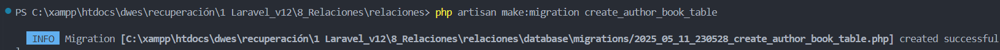

> Ahora debemos modificar la migración para poder unir los dos modelos.

##### Modif. create_author_book_table.

> vamos a añadirle a la migración unos valores minimos que necesita para añadir la relación entre los dos modelos, nos movemos a `database/migrations/create_author_book_table`.

```php
<?php

use Illuminate\Database\Migrations\Migration;
use Illuminate\Database\Schema\Blueprint;
use Illuminate\Support\Facades\Schema;

return new class extends Migration
{
    /**
     * Run the migrations.
     */
    public function up(): void
    {
        Schema::create('author_book', function (Blueprint $table) {
            $table->id();
            $table->unsignedBigInteger('author_id');
            $table->unsignedBigInteger('book_id');
            $table->timestamps();
        });
    }

    /**
     * Reverse the migrations.
     */
    public function down(): void
    {
        Schema::dropIfExists('author_book');
    }
};

```

> Esta sería la Tabla Puente, aunque tambien se le pueden añadir otros atributos, en mi caso no los necesito, pero si fuese una Tabla Puente para artículos y comprador podrías añadir, por ejemplo, la cantidad de artículos que compro el usuario, es decir: **Funganito compro 3 manzanas.**

Por ultimo hacemos un `php artisan migrate:refresh` para actualizar las migraciones.

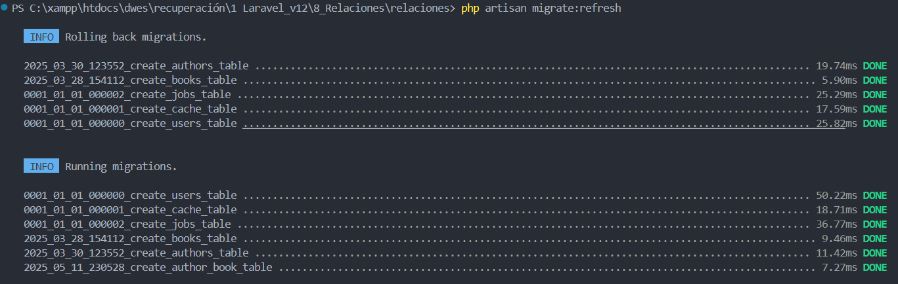

#### Comprobación N-M

> Ya tendriamos la infraestructura necesaria para poder establecer una relación muchos a muchos a continuación crearemos unos seeders para comprobar que vaya bien. 

Para ello creariamos un seeder para ***Book*** y otro para ***Author.***

* `php artisan make:seeder BookSeeder` (en mi caso ya lo tenia de puntos anteriores).
* `php artisan make:seeder AuthorSeeder`.

Ahora vamos a crear unos ejemplos de ambos, así se verían los seeders:

* **`database/seeders/AuthorSeeder.php`**:

```php
<?php

namespace Database\Seeders;

use App\Models\Author;
use Illuminate\Container\Attributes\Auth;
use Illuminate\Database\Console\Seeds\WithoutModelEvents;
use Illuminate\Database\Seeder;

class AuthorSeeder extends Seeder
{
    /**
     * Run the database seeds.
     */
    public function run(): void
    {
        Author::create([
            'id'=>1,
            'username'=>'J.R.R. Tolkien',
            'email'=>'I6VbJ@example.com',
            'password'=>'password', 
        ]);

        Author::create([
            'id'=>2,
            'username'=>'Gabriel García Márquez',
            'email'=>'Oo8h5@example.com',
            'password'=>'passworddos', 
        ]);

        Author::create([
            'id'=>3,
            'username'=>'Ernesto Sabato',
            'email'=>'6kGtM@example.com',
            'password'=>'passwordtres', 
        ]);

        Author::create([
            'id'=>4,
            'username'=>'Julio Cortázar',
            'email'=>'julio@hotmail.com',
            'password'=>'passwordcuatro', 
        ]);
    }
}

```

* **`database/seeders/BookSeeder.php`**:

```php
<?php

namespace Database\Seeders;

use Illuminate\Database\Console\Seeds\WithoutModelEvents;
use Illuminate\Database\Seeder;
use App\Models\Book;

class BookSeeder extends Seeder
{
    /**
     * Run the database seeds.
     */
    public function run(): void
    {
        Book::create([
            'id'=>1,
            'title'=>'El Señor de los Anillos',
            'author'=>'J.R.R. Tolkien',
            'genre'=>'Fantasía',
            'pages'=>1216,
            'rating'=>5,
        ]);

        Book::create([
            'id'=>2,
            'title'=>'Cien años de soledad',
            'author'=>'Gabriel García Márquez',
            'genre'=>'Realismo mágico',
            'pages'=>417,
            'rating'=>4,
        ]);

        Book::create([
            'id'=>3,
            'title'=>'El amor en los tiempos del cólera',
            'author'=>'Gabriel García Márquez',
            'genre'=>'Realismo mágico',
            'pages'=>368,
            'rating'=>5,
        ]);
      
        Book::create([
            'id'=>4,
            'title'=>'Crónica de una muerte anunciada',
            'author'=>'Gabriel García Márquez',
            'genre'=>'Realismo mágico',
            'pages'=>120,
            'rating'=>2,
        ]);

        Book::create([
            'id'=>5,
            'title'=>'El túnel',
            'author'=>'Ernesto Sabato',
            'genre'=>'Psicología',
            'pages'=>288,
            'rating'=>4,
        ]);

        Book::create([
            'id'=>6,
            'title'=>'Rayuela',
            'author'=>'Julio Cortázar',
            'genre'=>'Literatura contemporánea',
            'pages'=>560,
            'rating'=>2,
        ]);
    }
}

```

* **`database/seeders/DatabaseSeeder.php`**: (El que controla los seeders)

```php
<?php

namespace Database\Seeders;


use App\Models\Book;
// use Illuminate\Database\Console\Seeds\WithoutModelEvents;
use Illuminate\Database\Seeder;
use App\Models\Author;

class DatabaseSeeder extends Seeder
{
    /**
     * Seed the application's database.
     */
    public function run(): void
    {
       $this->call([
            BookSeeder::class,
            AuthorSeeder::class,
        ]);
    }
}

```

Una vez hayamos hecho esto ahora vamos a asignar que autor ha realizado cada libro, entonces, lo vamos a hacer mismamente en el `BookSeeder.php`, una asociación rapida desde la base de datos de la siguiente manera:

```php
<?php

namespace Database\Seeders;

use Illuminate\Database\Console\Seeds\WithoutModelEvents;
use Illuminate\Database\Seeder;
use App\Models\Book;
use Illuminate\Support\Facades\DB;

class BookSeeder extends Seeder
{
    /**
     * Run the database seeds.
     */
    public function run(): void
    {
        Book::create([
            'id'=>1,
            'title'=>'El Señor de los Anillos',
            'author'=>'J.R.R. Tolkien',
            'genre'=>'Fantasía',
            'pages'=>1216,
            'rating'=>5,
        ]);

        Book::create([
            'id'=>2,
            'title'=>'Cien años de soledad',
            'author'=>'Gabriel García Márquez',
            'genre'=>'Realismo mágico',
            'pages'=>417,
            'rating'=>4,
        ]);

        Book::create([
            'id'=>3,
            'title'=>'El amor en los tiempos del cólera',
            'author'=>'Gabriel García Márquez',
            'genre'=>'Realismo mágico',
            'pages'=>368,
            'rating'=>5,
        ]);
      
        Book::create([
            'id'=>4,
            'title'=>'Crónica de una muerte anunciada',
            'author'=>'Gabriel García Márquez',
            'genre'=>'Realismo mágico',
            'pages'=>120,
            'rating'=>2,
        ]);

        Book::create([
            'id'=>5,
            'title'=>'El túnel',
            'author'=>'Ernesto Sabato',
            'genre'=>'Psicología',
            'pages'=>288,
            'rating'=>4,
        ]);

        Book::create([
            'id'=>6,
            'title'=>'Rayuela',
            'author'=>'Julio Cortázar',
            'genre'=>'Literatura contemporánea',
            'pages'=>560,
            'rating'=>2,
        ]);


        DB::table('author_book')->insert([
            'id'=>1,
            'id'=>1,
        ]);

        DB::table('author_book')->insert([
            'id'=>2,
            'id'=>2,
        ]);

        DB::table('author_book')->insert([
            'id'=>2,
            'id'=>3,
        ]);

        DB::table('author_book')->insert([
            'id'=>2,
            'id'=>4,
        ]);

        DB::table('author_book')->insert([
            'id'=>3,
            'id'=>5,
        ]);

        DB::table('author_book')->insert([
            'id'=>4,
            'id'=>6,
        ]);
    }
}

```

Como veis hemos añadido varias cosas, para empezar añadimos la linea 8 que lo que hace es que proporciona acceso directo a la base de datos para realizar consultas SQL de bajo nivel. En mi caso, lo utilizo para insertar datos directamente en la tabla `author_book` con el método `DB::table()->insert()` que usamos despues justo debajo de la creacion de libros.

> Una vez tengamos listo todo vamos a realizar: 
>
> 1. `php artisan migrate:reset` para resetearlo todo.
> 2. `php artisan migrate` para volver a cargar las migraciones de nuevo.
> 3. php artisan db:seed para volver a poblar las tablas de datos.

* ***Reset***

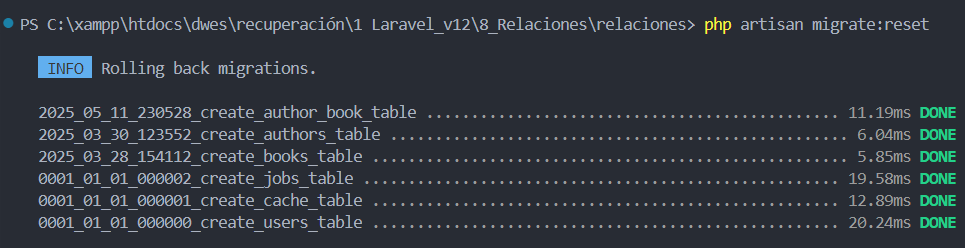

* ***migrate***

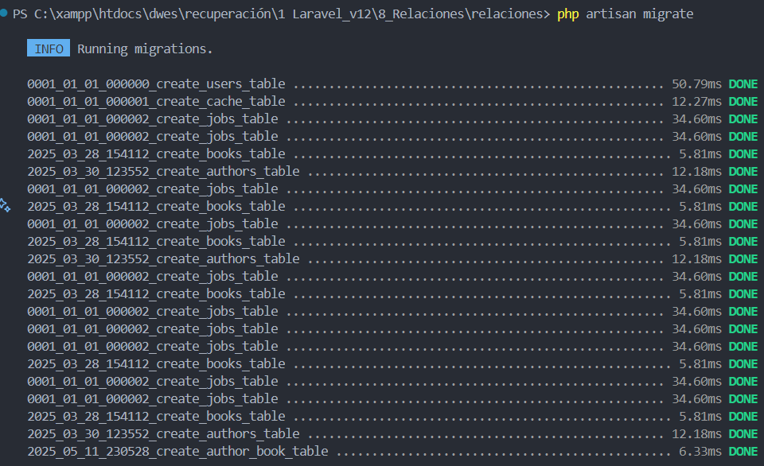

* ***db:seeder***

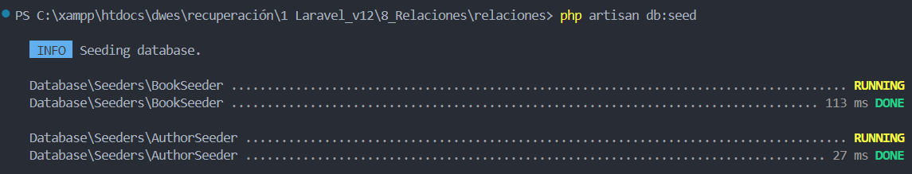

Ahora para juntar los modelos debemos de modificarlos de la siguiente manera:

* A **Book.php** le añadimos la función:

```php
 public function authors(): BelongsToMany
    {
        return $this->belongsToMany(Author::class);
    }
```

* Y lo mismo haremos con **Author.php**:

```php
 public function books(): BelongsToMany
    {
        return $this->belongsToMany(Book::class);
    }
```

> Sin olvidar de importarle BelongsToMany:


> En el caso de que hayamos añadido en nuestra tabla puente alguna otra columna aparte deberemos señalizarla de la siguiente manera:
>
> ```php
> public function authors(): BelongsToMany
>     {
>         return $this->belongsToMany(Author::class)->withPivot('newcolumna');
>     }
> ```

Y para finalizar en nuestro BookController modificaremos la funcion index para poder modificar la vista y asi comprobar que la relación funciona:

> lo que hemos cambiado es 

`$books = Book::all();`

> por

`$books = Book::with('authors')->get();` 

> **Y se vería así**

`app/Http/Controllers/BookController.php` :

```php
<?php

namespace App\Http\Controllers;

use Illuminate\Http\Request;
use App\Models\Book; // Importar el modelo Book
use App\Http\Requests\BookRequest; // Importar el request BookRequest

    class BookController extends Controller
    {
        //
        public function index()
        {
            //obtenemos todos los libros de la base de datos
            $books = Book::with('authors')->get();
            //retornamos la vista con los libros, la función compact nos permite pasar variables a la vista en un array asociativo  
            return view('book.index', compact('books'));
        }


        //crea create, donde se pasa una vista para que cree un libro
        public function create()
        {
            return view('book.create');
        }

        //crea store, donde se guarda el libro en la base de datos
        public function store(BookRequest $request)
        {
            Book::create($request->all());
            return redirect()->route('book.index')->with('success', 'Libro creado correctamente');   
        }

        //muestra el formulario para editar un libro
        public function edit(Book $book)
        {
            //$book = Book::find($id);  NO NECESARIO. Lo hace de forma implícita
            return view('book.edit', compact('book'));
        }

        //actualiza un libro
        public function update(BookRequest $request, Book $book)
        {
            $book->update($request->all());
            return redirect()->route('book.index')->with('success', 'Libro actualizado correctamente');
        }

        //muestra un libro en específico
        public function show(Book $book)
        {
            return view('book.show', compact('book'));
        }

        //eliminar un libro
        public function destroy(Book $book)
        {
            $book->delete();  
            return redirect()->route('book.index')->with('danger', 'Libro eliminado correctamente');
        }
  
  
}


```

Simplemente use `with('author')` en el controlador para cargar los autores junto con los libros.

Ahora la vista:

`resources/views/book/index.blade.php`.

```php
@extends('layouts.app')

@section('content')
<div class="container">
    <div class="flex-space-between mb-4">
        <h1>Libros</h1>
        <a href="{{ route('book.create') }}" class="button">Crear libro</a>
    </div>

    @if($books->isEmpty())
        <p class="text-gray-500">No hay libros disponibles.</p>
    @else
        <ul>
            @foreach($books as $book) 
                <li class="card">
                    <h2>{{ $book->title }}</h2>
                    <p>Autores:
                        @foreach($book->authors as $author) <!--Accede a los autores relacionados con el libro.-->
                            {{ $author->username }}{{ !$loop->last ? ',' : '' }}
                        @endforeach
                    </p>
                    <div class="flex mt-4">
                        <a href="{{ route('book.show', $book->id) }}">Ver</a>
                        <a href="{{ route('book.edit', $book->id) }}">Editar</a>
                        <form action="{{ route('book.destroy', $book->id) }}" method="POST" onsubmit="return confirm('¿Seguro que quieres borrar este libro?');">
                            @csrf
                            @method('DELETE')
                            <input type="submit" value="Borrar">
                        </form>
                    </div>
                </li>
            @endforeach
        </ul>
    @endif
</div>
@endsection

```


> Aqui lo que he añadido nuevo es:
>
> 1. **`$book->authors`** : que accede a los autores relacionados con el libro.
> 2. **`$author->username`** : que muestra el nombre del autor (en mi caso el nombre en la tabla de author es **username**).
> 3. **`!$loop->last ? ',' : ''`** : que agrega una coma entre los nombres de los autores, excepto después del último autor (util en el caso de que el libro tenga mas de un autor).

---

**¿¿Cómo funciona lo ultimo??**

1. **`$loop`** :

* Laravel proporciona la variable especial `$loop` dentro de los bucles `@foreach`.
* Esta variable contiene información sobre el estado del bucle, como si es el primer o último elemento, el índice actual, etc.

1. **`$loop->last`** :

* Es una propiedad de `$loop` que devuelve `true` si el elemento actual es el último del bucle.

1. **`!$loop->last`** :

* El operador `!` invierte el valor de `$loop->last`. Por lo tanto, devuelve `true` si **no** es el último elemento.

1. **`? ',' : ''`** :

* Es un operador ternario que dice:
  * Si `!$loop->last` es `true` (es decir,  **no es el último elemento** ), muestra una coma `','`.
  * Si `!$loop->last` es `false` (es decir,  **es el último elemento** ), muestra una cadena vacía `''`.

---

##### Web

Ahora veamos como se muestra en la pagina:

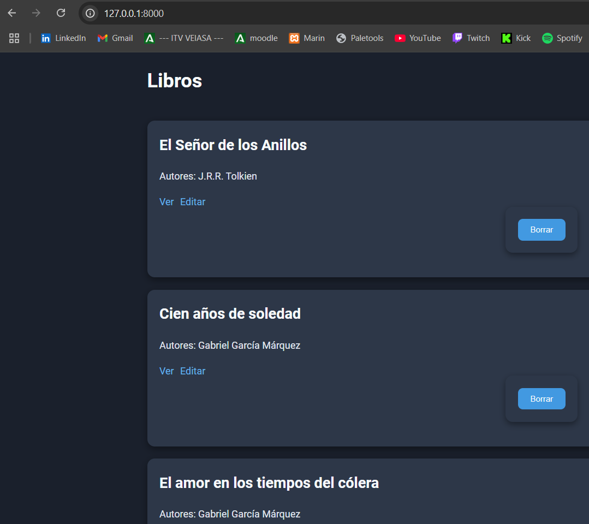

---

### Ranking

> Segunda relación.

#### Resumen.

> En este apartado vamos a seguir con la segunda relación del proyecto, que constara de la relacion entre valoracion **ranking** y libros ***book.***

**Relación entre `Book` y `Rating`**

1. **Un libro puede tener muchas calificaciones.**
2. **Una calificación pertenece a un solo libro.**

Esto se implementa como una relación  **uno a muchos**.

#### Ranking

Esta parte la hare mas rapido para no pararme en cosas ya vistas.

creo el modelo y la migración:

`php artisan make:model Ranking --migration`

Ahora modificamos la migración ***create_ranking_table***:

```php
<?php

use Illuminate\Database\Migrations\Migration;
use Illuminate\Database\Schema\Blueprint;
use Illuminate\Support\Facades\Schema;

return new class extends Migration
{
    /**
     * Run the migrations.
     */
    public function up(): void
    {
        Schema::create('rankings', function (Blueprint $table) {
            $table->id();
            $table->foreignId('book_id')->constrained()->onDelete('cascade'); // Relación con libros
            $table->integer('rating');
            $table->timestamps();
        });
    }

    /**
     * Reverse the migrations.
     */
    public function down(): void
    {
        Schema::dropIfExists('rankings');
    }
};

```

**¿Que hace?**

* **`foreignId('book_id')`** : Crea una columna llamada `book_id` en la tabla. Esta columna se utiliza para establecer una relación con otra tabla (en este caso, la tabla `books`).
* **`->constrained()`** : Define que la columna `book_id` es una clave foránea que está relacionada con la columna `id` de la tabla `books`.
* Laravel asume automáticamente que la tabla relacionada es `books` porque el nombre de la columna es `book_id`.
* Si necesitas relacionarla con una tabla diferente, puedes especificarlo explícitamente, por ejemplo:

> `$table->foreignId('book_id')->constrained('my_books_table');`

* **`->onDelete('cascade')`** : Configura la acción que debe realizarse cuando se elimina un registro en la tabla relacionada (`books`).
* En este caso, si un libro es eliminado de la tabla `books`, todos los registros en la tabla actual que estén relacionados con ese libro (es decir, que tengan el mismo `book_id`) también serán eliminados automáticamente.

En resumen crea una columna que guarda una clave foranea que esta directamente relacionada con la `id `de la tabla libros y en caso de que esta `id `sea eliminada de libros todos los elementos de esta migración relacionados con dicha `id `serán eliminados.

---

* Ejecutamos la migracion

`php artisan migrate:refresh`

* Definimos la relación en los modelos:

***Book.php***

```php
 public function rankings() : HasMany
    {
        return $this->hasMany(Ranking::class);
    }
```

> Esto indica que un libro puede tener muchas calificaciones.

***Ranking.php***

```php
<?php

namespace App\Models;

use Illuminate\Database\Eloquent\Model;

class Ranking extends Model
{
    protected $guarded = [];

    public function book() : BelongsTo
    {
        return $this->belongsTo(Book::class);
    }
}

```

> Esto indica que una calificación pertenece a un libro.

---

**Relación completa**

* **`Book`** tiene una relación **uno a muchos** con `Rating` (`hasMany`).
* **`Rating`** tiene una relación **muchos a uno** con `Book` (`belongsTo`).

---

> Ahora vamos a crear la vista que nos va a mostrar las rankings, la crearemos dentro de la carpeta `resources/views/book` ya que será para una función que haremos dentro del `BookController`

* creamos `top-rated.blade.php`

> Una vez creada la vista nos iremos al controlador y agregaremos la función topRated:

```php


public function topRated(){
        // Obtener los tres libros mejor valorados
    $books = Book::with('rankings')
        ->withAvg('rankings', 'rating') // Calcula el promedio de las calificaciones
        ->orderByDesc('rankings_avg_rating') // Ordena por el promedio de calificaciones
        ->take(3) // Limita a los 3 mejores
        ->get();

    // Retornar la vista con los libros mejor valorados
    return view('book.top-rated', compact('books'));
    }
```


---

**¿Que es el withAvg y para que se usa?**

Si tienes:

* Una relación llamada `rankings` en el modelo `Book`.
* Una columna llamada `rating` en la tabla relacionada (`rankings`).

> Entonces, al usar `withAvg('rankings', 'rating')`, Laravel generará una columna llamada **`rankings_avg_rating`** en el resultado.

**¿Qué contiene `rankings_avg_rating`?**

La columna **`rankings_avg_rating`** contiene el promedio de los valores de la columna `rating` en la tabla `rankings` para cada libro y el **OrderByDesc** los ordena de mayor a menor.

**Take**

Take lo usamos para elejir solo tres titulos

**GET**

get() lo usamos para mostrarlos.

Este metodo es ideal para cuando hay mas de una valoracion de un libro.

---

* Ahora antes de modificar la vista vamos a crear un seeder de ranking para poblar la bd de datos:

`php artisan make:seeder RankingSeeder`

* Y lo modificamos de la siguiente manera:

```php
<?php

namespace Database\Seeders;

use Illuminate\Database\Console\Seeds\WithoutModelEvents;
use Illuminate\Database\Seeder;
use App\Models\Ranking; // Importar el modelo Ranking

class RankingSeeder extends Seeder
{
    /**
     * Run the database seeds.
     */
    public function run(): void
    {
        // Calificaciones para los libros
        Ranking::create([
            'book_id' => 1,
            'rating' => 5,
        ]);

        Ranking::create([
            'book_id' => 2,
            'rating' => 4,
        ]);

        Ranking::create([
            'book_id' => 3,
            'rating' => 5,
        ]);

        Ranking::create([
            'book_id' => 4,
            'rating' => 2,
        ]);

        Ranking::create([
            'book_id' => 5,
            'rating' => 4,
        ]);

        Ranking::create([
            'book_id' => 6,
            'rating' => 2,
        ]);
    }
}

```

> En este caso no tendremos que asociarlo en la BD porque book_id ya esta dentro de la tabla Ranking.

* Lo añadimos en DatabaseSeeder.php y llamamos al modelo:

```php
<?php

namespace Database\Seeders;


use App\Models\Book;
// use Illuminate\Database\Console\Seeds\WithoutModelEvents;
use Illuminate\Database\Seeder;
use App\Models\Author;
use App\Models\Ranking; // Importar el modelo Ranking

class DatabaseSeeder extends Seeder
{
    /**
     * Seed the application's database.
     */
    public function run(): void
    {
       $this->call([
            BookSeeder::class,
            AuthorSeeder::class,
            RankingSeeder::class,
        ]);
    }
}

```

> Ahora volvemos a hacer un reset, migrate y db:seed

* `php artisan migrate:reset`
* `php artisan migrate`
* `php artisan db:seed`

---

* Añadimos la siguiente linea en `routes/web.php`

`Route::get('/book/ranking', [BookController::class, 'topRated'])->name('book.ranking');`

* Y modificamos el rop-rated.blade.php de la siguiente manera:

```php
@extends('layouts.app')

@section('content')
<div class="container">
    <h1>Top 3 Libros Mejor Valorados</h1>

    @if($books->isEmpty())
        <p class="text-gray-500">No hay libros disponibles.</p>
    @else
        <ul>
            @foreach($books as $book)
                <li class="card">
                    <h2>{{ $book->title }}</h2>
                    <p>Calificación promedio: {{ $book->rankings_avg_rating }}</p>
                </li>
            @endforeach
        </ul>
    @endif
</div>
@endsection
```

Comprobación.

Así quedaria la vista de la relación entre libro y ranking:

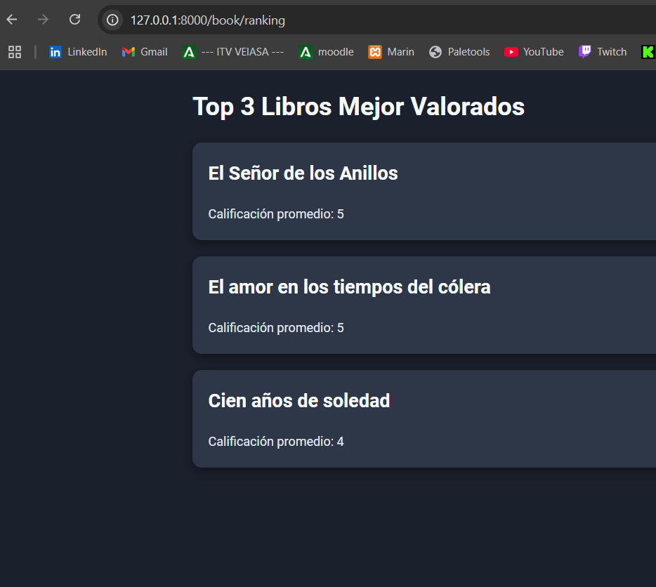
