# API


> En este documento, veremos al igual que en el 2 trimestre **la API en laravel** **12** practicaremos mientras que aprendemos sobre estos y documentaremos **paso a paso** para mayor entendimiento.

---

### Índice.

* Introducción
* API.php
* Controlador
* Tipado de Controlador y prueba de funcionamiento
* Api Resource

---

## Introducción.

Hablemos un poco del termino API y su función en Laravel 12:

Una **API** (Interfaz de Programación de Aplicaciones) es un conjunto de reglas y herramientas que permite que diferentes programas o sistemas se comuniquen entre sí.

> En el contexto web, una API suele ser un conjunto de rutas que permiten a otras aplicaciones **consultar, crear, modificar o eliminar datos** de tu aplicación, normalmente usando el formato JSON.

En  **Laravel 12** , una API sirve para:

* **Exponer datos** de tu aplicación a otras aplicaciones o servicios.
* **Permitir operaciones CRUD** (Crear, Leer, Actualizar, Borrar) sobre tus modelos, pero en vez de mostrar vistas HTML, responde con datos en formato JSON.
* **Separar el frontend del backend** : Puedes tener tu backend en Laravel y tu frontend en React, Vue, Angular, o una app móvil, comunicándose solo por la API.
* **Seguridad y control** : Puedes proteger rutas de la API con autenticación, limitar qué datos se exponen y cómo se exponen (por ejemplo, usando recursos como `AuthorResource`).

### Comienzo.

Trabajaremos con el modelo y migración de autores (serían los usuarios de la aplicación), para ello creamos y modificamos dichos
archivos, para crearlos es tan sencillo como poner el siguiente comando en la terminal: (Siempre dentro del proyecto)

`php artisan make:model autor --migration`

Ahora modifiquemos dichos archivos:

> autor.php (app/models/autor.php)

Aquí prepararemos que elementos serán accesibles.

```php
<?php

namespace App\Models;

use Illuminate\Database\Eloquent\Model;
use Illuminate\Database\Eloquent\Factories\HasFactory;
use Illuminate\Database\Eloquent\Relations\BelongsToMany;

class Author extends Model
{
    use HasFactory;
  
    protected $guarder = [];

    public function books(): BelongsToMany
    {
        return $this->belongsToMany(Book::class);
    }
}

```

Así se vería en mi caso.

---

> create-author-table.php :(database/migrations/…)

Aquí mencionaremos los datos que tendrá la tabla de autores:

```php
<?php

use Illuminate\Database\Migrations\Migration;
use Illuminate\Database\Schema\Blueprint;
use Illuminate\Support\Facades\Schema;

return new class extends Migration
{
    /**
     * Run the migrations.
     */
    public function up(): void
    {
        Schema::create('authors', function (Blueprint $table) {
            $table->id();
            $table->string('username');
            $table->string('email')->unique();
            $table->string('password');
            $table->timestamps();
        });
    }
	/**
    	 * Reverse the migrations.
     	*/
    public function down(): void
    {
        Schema::dropIfExists('authors');
    }
};


```

Así se vería en mi caso

Ahora deberíamos de migrar nuestro proyecto, en caso de que sea la primera vez realizaríamos:

`php artisan migrate`

En caso de que no sea la primera vez podemos hacer un refresh

`php artisan migrate:refresh`

---

## API.php

En este punto vamos a ver las rutas a la api de nuestra aplicación.

En nuestro proyecto, que anteriormente hemos creado, nos vamos a mover a la carpeta de routes y una vez dentro nos damos cuenta que únicamente tenemos.

* console.php
* web.php

Ya comentamos que el archivo donde se encuentran las rutas de la api, no se crea de forma predeterminada en laravel, sino que debemos de crearlo nosotros, asi que creemos dicho archivo:

Para ello vamos a escribir el siguiente comando en la terminal

`php artisan install:api`

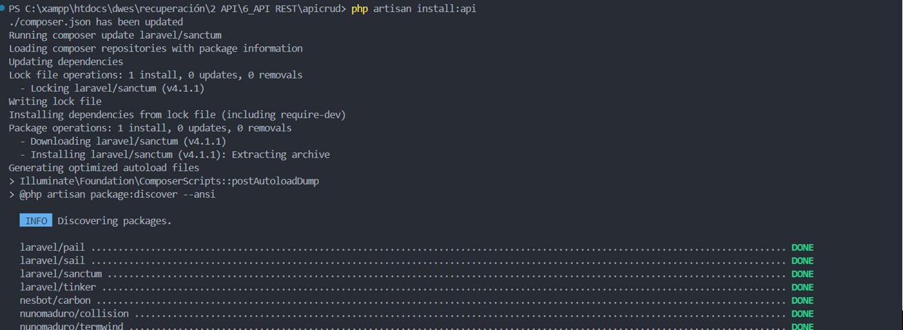

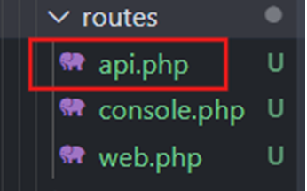

Ahora veamos lo que contiene y modifiquemoslo:

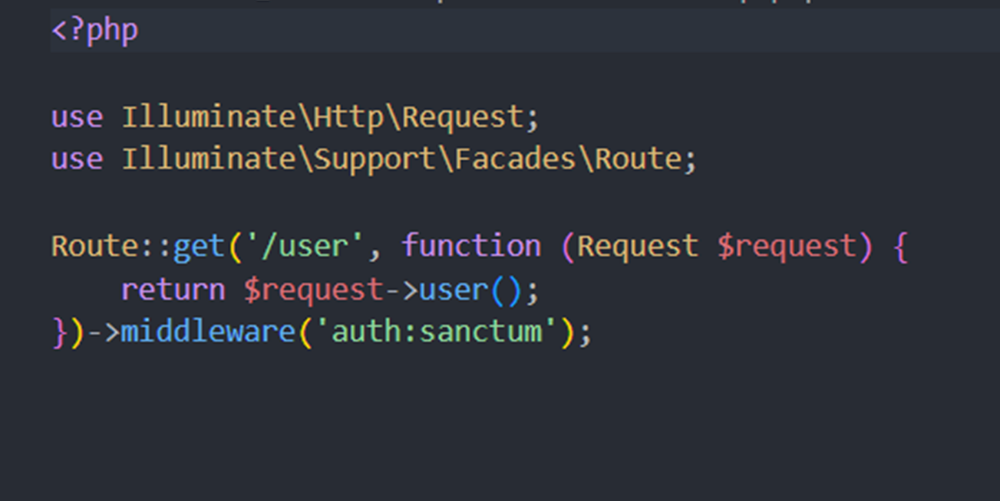

> Vemos que contiene una ruta para un middleware de autentificación esto lo que hace es que solo pueda acceder a rutas si  el usuario se ha autentificado previamente. Pero eso ya lo veremos posteriormente con el punto de middleware.

Lo limpiamos y modificamos pero antes de nada necesitamos nuestro controlador que se encargue de dicha API, para ello creémoslo

`php artisan make:controller AuthorController  --resource`

> `--resource` se encarga de ubicar las funciones principales
> dentro del controlador: index, store, create….

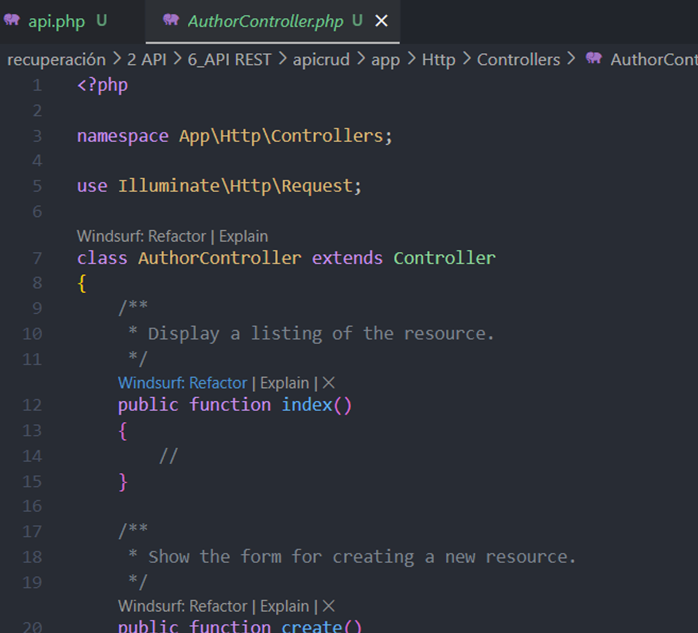

Ahora ya teniendo nuestro controlador vamos a crear la ruta en api.php, además al estar haciendo las rutas para un crud completo podemos reducir las líneas de código al no hacer una ruta por cada función.

¿Cómo se haría?

Modificamos api.php de la siguiente manera:

```php


<?php

use Illuminate\Http\Request;
use Illuminate\Support\Facades\Route;
use App\Http\Controllers\AuthorController;

Route::resource('/author', AuthorController::class);


```

> No nos olvidemos  de importar el controlador  es sumamente importante,  de esta manera estamos trabajando
> con las funciones de controlador sin necesidad de ir una por una.

> No necesitamos nombrar la ruta ya que como de momento es únicamente para el uso de la api y no necesitamos de vistas no hace falta referenciarla.

---

## Controlador

Aquí veremos como le daremos uso al controlador de la API

Ahora vamos a generar un archivo Request para así validar
los datos que queremos guardar de los autores tal como vimos en puntos
anteriores, hagamos lo siguiente:

`php artisan make:Request AuthorRequest`

en mi caso lo modifiqué de la siguiente manera:

> /app/request/AuthorRequest.php

```php
<?php

namespace App\Http\Requests;

use Illuminate\Foundation\Http\FormRequest;

class AuthorRequest extends FormRequest
{
    /**
     * Determine if the user is authorized to make this request.
     */
    public function authorize(): bool
    {
        return true; 
    }//importante para que todos los usuarios puedan realizar este tipo de peticiones

    /**
     * Get the validation rules that apply to the request.
     *
     * @return array<string, \Illuminate\Contracts\Validation\ValidationRule|array<mixed>|string>
     */
    public function rules(): array
    {
        return [
            'username' => 'required'|'string|max:100',
            'email' => 'required'|'email|max:255|unique:authors,email,'.$this->route('author'),
            'password' => 'required'|'string|min:8',
        ];
    }
}

```

Todo esto es para mayor organización de código y comodidad,
ahora vayamos para usarla en el controlador
y modifiquémoslo.

> /app/http/controllers/AuthorController.php

```php
<?php

namespace App\Http\Controllers;

use Illuminate\Http\Request;
use App\Models\Author;
use App\Http\Requests\AuthorRequest;

class AuthorController extends Controller
{
    /**
     * Display a listing of the resource.
     */
    public function index()
    {
        $author = Author::all();
        return response()->json($author, 200);
        //aqui estamos devolviendo una respuesta en formato json y un codigo 200
        //como vemos a diferencia do lo anterior 
        //aqui devuelve una respuesta, no una vista 
    }

    /**
     * Show the form for creating a new resource.
     */
    public function store(AuthorRequest $request)// esto es para que la peticion llegue ya validada por el AuthorRequest
    {
        Author::create($request->all());
        return response()->json([
            'success' => true,
        ], 201);
        //aqui estamos devolviendo una respuesta en formato json y un codigo 201
        //que significa que se ha creado un nuevo recurso
    }

    /**
     * Display the specified resource.
     */
    public function show(string $id)
    {
        $author = Author::find($id); //busca el id del Author
        return response()->json($author, 200);
    }

    /**
     * Update the specified resource in storage.
     */
    public function update(AuthorRequest $request, $id)
    {
        $author = Author::find($id);
        $author ->username = $request->username;
        $author ->email = $request->email;
        $author ->password = $request->password;
        $author->save();

        return response()->json([
            'success' => true,
        ], 200);
        //aqui estamos devolviendo una respuesta en formato json y un codigo 200
        //que significa que se ha actualizado un recurso
        }

    /**
     * Remove the specified resource from storage.
     */
    public function destroy($id)
    {
        Author::destroy($id);
        return response()->json([
            'success' => true,
        ], 200);
        //aqui estamos devolviendo una respuesta en formato json y un codigo 200

        //que significa que se ha eliminado un recurso
    }
}

```

> Así se vería como podemos observar hay funciones que no aparecen como es el caso del edit y del create eso se debe a que no estamos devolviendo una vista de formulario sino una respuesta en formato json.

---

## Tipado de Controlador y prueba de funcionamiento.

Vamos a tener dos tipos de enfoque para llevar a cabo esta refactirización

* Aplicada al tipo de respuesta
* Mostrado del  tipado

Limpiado de controlador

```php

<?php

namespace App\Http\Controllers;

use Illuminate\Http\Request;
use App\Models\Author;
use App\Http\Requests\AuthorRequest;
use Illuminate\Database\Eloquent\Casts\Json;
use Illuminate\Http\JsonResponse;

class AuthorController extends Controller
{

    public function index():JsonResponse
    {
        return response()->json(Author::all(), 200);
    }


    public function store(AuthorRequest $request):JsonResponse
    {
        Author::create($request->all());
        return response()->json([
            'success' => true,
        ], 201);
        }


    public function show(string $id):JsonResponse
    {
        $author = Author::find($id);
        return response()->json($author, 200);
    }

    public function update(AuthorRequest $request, $id):JsonResponse
    {
        $author = Author::find($id);
        $author ->username = $request->username;
        $author ->email = $request->email;
        $author ->password = $request->password;
        $author->save();

        return response()->json([
            'success' => true,
        ], 200);
        }


    public function destroy($id):JsonResponse
    {
        Author::destroy($id);
        return response()->json([
            'success' => true,
        ], 200);
    }
}

```

Hemos reducido el codigo quitando los comentarios a cambio de señalizar el tipado de lo que devuelve las funciones:

`:JsonResponse`

Y tambien hemos cambiado la linea de:

```php
public function index() {
$author = Author::all();   
return response()->json($author, 200);...
```

por:

```php
public function index():JsonResponse
    {
        return response()->json(Author::all(), 200);
    }
```

Comprobemos la API

Para ello vamos a instalarnos la extensión de Thunder Client aunque lo podemos comprobar tambien con postman pero en mi caso usaré la extensión. Para instalarla:

1. Desde Visual Studio Code nos iremos a extensiones

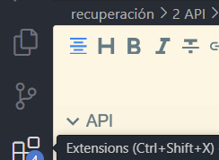

    2. En el buscador ponemos Thunder Client

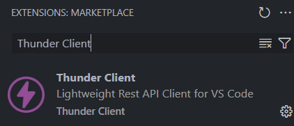

    3. Lo instalamos


Antes de nada levantamos el servicio:

`php artisan serve`

> Ya que sino no podremos realizar las peticiones.

Ahora abrimos Thunder Client:

En mi caso me gusta crear una colleccion donde guardar las peticiones, voy a crear una coleccion que se llame API AUTHOR

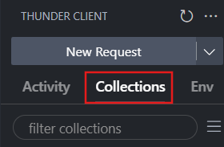

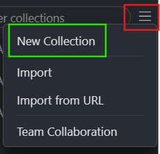

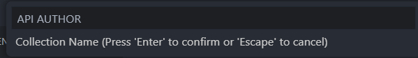

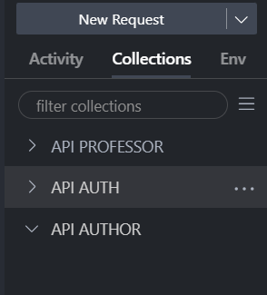

Una vez creada la collección yo creo una request por funcion por ejemplo si en el controlador de la api hay 4 funciones creo cuatro archivos request:

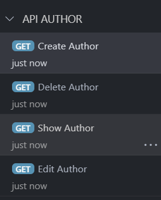

Obviamente tenemos que modificarlo porque no todas las peticiones son get... ahora os muestro cada peticion como quedaría, ya modificada:

> OJO para la hora de modificar las rutas si quieres tenerlas a mano por si acaso no te acuerdas ejecutas el comando
>
> `php artisan route:list`  y te mostrará todas las rutas incluyendo las de la api
>
> 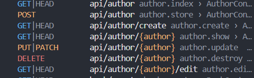
>
> ademas deberías añadirle el content-type en los headers para que no haya ningún problema:
>
> 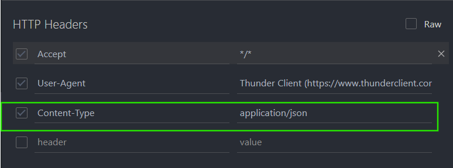

---

## Api Resource

Estos recursos nos van a permitir es establecer una capa intermedia mediante la cual a cada uno de los modelos que estaremos generando, vamos a indicarle como tiene que construir los datos que vamos a estar devolviendo, para empezar a trabajar con ello crearemos un nuevo elemento:

`php artisan make:resource AuthorResource`

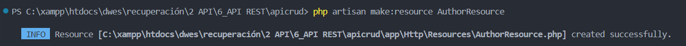

> Es el comando para crear un recurso, este se establecera en el directorio  `app/http/Resources`

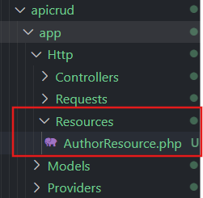

Podemos observar que el AuthorResource nos va a incluir por defecto una función que se va a encargar de realizar la traducción del array que posteriormente sera retornado en Json cuando se realice una petición a este recurso, a continuación vamos a realizar diferentes acciones para poder modificar su contenido.

> Mi ***AuthorResource.php*** quedaria así:

```php
<?php

namespace App\Http\Resources;

use Illuminate\Http\Request;
use Illuminate\Http\Resources\Json\JsonResource;

class AuthorResource extends JsonResource
{
    /**
     * Transform the resource into an array.
     *
     * @return array<string, mixed>
     */
    public function toArray(Request $request): array
    {
        return [
            'id' => $this->id,
            'username' => 'El nombre de usuario es: ' . $this->username,
            'email' => 'El email es: ' . $this->email,
            'password' => 'La contraseña es: ' . $this->password,
        ];
    }
}

```

Ahora volvemos a AuthorController.php para realizarlas modificaciones y asi que se apoye en nuestro recurso.

> Recordemos que para usar nuestro recurso hay que importarlo en el controller:* **use App\Http\Resources\AuthorResource;***

Asi quedaría la clase del AuthorController.php:

```php
<?php

namespace App\Http\Controllers;


use App\Models\Author;
use App\Http\Requests\AuthorRequest;
use Illuminate\Http\JsonResponse;
use App\Http\Resources\AuthorResource;
use Illuminate\Database\Eloquent\Casts\Json;
use Illuminate\Http\Resources\Json\JsonResource;
use Illuminate\Http\Response;


class AuthorController extends Controller
{

    public function index(): JsonResource
    {
        //return response()->json(Author::all(), 200);
        return AuthorResource::collection(Author::all());
    }


    public function store(AuthorRequest $request): JsonResponse
    {
        //$request->validated();
        $author = new Author();
        $author->username = $request->username;
        $author->email = $request->email;
        $author->password = $request->password;
        $author->save();
        // Otra forma de crear el autor es usando el método create
        // $author = Author::create($request->all());
        return response()->json([
            'success' => true,
            'data' => new AuthorResource($author),
        ], 201);
    }


    public function show(string $id): JsonResource
    {
        $author = Author::find($id);
        //return response()->json($author, 200);
        return new AuthorResource($author);
    }

    public function update(AuthorRequest $request, $id): JsonResponse
    {
        $author = Author::find($id);
        $author->username = $request->username;
        $author->email = $request->email;
        $author->password = $request->password;
        $author->save();

        return response()->json([
            'success' => true,
            'data' => new AuthorResource($author),
        ], 200);
    }


    public function destroy($id): JsonResponse
    {
        Author::destroy($id);
        return response()->json([
            'success' => true,
        ], 200);
    }
}

```

Como podrán ver hemos cambiado tambien el tipado de lo que devuelven las funciones como por ejemplo en index que devuelve un JsonResource en lugar de un JsonRequest. Ahora comentaré un poco los cambios que he realizado.

#### Usos del AuthorResource

##### index()

```php
<?php

return AuthorResource::collection(Author::all());
```

Devuelve **todos los autores** usando el formato definido en `AuthorResource` para cada uno.

##### show()

```php
<?php

return new AuthorResource($author);
```

Devuelve el **autor** con el formato personalizado.

##### store() y update()

```php
<?php

'data' => new AuthorResource($author)
```

Cuando creas o actualizas un autor, la respuesta incluye los datos del autor **ya formateados** por el recurso.

##### destroy()

No devuelve datos del autor, solo un mensaje de éxito, así que aquí no afecta.

##### Comprobación:

> ShowAuthor:

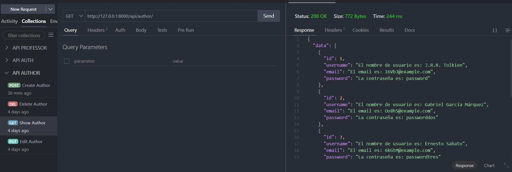

> CreateAuthor

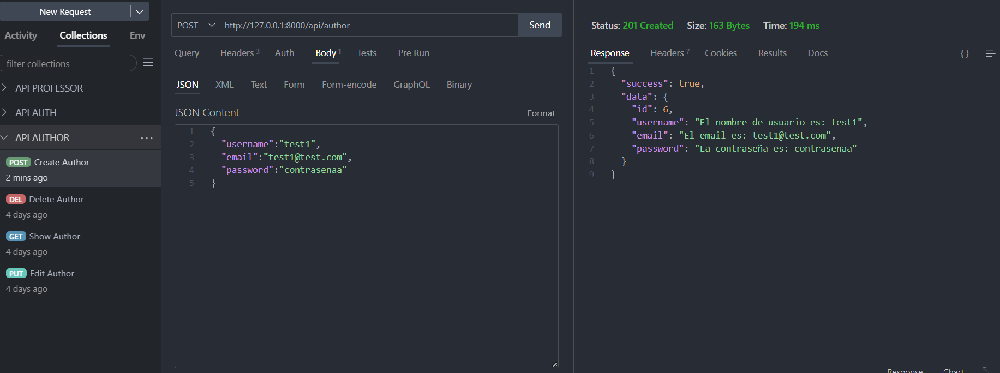

> EditAuthor

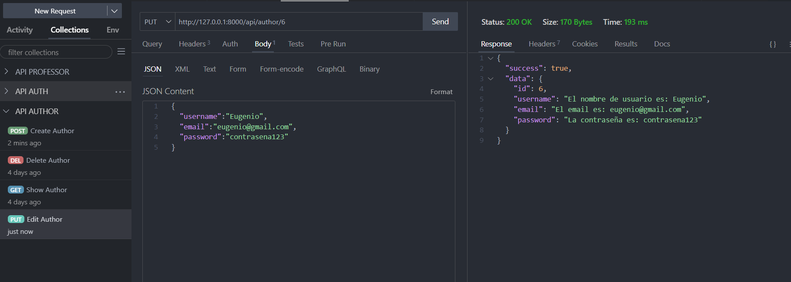

> DeleteAuthor:

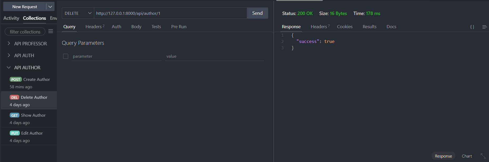

---

> Usar `AuthorResource` es como ponerle un filtro a los datos antes de entregárselos al cliente de la API. Así, solo muestras lo que quieres y como quieres, haciendo tus respuestas más seguras, limpias y fáciles de entender.
