# Autenticación API


> En este documento, veremos al igual que en el 2 trimestre **la Autenticación API en laravel** **12** practicaremos mientras que aprendemos sobre estos y documentaremos **paso a paso** para mayor entendimiento.

---

### Índice.

* Introducción
* Registrar Middleware
* Middleware en Grupos de Rutas
* Ejemplo de middleware
* Proyecto ApiAuth

---

## Introducción.

Middleware proporciona un mecanismo práctico para inspeccionar y filtrar las solicitudes HTTP que entran en tu aplicación. Por ejemplo, Laravel incluye un middleware que verifica que el usuario de tu aplicación esté autenticado. Si el usuario no está autenticado, el middleware lo redirigirá a la pantalla de inicio de sesión de tu aplicación.

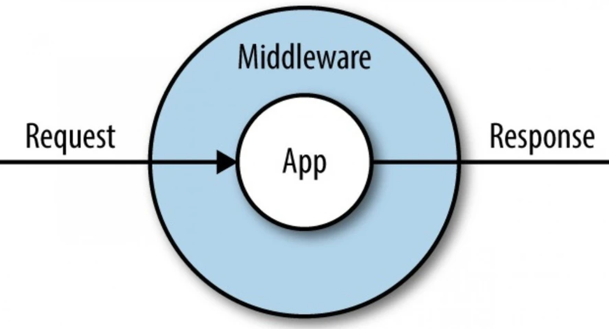

---

## Registrar Middleware.

En este apartado, se estará trabajando con el proyecto del apartado anterior, como ya hemos visto en ocasiones anteriores, simplemente hemos copiado y pegado el archivo en la nueva carpeta:

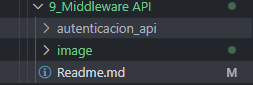

Al proyecto lo he llamado autenticacion_api, tambien podremos crearlos desde 0 como ya hemos comentado en anteriores puntos.

En laravel 12 no viene la carpeta middleware no se crea automáticamente a menos que se genere un middleware o ya exista alguno en el proyecto.

Como no tenemos ninguno haremos lo siguiente:

> * **¿Como creamos un middleware?**
>
> Para crear un middleware, solo debemos realizar el siguiente comando dentro de nuestro proyecto:
>
> `php artisan make:middleware (NombreMiddleware)  //Con esa misma nomenclatura`

En mi caso crearé el middleware **"ejemplo"** para ir probando y ojeando los middleware.

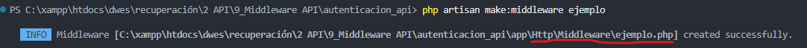

como podemos observar ahora si tendremos la carpeta middleware en el caso de que no estuviera anteriormente.

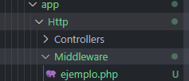

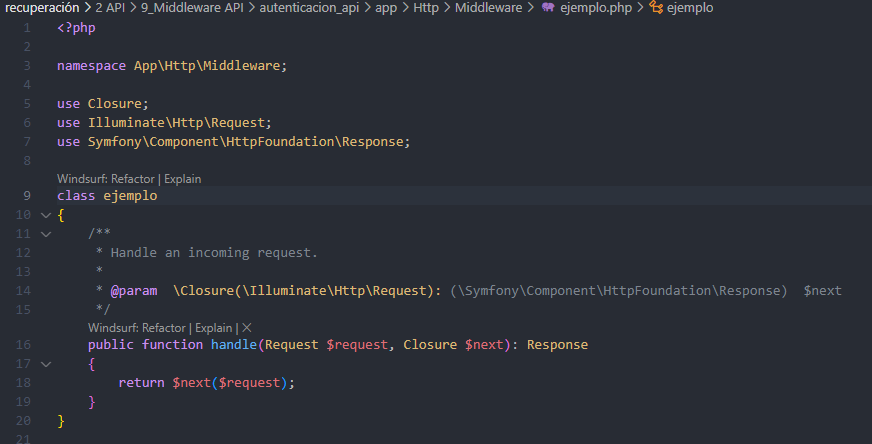

Para **registrar** los middleware lo haremos desde el archivo `/bootstrap/app.php` y se vería así:

```php
<?php

use Illuminate\Foundation\Application;
use Illuminate\Foundation\Configuration\Exceptions;
use Illuminate\Foundation\Configuration\Middleware;

return Application::configure(basePath: dirname(__DIR__))
    ->withRouting(
        web: __DIR__.'/../routes/web.php',
        api: __DIR__.'/../routes/api.php',
        commands: __DIR__.'/../routes/console.php',
        health: '/up',
    )
    ->withMiddleware(function (Middleware $middleware) {
        // Middleware global
        $middleware->use([
        // middleware globales
        // Si quieres que el middleware se aplique a todas las solicitudes
          //  \App\Http\Middleware\ejemplo::class,
        ]);

        // Middleware de grupo "web"
        $middleware->group('web', [
            // middleware para el grupo web
            // Si quieres que el middleware se aplique solo a un grupo específico web
            // \App\Http\Middleware\ejemplo::class,
        ]);

        // Middleware de grupo "api"
        $middleware->group('api', [
            // middleware para el grupo api
            // Si quieres que el middleware se aplique solo a un grupo específico api
            // \App\Http\Middleware\ejemplo::class,
        ]);

        // Alias de middleware para rutas
        $middleware->alias([
            // middleware de rutas
            // Si quieres aplicar el middleware solo a rutas específicas
            // 'ejemplo' => \App\Http\Middleware\ejemplo::class,
        ]);
    })
    ->withExceptions(function (Exceptions $exceptions) {
        //
    })->create();

```

> Dependiendo de cómo hayas registrado el middleware, se aplicará automáticamente a todas las solicitudes, a un grupo de rutas, o a rutas específicas.
>
> * **(Opcional)**
>
> ### Modificar el Comportamiento del Middleware
>
> Si necesitas modificar el comportamiento del middleware, puedes hacerlo en el archivo `app/Http/Middleware/NombreDelMiddleware.php`.

---

**En resumen:**

En Laravel 11, el middleware ya no se registra en `Kernel.php`. Ahora se agrega en `bootstrap/app.php` o directamente en las rutas usando `middleware()`. Esto hace que la aplicación sea más flexible y modular.

---

## Rutas Middleware

* **¿Como proteger una ruta?**

Lo normal es proteger una ruta en el archivo de enrutado pero tambien hay otra opción que veremos mas adelante.

> Un ejemplo de proteccion en ruta lo hemos podido observar cuando hemos trabajado con API ya que nos ha aparecido por defecto lo siguiente:
>
> ```php
> <?php
>
> use Illuminate\Http\Request;
> use Illuminate\Support\Facades\Route;
>
> Route::middleware('auth:sanctum')->get('/user', function (Request $request) {
>     return $request->user();
> });
> ```
>
> Nos esta marcando el uso de un middleware llamado `auth:sanctum` para proteger esa ruta de ejemplo que muestra ahí, nosotros lo usaremos mas adelante cuando trabajemos el bloque de autenticación

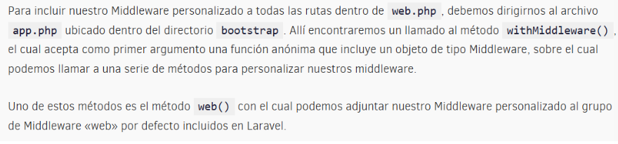

Así se vería mi app.php en mi caso:

```php
<?php

use Illuminate\Foundation\Application;
use Illuminate\Foundation\Configuration\Exceptions;
use Illuminate\Foundation\Configuration\Middleware;

return Application::configure(basePath: dirname(__DIR__))
    ->withRouting(
        web: __DIR__.'/../routes/web.php',
        api: __DIR__.'/../routes/api.php',
        commands: __DIR__.'/../routes/console.php',
        health: '/up',
    )
  
    ->withMiddleware(function (Middleware $middleware) {

        $middleware->web(\App\Http\Middleware\Ejemplo::class,);
    })
  
    ->withExceptions(function (Exceptions $exceptions) {
        //
    })->create();

```

WithMiddleware (function ... recibe una función con todas las rutas que se contienen dentro de este grupo.

```php
->withMiddleware(function (Middleware $middleware) {
        //
        $middleware->alias(['example' => \App\Http\Middleware\Example::class]);
        $middleware->group('api', ['example']);
        $middleware->api(['example']);
```

Ya sabemos aplicar middleware de forma singular y en grupo, el tercer formato sólo es válido en una buena estructuración de controladores, siguiente apartado

---

## Ejemplo Middleware

El ejemplo va a consistir en lo siguiente:

1. obtiene el valor del parámetro `token` desde la URL.
2. Si el token **no es igual** a `123456`, se detiene la ejecución.
3. Si la condición **ES CORRECTA**: Todo está bien, sigue con el controlador.
4. Si la condición **NO** **ES CORRECTA**: Devuelve una respuesta inmediata **sin pasar al controlador.**


Para comenzar con este ejemplo primero crearemos nuestro middleware como hemos visto anteriormente:

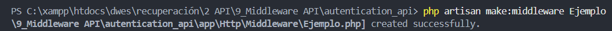

Y lo buscamos en la carpeta `app/http/middleware` a continuación lo modificaremos de la siguiente manera:

```php
<?php

namespace App\Http\Middleware;

use Closure;
use Illuminate\Http\Request;
use Symfony\Component\HttpFoundation\Response;

class Ejemplo
{
    /**
     * Handle an incoming request.
     *
     * @param  \Closure(\Illuminate\Http\Request): (\Symfony\Component\HttpFoundation\Response)  $next
     */
    public function handle(Request $request, Closure $next): Response
    {

        // Ejemplo de condición: validar si el parámetro 'token' es correcto
        if ($request->input('token') !== '123456') {
            return response('Acceso denegado por middleware.', 403);
        }

        // Si la condición pasa, continúa al controlador
        return $next($request);
    }
}

```

Para proseguir debemos registrar dicho middleware para ello nos movemos a `bootstrap/app.php` y modificamos el archivo tal que así:

```php
<?php

use Illuminate\Foundation\Application;
use Illuminate\Foundation\Configuration\Exceptions;
use Illuminate\Foundation\Configuration\Middleware;

return Application::configure(basePath: dirname(__DIR__))
    ->withRouting(
        web: __DIR__.'/../routes/web.php',
        api: __DIR__.'/../routes/api.php',
        commands: __DIR__.'/../routes/console.php',
        health: '/up',
    )
    ->withMiddleware(function (Middleware $middleware): void {
         $middleware->alias([
        'ejemplo' => \App\Http\Middleware\Ejemplo::class,
    ]);
    })
    ->withExceptions(function (Exceptions $exceptions): void {
        //
    })->create();

```

> Esto crea un **alias** llamado `ejemplo` para que puedas llamarlo fácilmente en las rutas.


Nos vamos a desplazar a routes/web.php y ahi vamos a colocar una ruta:

> web.php

```php
<?php

use Illuminate\Support\Facades\Route;
use App\Http\Controllers\EjemploController;

Route::get('/demo', [EjemploController::class, 'index'])
    ->middleware('ejemplo');

```

> Esto significa que **la ruta `/demo` estará protegida por el middleware `Ejemplo`.**


Y nos vamos al controlador para crearlo, ruta: `app/Http/Controllers/EjemploController.php`

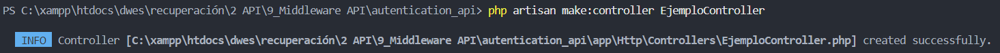

> EjemploController.php

```php
<?php

namespace App\Http\Controllers;

use Illuminate\Http\Request;

class EjemploController extends Controller
{
    public function index()
    {
        return 'Bienvenido, pasaste por el middleware correctamente.';
    }
}

```


---

## Proyecto

> Ahora vamos a realizar nuestro primer sistema de autenticación a traves de API.

Se basa en el método " **Token al portador o bearer tokens** ".

1. Usuario facilita email y password desde el formulario
2. Generamos token y se lo devolvemos al frontend
3. Ahora cada vez que quiera pedirnos información ha de enviarnos ese token para que el backend verifique

> **Laravel ya nos incluye autenticación con la librería SANCTUM**

Creamos el controlador:

Lo llamaremos AuthController

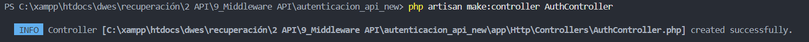

Este es el controlador que permitira loguear y registrar a los usuarios, en mi caso autores.

* Aquí creamos algunas funciones para registrar a nuestros usuarios
* Necesitamos crear primero una request para validar usuarios

Para crearla ya lo vimos en apartados anteriores:

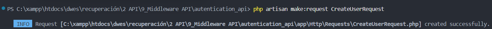

La modificamos de la siguiente manera:

> /app/Http/Request/CreateUserRequest.php

```php
<?php

namespace App\Http\Requests;

use Illuminate\Foundation\Http\FormRequest;

class CreateUserRequest extends FormRequest
{
    /**
     * Determine if the user is authorized to make this request.
     */
    public function authorize(): bool
    {
        return true;
    }

    /**
     * Get the validation rules that apply to the request.
     *
     * @return array<string, \Illuminate\Contracts\Validation\ValidationRule|array<mixed>|string>
     */
    public function rules(): array
    {
        return [
            //En las reglas, solicitamos los datos necesarios:
            'username' => 'required',
            //el email ha de ser único dentro de la tabla authors en el campo email
            'email' => 'required|email|unique:users, email',
            'password' => 'required|min:8', //podriamos indicar longitud minima...
        ];
    }
}

```

* Ahora el AuthController quedaría tal que así:

```php
<?php

namespace App\Http\Controllers;

use App\Http\Requests\CreateUserRequest;
use App\Http\Requests\LoginRequest;
use App\Http\Requests\CreateUserRequest as RequestsCreateUserRequest;
use App\Models\User;
use Illuminate\Support\Facades\Hash;
use Illuminate\Support\Facades\Auth;

class AuthController extends Controller
{
    //
    public function store(CreateUserRequest $request)
    {
        try {
            // Crear el usuario
            $user = User::create([
                'username' => $request->username,
                'email' => $request->email,
                'password' => Hash::make($request->password),
            ]);

            // Devolver respuesta con token de API
            return response()->json([
                'status' => true,
                'message' => 'User created successfully',
                'token' => $user->createToken("API TOKEN")->plainTextToken
            ], 201);

        } catch (\Exception $e) {
            // Manejo de errores generales
            return response()->json([
                'status' => false,
                'message' => 'User registration failed',
                'error' => $e->getMessage()
            ], 500);
        }
    }
}

```

Seguimos con la Request de Login para ello repetimos el comando para crear la Request pero cambiamos el nombre:

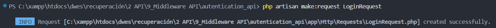

Así se vería:

> LoginRequest.php

```php
<?php

namespace App\Http\Requests;

use Illuminate\Foundation\Http\FormRequest;

class LoginRequest extends FormRequest
{
    /**
     * Determine if the user is authorized to make this request.
     */
    public function authorize(): bool
    {
        return true;
    }

    /**
     * Get the validation rules that apply to the request.
     *
     * @return array<string, \Illuminate\Contracts\Validation\ValidationRule|array<mixed>|string>
     */
    public function rules(): array
    {
        return [
            'email' => 'required|email',
            'password' => 'required', 
        ];
    }
}

```

Ahora generamos las validaciones, Laravel nos ofrece una clase ***muy muy útil*** que es la clase ***`Auth`***

Desde nuestro controlador `AuthController.php` podemos :

1. Acceder a los datos del usuario logueado.
2. Tratar de loguear a un usuario.

Así se vería actualmente el AuthController, habiendole añadido la función Login:

> AuthController.php

```php
<?php

namespace App\Http\Controllers;

use App\Http\Requests\CreateUserRequest;
use App\Http\Requests\LoginRequest;
use App\Http\Requests\CreateUserRequest as RequestsCreateUserRequest;
use App\Models\User;
use Illuminate\Support\Facades\Hash;
use Illuminate\Support\Facades\Auth;

class AuthController extends Controller
{
    //
    public function store(CreateUserRequest $request)
    {
        try {
            // Crear el usuario
            $user = User::create([
                'username' => $request->username,
                'email' => $request->email,
                'password' => Hash::make($request->password),
            ]);

            // Devolver respuesta con token de API
            return response()->json([
                'status' => true,
                'message' => 'User created successfully',
                'token' => $user->createToken("API TOKEN")->plainTextToken
            ], 201);

        } catch (\Exception $e) {
            // Manejo de errores generales
            return response()->json([
                'status' => false,
                'message' => 'User registration failed',
                'error' => $e->getMessage()
            ], 500);
        }
    }

     public function loginUser(LoginRequest $request)
{
    try {
        // Obtener credenciales validadas
        $credentials = $request->validated();

        // Intentar autenticación
        if (!Auth::attempt(['email' => $credentials['email'], 'password' => $credentials['password']])) {
            return response()->json([
                'status' => false,
                'message' => 'Email & password do not match our records'
            ], 401);
        }

        // Obtener usuario autenticado
        $user = User::where('email', $credentials['email'])->firstOrFail();

        return response()->json([
            'status' => true,
            'message' => 'User logged in successfully',
            'token' => $user->createToken("API TOKEN")->plainTextToken
        ], 200);

    } catch (\Exception $e) {
        return response()->json([
            'status' => false,
            'message' => 'Login failed',
            'error' => $e->getMessage()
        ], 500);
    }
}
}

```

En Laravel 11, debemos configurar un poco más nuestro modelo User para que podamos hacer uso de las API Tokens generadas.

### Agregar `HasApiTokens` en el modelo `Author`

Abre `app/Models/User.php` y asegúrate de agregar `HasApiTokens`:

```php
<?php

namespace App\Models;

// use Illuminate\Contracts\Auth\MustVerifyEmail;
use Illuminate\Database\Eloquent\Factories\HasFactory;
use Illuminate\Foundation\Auth\User as Authenticatable;
use Illuminate\Notifications\Notifiable;
use Laravel\Sanctum\HasApiTokens;

class User extends Authenticatable
{
    use HasApiTokens, HasFactory, Notifiable;

    protected $guarded = [];
    protected $hidden = ['created_at', 'updated_at'];
}

```

> pd: en caso de duda, aqui dejo como se veria la tabla de user en la migración (database/migrations/create-user-table)
>
> ```php
> <?php
>
> use Illuminate\Database\Migrations\Migration;
> use Illuminate\Database\Schema\Blueprint;
> use Illuminate\Support\Facades\Schema;
>
> return new class extends Migration
> {
>     /**
>      * Run the migrations.
>      */
>     public function up(): void
>     {
>         Schema::create('users', function (Blueprint $table) {
>             $table->id();
>             $table->string('name');
>             $table->string('email')->unique();
>             $table->timestamp('email_verified_at')->nullable();
>             $table->string('password');
>             $table->rememberToken();
>             $table->timestamps();
>         });
>
>         Schema::create('password_reset_tokens', function (Blueprint $table) {
>             $table->string('email')->primary();
>             $table->string('token');
>             $table->timestamp('created_at')->nullable();
>         });
>
>         Schema::create('sessions', function (Blueprint $table) {
>             $table->string('id')->primary();
>             $table->foreignId('user_id')->nullable()->index();
>             $table->string('ip_address', 45)->nullable();
>             $table->text('user_agent')->nullable();
>             $table->longText('payload');
>             $table->integer('last_activity')->index();
>         });
>     }
>
>     /**
>      * Reverse the migrations.
>      */
>     public function down(): void
>     {
>         Schema::dropIfExists('users');
>         Schema::dropIfExists('password_reset_tokens');
>         Schema::dropIfExists('sessions');
>     }
> };
>
> ```


#### Configuración de las rutas:

Ya que tenemos nuestro controlador, necesitamos especificarlo en nuestras **rutas API**.

```php
<?php

use Illuminate\Http\Request;
use Illuminate\Support\Facades\Route;
use App\Http\Controllers\AuthController;

Route::post('/create', [AuthController::class, 'store'])->name('create');
Route::post('/login', [AuthController::class, 'loginUser'])->name('login');

//ruta para obtener un dato protegido, aprovechamos la de laravel.
Route::middleware('auth:sanctum')->get('/user', function (Request $request) {
    return $request->user();
});


```

Una vez redefinida nuestra API, vamos a probarla:

Levantamos el servicio:

```
php artisan serve
```

Nueva petición en thunderclient:

**Thunder Client**

* Ruta

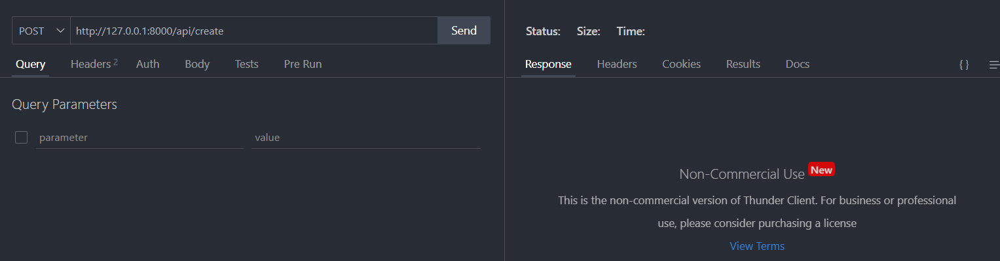

nuestra ruta sera `http://127.0.0.1:8000/api/create` y de tipo post.

Y a continuación en el body, escribimos nuestro primer usuario:

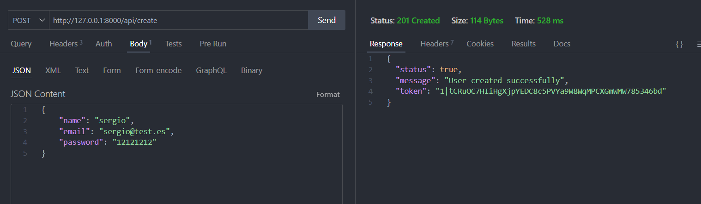

**Guarda ese TOKEN ya que lo vas a necesitar para autenticarte!**

#### Login User:

Vamos a acceder indicándole el token:

En la Autorización debemos entregar el **BEARER** token al usuario, eso se hace desde los headers así:

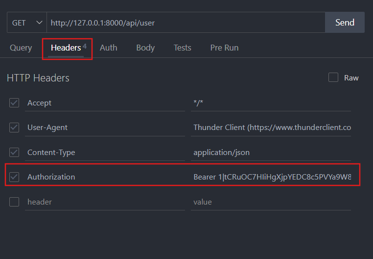

A continuación para ver que todo funciona le damos de nuevoa a send y deveria aparecernos lo siguiente:

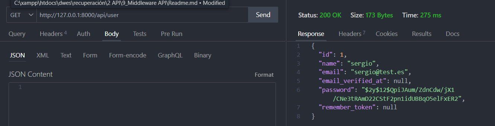

> Ya sabemos cómo añadir el middleware auth Sanctum mediante sistema de token para poder autenticar a los usuarios.
