# Testing


> En este documento, veremos al igual que en el 2 trimestre **el testing en laravel** **12** practicaremos mientras que aprendemos sobre estos y documentaremos **paso a paso** para mayor entendimiento.

---

### Índice.

* Introducción
* Tipos de Test
* Formatos de trabajo
* Creación y ejemplo de test
* Configuración de entorno testing
* Ejecución de tests y solución de errores

---

## Introducción

El testing es una disciplina dentro del desarrollo. Independientemente de eso, todo desarrollador debe ser capaz de realizar los diferentes tests.

## Tipos de Test

#### Test Unitarios

Se enfocan en funciones o acciones concretas. Se prueban pequeños trozos de código para asegurarse de que funcionan correctamente de manera aislada.

#### Test de Integración

Prueban el circuito completo de la aplicación. Se verifica que la ruta correcta devuelve la vista correspondiente con los datos esperados.

##### Importancia

Al inicio, puede parecer innecesario en proyectos pequeños, pero en el trabajo profesional, los tests son obligatorios.

## Formatos de trabajo

### Test-Driven Development (TDD)

Se escriben los tests **antes** de desarrollar la funcionalidad.

### Test Después del Desarrollo

Siempre se ejecutan antes de cada commit.

### Estrategias

* Usar **seeders** o **factories** para datos en memoria y evitar alterar la base de datos.
* Usar un **entorno de testing** para ejecutar los tests sin afectar los datos reales.

## Creación y ejemplos de tests

Primero crearemos el proyecto o en su defecto lo que he hecho yo es copiar y pegar el proyecto del apartado anterior y cambiar el nombre a ***testexample***.

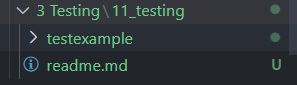

Yo voy a trabajar con test  ***PHPUnit***  para crear un test ***unit*** haremos lo siguiente:

```bash
php artisan make:test UserTest --unit
```

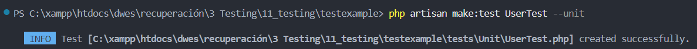

La estructura base de nuestra clase se Ubica en: `tests/Unit`

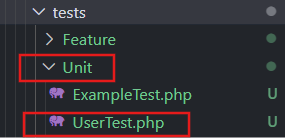

El archivo se vería tal que así:

```php
<?php

namespace Tests\Unit;

use PHPUnit\Framework\TestCase;

class UserTest extends TestCase
{
    /**
     * A basic unit test example.
     */
    public function test_example(): void
    {
        $this->assertTrue(true);
    }
}

```

Ahora realizaremos los test para ello añadiremos a el archivo de test UserTest.php las siguientes funciones:

### Listar todos los usuarios (`index`)

```php
public function test_index_returns_all_users()
{
    // Preparamos el entorno: crear usuarios de prueba
    \App\Models\User::factory(3)->create();

    // Llamamos a la ruta index
    $response = $this->getJson('/api/users');

    // Verificamos que el status sea 200
    $response->assertStatus(200);

    // Verificamos que haya 3 usuarios en la respuesta
    $response->assertJsonCount(3);
}
```

Verificar que la ruta `/users` retorne todos los usuarios correctamente.

* Crea 3 usuarios usando factories.
* Llama al endpoint `/api/users`.
* Verifica que la respuesta sea correcta (HTTP 200) y que retorne 3 registros.

### Obtener detalle de usuario existente (`detail`)

```php
public function test_detail_returns_user_if_exists()
{
    $user = \App\Models\User::factory()->create(['name' => 'Antonio']);

    $response = $this->getJson("/api/users/{$user->id}");

    $response->assertStatus(200)
             ->assertJson([
                 'id' => $user->id,
                 'name' => 'Antonio',
             ]);
}
```

Verificar que el endpoint `/users/{id}` retorne un usuario correctamente si existe.

* Crea un usuario con nombre "Antonio".
* Llama al endpoint `/api/users/{id}` con el ID del usuario.
* Verifica que el status sea 200 y que la respuesta contenga los datos esperados.

### Obtener detalle de usuario inexistente (error 404)

```php
public function test_detail_returns_404_if_user_not_found()
{
    $response = $this->getJson('/api/users/999'); // ID que no existe

    $response->assertStatus(404)
             ->assertJson([
                 'error' => 'User not found',
             ]);
}
```

Verificar que si el usuario no existe, la API responde correctamente con un error 404.

* Intenta acceder a un usuario con ID 999 que no existe.
* Verifica que el status sea 404 y que la respuesta contenga el mensaje de error adecuado.

## Configurar entorno testing

Primero debemos crear el **.env.testing** para configurar la base de datos para testing, lo realizaré de la siguiente manera:

copiaremos el ***.env.example*** lo pegaremos y le cambiaremos el nombre a ***.env.testing*** para que quede así:

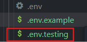

Ahora pasamos a modificarlo y quedará de esta forma:

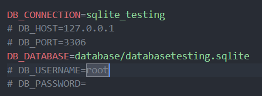

Pasariamos a definir nuestro database.php que se ubica en config/database.php

en donde añadiremos las siguientes lineas:

```php
'sqlite_testing' => [
        'driver' => 'sqlite',
        'database' => env('DB_DATABASE', database_path('databasetesting.sqlite')),
        'prefix' => '',
        'foreign_key_constraints' => env('DB_FOREIGN_KEYS', true),
       ],
```

Ahora migraremos esa base de datos de testing con el comando:

`php artisan migrate --env=testing`

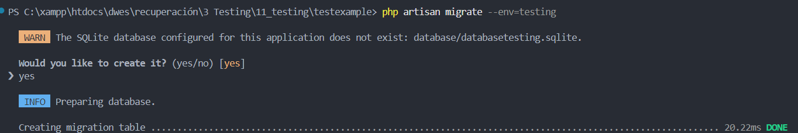

## EJECUCIÓN DE TESTS Y SOLUCIÓN DE ERRORES

Ejecutar los tests:

```bash
php artisan test
```

Si los tests fallan, modificar el código para corregir errores:

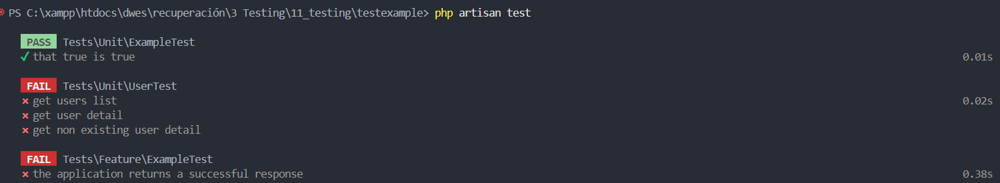

* **Configurar Rutas API** en `routes/api.php`:

```php
Route::get('/users/{id}', [UserController::class, 'detail']);
```

* **Crear Controlador** :

```bash
php artisan make:controller UserController
```

* **Implementar la Lógica del Controlador** :

```php
class UserController extends Controller
{
    public function index()
    {
        return response()->json(User::all());
    }
    public function detail($id)
    {
        $user = User::find($id);
        if (!$user) {
            return response()->json(['error' => 'User not found'], 404);
        }
        return response()->json($user);
    }
}
```

* **Crear un Seeder** para poblar usuarios:

```bash
php artisan make:seeder UserSeeder
```

* **Definir el Seeder** :

```php
class UserSeeder extends Seeder
{
    public function run(): void
    {
        User::factory()->create(['name' => 'Antonio']);
        User::factory(3)->create();
    }
}
```

* **Ejecutar el Seeder** :

```bash
php artisan db:seed --env=testing
```

#### Solucion de errores

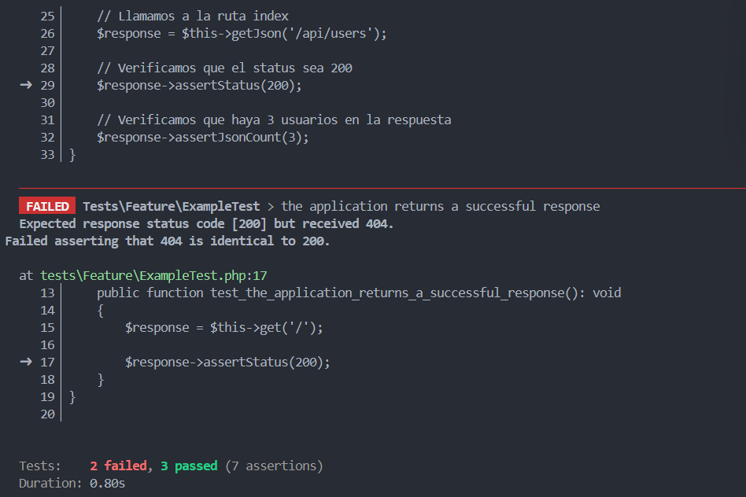

##### Tenemos dos errores:

1. Llama a la funcion index del conntrolador por ello la tendremos que añadir en api.php
2. Esta llamando al test de la carpeta feature que no estamos usando que llama a la ruta de web.php para solucionarlo vamos a comentar esa ruta

> 1

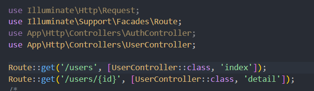

> 2

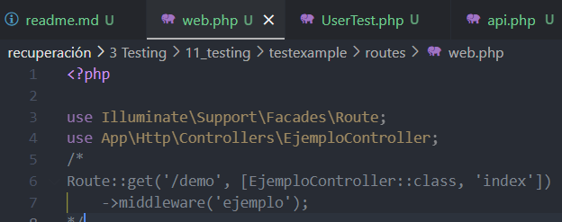

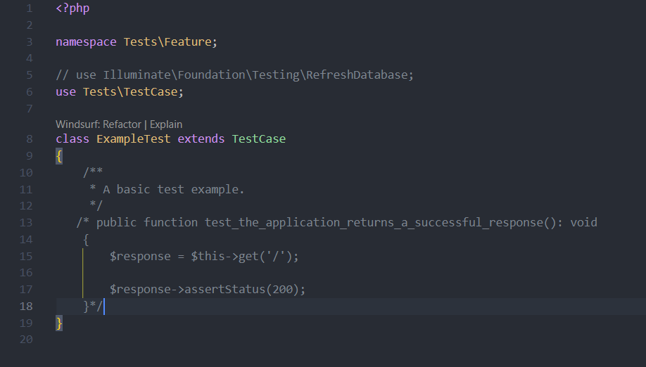

##### Corregido:

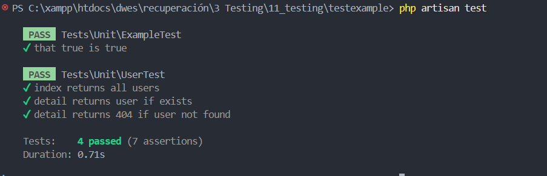
